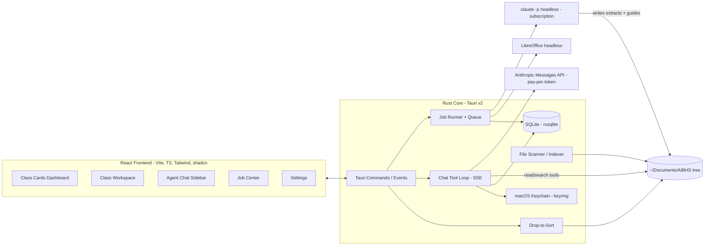

# ClassHub — End-to-End Specification

ClassHub is a personal, local-only macOS desktop app (Tauri v2) that serves as the centralized
hub for Danny's master's program (AI in Biomedical & Health Sciences, Fall 2026). It ingests
class material from `~/Documents/AIBHS`, synthesizes dense high-yield HTML study guides using
the Claude Code (Max 20x) subscription, and provides an agent chat sidebar backed by the direct
Anthropic API with agentic retrieval over pre-extracted material.

This file is the single source of truth for the project. Each milestone below is designed to be
completed in **one dedicated coding session** to avoid context rot. See [Session protocol](#session-protocol).

---

## 1. Verified facts & hard constraints

These were verified on 2026-08-22. Do not re-litigate them in milestone sessions.

- **Agent SDK credit is PAUSED.** Anthropic announced (then paused before the June 15, 2026
  launch) a separate monthly Agent SDK credit. Current reality: `claude -p` / Agent SDK usage
  with subscription auth **draws from the normal subscription usage limits** (same rolling
  limits as interactive Claude Code). Source: support.claude.com article 15036540.
- **Headless subscription use is officially supported.** The locally installed `claude` CLI
  (v2.1.237 at `~/.local/bin/claude`) is logged in to the Max 20x subscription and `claude -p`
  uses those credentials.
- **Auth precedence gotcha (critical):** Claude Code resolves auth in this order:
  cloud creds → `ANTHROPIC_AUTH_TOKEN` → `ANTHROPIC_API_KEY` → `apiKeyHelper` →
  `CLAUDE_CODE_OAUTH_TOKEN` → interactive login. Because ClassHub also holds a console API key
  for the chat agent, **every spawned `claude` process MUST have `ANTHROPIC_API_KEY` and
  `ANTHROPIC_AUTH_TOKEN` removed from its environment**, or synthesis silently bills
  pay-per-token API credits instead of the subscription.
- **Chat agent uses the direct Anthropic Messages API** (pay-per-token, console API key).
  Deliberate choice: chat availability must be independent of subscription rate limits, which
  heavy synthesis jobs can exhaust.
- **Anthropic has no embeddings API.** RAG is agentic (grep/read over pre-extracted markdown),
  not vector-based. No embedding provider, no vector DB.
- **Claude cannot read `.pptx`.** It reads PDFs and images natively. LibreOffice
  (`soffice --headless --convert-to pdf`) converts PPTX → PDF during ingestion.
- Toolchain verified installed: Rust 1.96.1, Node v26.3.1, Homebrew. LibreOffice is NOT yet
  installed (Milestone 4 installs it via `brew install --cask libreoffice`).

## 2. Prerequisites

| Prerequisite | Needed by | Status |
| --- | --- | --- |
| `claude` CLI logged in to Max 20x subscription | Milestone 3 | Done |
| LibreOffice (`brew install --cask libreoffice`) | Milestone 4 | To install |
| Anthropic console API key with usage credits | Milestone 7 | To obtain at console.anthropic.com |

## 3. Architecture



**Stack:** Tauri v2 (Rust backend) + React 19 + Vite + TypeScript + Tailwind CSS + shadcn/ui.
SQLite via `rusqlite` (bundled) in the Tauri app-data dir. Streaming from Rust to the frontend
via Tauri events. No Python anywhere in the stack.

## 4. Filesystem conventions

The AIBHS tree is the **source of truth**. ClassHub reads it directly and writes only to the
designated locations below. The AIBHS root path is configurable (default `~/Documents/AIBHS`).

```
~/Documents/AIBHS/
├── Biostatistics for AI/                  ← one folder per class (4 total)
│   ├── Module 1/                          ← modules created by Danny or by drop-to-sort
│   │   ├── Slides/                        ← .pptx lecture slides
│   │   ├── Reading Material/              ← .pdf readings
│   │   └── R Files/
│   │       ├── Class Files/               ← provided .Rmd / .html
│   │       └── Edited Files/              ← Danny's classwork (.R)
│   ├── Study Guides/                      ← APP-MANAGED: generated artifacts
│   │   ├── Module 1.html
│   │   ├── Semester Master.html
│   │   └── Practice/                      ← generated practice exams
│   ├── Notes/                             ← APP-MANAGED: per-class markdown notes
│   ├── _Inbox/                            ← APP-MANAGED: drop-to-sort staging
│   └── .classhub/
│       └── extracts/                      ← APP-MANAGED: hidden extraction cache,
│           └── Module 1/Slides/Biostatistics_Module1_Slides_class2.pptx.md
└── ... (3 more class folders)
```

Rules:

- Module folder structure inside each class is **arbitrary and user-owned**; never assume the
  exact layout above. Scanner and agents must tolerate any nesting.
- Extract paths mirror the source file's relative path with `.md` appended, under
  `.classhub/extracts/`. PPTX→PDF conversions live alongside as `<name>.pptx.pdf`.
- `Study Guides/`, `Notes/`, `_Inbox/`, `.classhub/` are excluded from module scanning,
  drop-to-sort proposals, and staleness computation of source material.
- The app never deletes source files. Moves happen only through the confirmed drop-to-sort flow
  and are audit-logged.

## 5. Data model (SQLite)

Migrations run at startup (numbered SQL files embedded in the Rust binary). Schema:

```sql
classes(id INTEGER PK, folder_name TEXT UNIQUE, display_name TEXT, code TEXT,
        color TEXT, room TEXT, instructors TEXT, credits INTEGER,
        grading_basis TEXT, final_exam_start TEXT NULL, final_exam_end TEXT NULL);

meetings(id INTEGER PK, class_id INTEGER FK, weekday INTEGER,  -- 1=Mon .. 7=Sun
         start_time TEXT, end_time TEXT, periods TEXT);

files(id INTEGER PK, class_id INTEGER FK, rel_path TEXT, sha256 TEXT, size INTEGER,
      mtime INTEGER, kind TEXT,            -- pptx|pdf|rmd|r|html|md|other
      extract_rel_path TEXT NULL, extracted_at INTEGER NULL,
      extracted_sha256 TEXT NULL,          -- hash of source when extract was made
      UNIQUE(class_id, rel_path));

jobs(id INTEGER PK, kind TEXT,             -- extract|module_guide|master_guide|sort_proposal|syllabus_scan|practice
     class_id INTEGER NULL, scope TEXT NULL,  -- e.g. module rel path, or 'master'
     status TEXT,                          -- queued|running|succeeded|failed|cancelled
     session_id TEXT NULL,                 -- claude session id (for --resume)
     created_at INTEGER, started_at INTEGER NULL, finished_at INTEGER NULL,
     log_path TEXT NULL, error TEXT NULL, summary TEXT NULL);

guides(id INTEGER PK, class_id INTEGER FK, scope TEXT,  -- module rel path | 'master'
       rel_path TEXT, generated_at INTEGER,
       source_manifest TEXT,               -- JSON: [{rel_path, sha256}] used for staleness
       UNIQUE(class_id, scope));

deadlines(id INTEGER PK, class_id INTEGER FK, title TEXT, kind TEXT,  -- assignment|exam|quiz|project|other
          due_at TEXT, notes TEXT NULL, status TEXT,  -- open|done
          source TEXT);                    -- manual|agent|syllabus

grade_categories(id INTEGER PK, class_id INTEGER FK, name TEXT, weight REAL);
grade_items(id INTEGER PK, category_id INTEGER FK, name TEXT,
            score REAL, max_score REAL, graded_at TEXT NULL);

chat_sessions(id INTEGER PK, title TEXT, created_at INTEGER);
chat_messages(id INTEGER PK, session_id INTEGER FK, role TEXT,
              content TEXT,                -- JSON: full Messages-API content blocks
              created_at INTEGER);

audit_log(id INTEGER PK, action TEXT, payload TEXT, created_at INTEGER);
settings(key TEXT PK, value TEXT);         -- API key lives in Keychain, NOT here
```

**Seed data** (inserted by the first migration; codes stored as metadata but never displayed):

| display_name | folder_name | code | color | meetings | room | instructors | credits | final exam |
| --- | --- | --- | --- | --- | --- | --- | --- | --- |
| Fundamentals of AI in Medicine I | Fundamentals of Artificial Intelligence in Medicine I | CAI5720 | blue | Tue 16:05–19:05 (periods 9–11) | JAX1 231 | Zhenhong Hu, Yijiang Chen | 3 | — |
| AI in Health Design Studio I | AI in Health Design Studio I | CAI5724 | orange | Wed 17:10–18:00 (period 10) | JAX1 231 | Benjamin Shickel | 1 | 2026-12-07 20:00–22:00 |
| Biostatistics for AI | Biostatistics for AI | CAI5731 | green | Thu 11:45–13:40 (periods 5–6) | JAX1 231 | Esra Adiyeke, Tezcan Ozrazgat Baslanti | 2 | — |
| Applied Generative AI in Medicine | Applied Generative AI in Medicine | CAI6734 | amber | Tue 11:45–14:45 (periods 5–7) | JAX1 231 | Akshith Ullal, Xuefeng Liu | 3 | — |

All grading bases are Letter Grade. `display_name` intentionally drops "Artificial Intelligence"
verbosity only where it keeps cards clean; UI always uses `display_name`, never `code`.

## 6. Claude Code job runner

The job runner is the single gateway to the subscription. All heavy-token work (extraction,
guides, master file, sort proposals, syllabus scans, practice exams) flows through it.

**Invocation template** (Rust `std::process::Command`):

```
claude -p <prompt>
  --output-format stream-json --verbose
  --model <per job kind, see below>
  --allowedTools <per job kind, see below>
  --add-dir <class folder absolute path>
```

- **cwd** = the class folder.
- **Environment**: inherit, then **remove `ANTHROPIC_API_KEY` and `ANTHROPIC_AUTH_TOKEN`**
  (see §1). A startup self-check job asserts the active auth is the subscription (the
  stream-json init event exposes the auth/rate-limit type) and surfaces a blocking warning
  in the UI if not.
- **Tool scoping by job kind** (least privilege; never allow Bash, WebFetch, WebSearch):
  - `extract`, `module_guide`, `master_guide`, `practice`: `Read,Glob,Grep,Write`
  - `sort_proposal`, `syllabus_scan`: `Read,Glob,Grep` (read-only; output is JSON on stdout)
- **Models**: `opus` for `module_guide`, `master_guide`, `practice`; default (`sonnet`) for
  `extract`, `sort_proposal`, `syllabus_scan`.
- **Streaming**: parse stream-json lines into typed events (init, assistant text deltas, tool
  use, result). Persist raw lines to `log_path`; forward condensed progress events to the
  frontend via Tauri events (`job://{id}/progress`).
- **Queue**: max 2 concurrent jobs; `master_guide` runs exclusively (queue drains first).
  Jobs are cancellable (kill child process, mark `cancelled`).
- **Resumability**: store the claude `session_id` from the init event; failed/interrupted
  `master_guide` jobs offer "Resume" which re-invokes with `--resume <session_id>`.
- Prompts are Rust-side templates (askama or `format!` with named sections) versioned in
  `src-tauri/prompts/`. Each prompt states: role, exact output path(s), output contract,
  and what NOT to do (no source edits, no files outside the contract).

## 7. Ingestion & extraction pipeline

Goal: every source file gets a clean markdown extract under `.classhub/extracts/` so the chat
agent and synthesis prompts can search text instead of re-reading binaries.

1. **Scan** (on launch, on window focus, and manual refresh): walk each class folder
   (excluding app-managed dirs), upsert `files` rows with sha256 + mtime. Detect
   added/changed/removed files by hash.
2. **Convert**: for `.pptx` files, run
   `soffice --headless --convert-to pdf --outdir <extracts mirror dir> <file>`
   producing `<name>.pptx.pdf`. Skip if the PDF is newer than the source hash.
3. **Extract** (per changed file, batched into one `extract` job per class per run):
   - Text-native formats (`.Rmd`, `.R`, `.md`, `.txt`): local Rust extraction (copy /
     light normalization). `.html` (R-rendered notebooks): local tag-strip to text.
     No tokens spent.
   - Visual formats (`.pdf`, converted PPTX-PDFs): `claude -p` extraction. The prompt
     instructs: read the PDF, produce a faithful markdown extract preserving structure,
     tables, formulas, code; **describe every figure/diagram/chart in brackets**
     (e.g. `[Figure: scatterplot of X vs Y showing positive correlation]`); write to the
     mirrored extract path.
4. **Record**: update `extract_rel_path`, `extracted_at`, `extracted_sha256`.
5. **Staleness**: a guide is stale when its `source_manifest` differs from the current set of
   `{rel_path, sha256}` in its scope. Computed on demand; surfaced as badges.

Extraction is triggered automatically after a scan finds changes (extraction is cheap:
sonnet + mostly local), but **guide synthesis is never automatic**.

## 8. Study guide synthesis

### 8.1 Module guides (`module_guide` job)

Manual trigger per module from the Class Workspace. Prompt contract:

- Inputs: all extracts in the module (primary) + originals via `--add-dir` when the extract
  flags a figure worth re-inspecting; Danny's classwork files marked as "learner work" for
  the worked-examples section.
- Output: **one self-contained HTML file** at `Study Guides/<Module name>.html`. No external
  requests (no CDN fonts/JS/CSS). Inline CSS + inline SVG only. Print-friendly stylesheet.
  Class accent color as the theme hue. Footer with generated-at timestamp and source manifest.
- Required sections (the "guide anatomy"):
  1. **Key concepts** — dense high-yield summaries, exam-oriented
  2. **Diagrams** — inline SVG concept maps / flowcharts / comparison tables
  3. **Formula & code reference** — stats formulas, R snippets with expected outputs
  4. **Worked examples** — pulled from classwork, annotated step-by-step
  5. **Self-test quiz** — active-recall questions, answers hidden in `<details>` elements
  6. **Glossary** — terms with one-line definitions
- Tone: dense reference, not tutorial prose. Every claim traceable to source material;
  cite source filenames inline in small muted text.
- After the job succeeds, upsert `guides` row with the source manifest.

### 8.2 Semester master file (`master_guide` job)

Manual trigger per class ("Generate Semester Master"). **Full re-synthesis from all raw
material every time** (deliberate quality-first decision — not map-reduce over module guides).
Prompt contract: read every extract (and originals as needed) across all modules, synthesize
cross-module connections, output `Study Guides/Semester Master.html` with the same anatomy
plus a "Cross-module threads" section. This is a long-running exclusive job (potentially
30+ min); UI must show phased streaming progress and support resume (§6).

### 8.3 Practice exams (`practice` job)

Triggered from chat (M8) or a button in Study Guides. Inputs: scope (module or semester) +
optional focus topics. Output: `Study Guides/Practice/<scope> — <date>.html`, exam-style
questions with hidden answers + scoring rubric.

## 9. Agent chat (direct Anthropic API)

- **Transport**: Rust `reqwest` streaming SSE to `POST /v1/messages`, `stream: true`.
  API key from macOS Keychain (`keyring` crate, service `classhub`). Model configurable in
  Settings; the dropdown is populated from `GET /v1/models`; default to the current
  mid-tier (Sonnet-class) model.
- **Tool loop**: hand-rolled in Rust: send → on `tool_use` block, execute locally → append
  `tool_result` → continue until end_turn. Stream text deltas and tool-call chips to the
  frontend. Persist full content blocks to `chat_messages`.
- **System prompt**: identity ("ClassHub agent"), today's date, injected context (classes,
  schedule, open deadlines, staleness summary), retrieval guidance (search extracts first;
  cite file paths), and write-action policy (file moves are proposals only).
- **Read tools** (Milestone 7):
  - `get_overview()` — classes, schedule, upcoming deadlines, guide freshness
  - `list_material(class, subpath?)` — tree listing
  - `search_material(query, class?)` — ripgrep over extracts, notes, and guides
  - `read_material(path, offset?, limit?)` — bounded file reads (extracts/notes/guides/text
    sources; never binaries)
- **Write tools** (Milestone 8):
  - `trigger_synthesis(class, scope)` — enqueue module/master/practice job
  - `upsert_deadline(...)` / `complete_deadline(id)` / `delete_deadline(id)`
  - `upsert_grade_category(...)` / `add_grade_item(...)`
  - `write_note(class, title, content_md)` — creates/updates `Notes/<title>.md`
  - `propose_file_moves(moves[])` — routes into the drop-to-sort confirm queue; never moves
    directly
  - `generate_practice(class, scope, focus?)`
- Sidebar UX: toggleable right panel, session list, streaming markdown, tool-call chips with
  expandable args/results, inline confirm cards for proposals.

## 10. Drop-to-sort (propose-and-confirm)

1. Files dropped onto a class workspace (Tauri `onDragDrop`) are **copied** into
   `<Class>/_Inbox/` (originals untouched).
2. A `sort_proposal` job (read-only tools) receives the inbox listing + the class folder tree
   and returns strict JSON on stdout:
   `[{file, destination_rel_path, create_folders: [], reasoning, confidence: high|medium|low}]`.
3. UI renders one proposal card per file: destination path, reasoning, confidence badge,
   with Approve / Change destination (folder picker) / Leave in inbox.
4. On approve, Rust performs the move (creating folders as needed), updates the file index,
   and writes an `audit_log` entry. No file ever moves without explicit approval.
5. The inbox badge on the class card shows pending count.

## 11. Hub features

- **Schedule**: weekly grid (Mon–Fri) built from `meetings`; today highlighted; "next class"
  chip on the dashboard; exam countdown chips (days until each `final_exam_start`).
- **Deadlines**: per-class list + dashboard aggregation (next 7 days strip). CRUD via UI and
  chat tools. **Syllabus extraction**: a `syllabus_scan` job reads a chosen file (or whole
  class folder) and proposes deadlines as JSON → confirm cards → insert with `source='syllabus'`.
- **Notes**: markdown files in `<Class>/Notes/`. Lightweight editor (textarea + live preview,
  no heavy editor dependency). Notes are included in `search_material` scope.
- **Grades**: weighted categories per class (weights should sum to 100%; show a warning
  otherwise). Items with score/max. Computed: current weighted grade over graded items,
  displayed on the class card and Grades tab.

## 12. UI specification & design language

**Any milestone session that touches UI MUST first read the frontend-design skill**
(`/Users/danny/.claude/plugins/cache/claude-plugins-official/frontend-design/unknown/skills/frontend-design/SKILL.md`)
and apply it. Non-negotiable per project owner.

- Minimalist, modern, generous whitespace; light + dark mode; system font stack or a single
  bundled variable font (no CDN fetches).
- Per-class accent colors: blue, orange, green, amber (matching the enrollment screenshot's
  card edge bars). Class cards show a left accent bar, `display_name` only (never course
  codes), next meeting, staleness/inbox badges, current grade, nearest deadline.
- **Views**: Dashboard (4 class cards + deadlines strip + exam countdowns + job status pill)
  · Class Workspace (accent header; tabs: Materials, Study Guides, Notes, Grades, Deadlines)
  · Guide viewer (sandboxed iframe rendering the HTML file + Open in Browser / Show in Finder)
  · Chat sidebar (global, overlays right side, keyboard shortcut) · Job Center (bottom bar
  pill expanding to a panel with live logs) · Settings.
- Empty states matter: a class with no modules yet (3 of 4 classes today) shows a friendly
  drop-target hero, not a blank pane.

## 13. Engineering conventions

- TypeScript strict; React function components; **no `useEffect`** (per workspace rules — use
  event handlers, derived state, and TanStack Query for async server state from Tauri
  commands). No Python anywhere.
- Dev loop only: `npm run tauri dev`. Never run production builds (`tauri build`) in sessions.
- Rust: `anyhow` for errors in commands, typed event payloads (serde), no `unwrap()` outside
  tests/startup.
- Commits: small, per-milestone; no AI attribution lines; existing git config untouched.
- Secrets: API key only in Keychain. `.gitignore`: `node_modules`, `target`, app-data,
  any `.env`.

## 14. Milestones

One milestone per coding session, in order. Dependencies are strictly earlier-numbered.
Mark the checkbox when the acceptance criteria pass.

### Session protocol

1. Start a fresh session. Read `SPEC.md` in full, then the milestone section.
2. Read the frontend-design skill if the milestone touches UI (all except M4).
3. Implement only that milestone. Verify with `npm run tauri dev` against the real AIBHS folder.
4. Tick the milestone checkbox in §14 (the only permitted SPEC.md edit) and commit.

---

- [x] **M1 — Scaffold + dashboard.**
  Tauri v2 app (`npm create tauri-app` — React + TS + Vite), Tailwind + shadcn, rusqlite with
  migrations + seed data (§5), settings table with AIBHS root, class discovery (map folder
  names → seeded classes), dashboard with 4 accent-colored class cards showing next meeting.
  *Accepted when:* app launches via `npm run tauri dev`, DB is created and seeded, all 4
  classes render as cards with correct names (no codes), colors, and next-meeting times.

- [x] **M2 — Class workspace.**
  File scanner/indexer (§7 step 1, hashes into `files`), class view with module/file tree
  (app-managed dirs hidden), file-kind icons, row actions: Show in Finder, Open in default app.
  *Accepted when:* Biostatistics shows Module 1's real tree; adding/removing a file in Finder
  and refreshing updates the tree and the `files` table.

- [x] **M3 — Claude Code job runner.**
  Job queue + `jobs` table, `claude -p` spawn per §6 (env stripping, tool scoping, stream-json
  parsing, log files), Tauri progress events, Job Center UI (bottom pill → panel, live output,
  cancel), startup subscription-auth self-check with UI warning.
  *Accepted when:* a throwaway "list the files in this class folder" job runs end-to-end with
  live streamed output, is cancellable, and the self-check confirms subscription auth (with
  `ANTHROPIC_API_KEY` deliberately set in the parent env to prove stripping works).

- [x] **M4 — Ingestion & extraction.**
  Install LibreOffice. PPTX→PDF conversion, extract jobs per §7 (local for text formats,
  `claude -p` for PDFs), extract cache under `.classhub/extracts/`, auto-extract after scans,
  staleness computation groundwork (manifest diffing utility).
  *Accepted when:* the Biostatistics Module 1 pptx and pdf produce faithful markdown extracts
  with bracketed figure descriptions; re-running without changes spends zero tokens.

- [ ] **M5 — Module study guide synthesis.**
  `module_guide` prompt template per §8.1 (all six sections, self-contained HTML contract),
  Synthesize button per module, staleness badges (module + card level), `guides` manifest
  tracking, in-app sandboxed guide viewer + Open in Browser / Show in Finder.
  *Accepted when:* Biostatistics Module 1 yields a self-contained HTML guide with all six
  sections and inline SVG, viewable in-app, offline, and print-clean; touching a source file
  flips the staleness badge.

- [ ] **M6 — Semester master synthesis.**
  `master_guide` exclusive job per §8.2 (full raw re-synthesis, cross-module threads section),
  long-job UX: phased progress display, resume-from-session on failure, time-elapsed indicator.
  *Accepted when:* a master file generates for Biostatistics (single module today — the
  pipeline must still work), resume works after a forced mid-job kill.

- [ ] **M7 — Chat sidebar (read).**
  Keychain-backed API key settings + model picker (from `/v1/models`), SSE streaming chat with
  the four read tools (§9), tool-call chips, session persistence and picker, global sidebar
  with keyboard shortcut.
  *Accepted when:* "What did Module 1 of Biostats cover about measures of central tendency?"
  streams an answer grounded in extracts with cited file paths, and history survives relaunch.

- [ ] **M8 — Chat write-actions.**
  All write tools per §9: synthesis triggering (visible in Job Center), deadline/grade/note
  tools, `propose_file_moves` routing into the M9 confirm queue (build the queue data model
  now; full UI lands in M9), `generate_practice` producing a practice exam HTML.
  *Accepted when:* chat can create a deadline, write a note file, kick off a module synthesis,
  and generate a practice exam — each visibly reflected in the UI.

- [ ] **M9 — Drop-to-sort.**
  Drag-drop onto class workspace → `_Inbox/` copy, `sort_proposal` job with strict-JSON output,
  proposal cards (approve / change destination / leave), folder-creating moves, audit log,
  inbox badges.
  *Accepted when:* dropping a mixed handful of files (e.g. a slides pptx named "week3" and an
  unrelated pdf) yields sensible proposals, approvals move files correctly (new folders
  created as proposed), and every move is audit-logged. Chat-proposed moves (M8) surface in
  the same queue.

- [ ] **M10 — Schedule + deadlines.**
  Weekly schedule grid + today highlight + next-class and exam-countdown chips, deadline CRUD
  (per-class tab + dashboard 7-day strip), `syllabus_scan` job with confirm cards.
  *Accepted when:* the grid matches §5 seed data, a manually added deadline appears on the
  dashboard, and a syllabus scan proposes at least date-bearing items from a real syllabus
  file with confirm-before-insert.

- [ ] **M11 — Notes + grades + polish.**
  Markdown notes editor with preview (files in `Notes/`), weighted grade tracker with computed
  current grade on card + tab, Settings screen (AIBHS root, API key management, model,
  concurrency), empty/error states everywhere (3 empty classes today must look intentional),
  final design pass with the frontend-design skill.
  *Accepted when:* notes round-trip to disk and are chat-searchable, grade math is correct for
  a worked example (weights warning at ≠100%), settings changes persist, and every view has a
  designed empty state.

## 15. Risks & trade-offs (accepted)

- **Master re-synthesis cost/time**: full raw re-synthesis on every run is token-heavy and
  slow by design (quality-first choice). It shares subscription limits with interactive
  Claude Code use — always user-triggered, runs exclusively, never scheduled.
- **Chat is pay-per-token**: read tools are extracts-first and reads are bounded to keep
  context small; practice/synthesis work is delegated to the subscription via the job runner.
- **LibreOffice fidelity**: rare PPTX features may render imperfectly in PDF; acceptable for
  lecture slides.
- **Single-user, local-only**: no auth, no telemetry, no deployment infra. The subscription
  OAuth stays personal; nothing here is multi-tenant.

## 16. Future ideas (explicitly out of v1)

- Spaced-repetition export (Anki) from quiz sections
- Canvas/LMS integration for automatic assignment ingestion
- Audio lecture transcription ingestion
- Cross-class semester dashboard analytics (study time, grade trends)
- Auto-sync of the AIBHS folder from cloud storage
