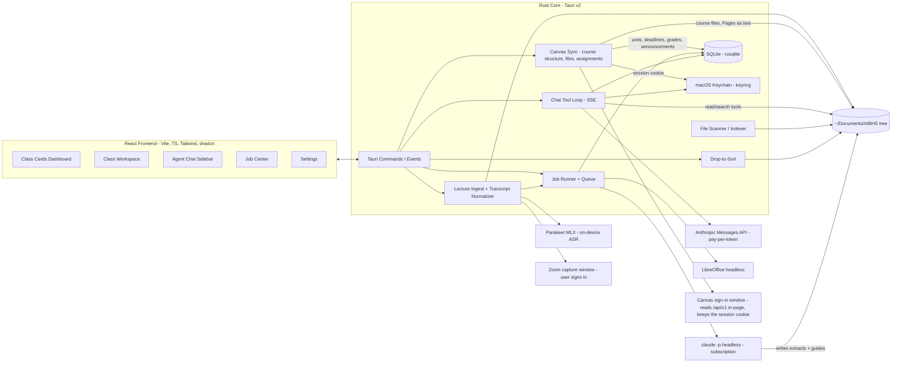

# ClassHub — End-to-End Specification

ClassHub is a personal, local-only macOS desktop app (Tauri v2) that serves as the centralized
hub for Daniel's master's program (AI in Biomedical & Health Sciences, Fall 2026). It ingests
class material from `~/Documents/AIBHS`, synthesizes dense high-yield HTML study guides using
the Claude Code (Max 20x) subscription, and provides an agent chat sidebar backed by the direct
Anthropic API with agentic retrieval over pre-extracted material.

This file is the single source of truth for the project. Each milestone below is designed to be
completed in **one dedicated coding session** to avoid context rot. See [Session protocol](#session-protocol).

---

## 1. Verified facts & hard constraints

These were verified on 2026-08-22. Do not re-litigate them in milestone sessions.

- **Agent SDK credit is PAUSED.** Anthropic announced (then paused before the June 15, 2026
  launch) a separate monthly Agent SDK credit. Current reality: `claude -p` / Agent SDK usage
  with subscription auth **draws from the normal subscription usage limits** (same rolling
  limits as interactive Claude Code). Source: support.claude.com article 15036540.
- **Headless subscription use is officially supported.** The locally installed `claude` CLI
  (v2.1.237 at `~/.local/bin/claude`) is logged in to the Max 20x subscription and `claude -p`
  uses those credentials.
- **Auth precedence gotcha (critical):** Claude Code resolves auth in this order:
  cloud creds → `ANTHROPIC_AUTH_TOKEN` → `ANTHROPIC_API_KEY` → `apiKeyHelper` →
  `CLAUDE_CODE_OAUTH_TOKEN` → interactive login. Because ClassHub also holds a console API key
  for the chat agent, **every spawned `claude` process MUST have `ANTHROPIC_API_KEY` and
  `ANTHROPIC_AUTH_TOKEN` removed from its environment**, or synthesis silently bills
  pay-per-token API credits instead of the subscription.
- **Chat agent uses the direct Anthropic Messages API** (pay-per-token, console API key).
  Deliberate choice: chat availability must be independent of subscription rate limits, which
  heavy synthesis jobs can exhaust.
- **Anthropic has no embeddings API.** RAG is agentic (grep/read over pre-extracted markdown),
  not vector-based. No embedding provider, no vector DB.
- **Claude cannot read `.pptx`.** It reads PDFs and images natively. LibreOffice
  (`soffice --headless --convert-to pdf`) converts PPTX → PDF during ingestion.
- **A Zoom recording link is read through a browser window, never fetched.** There is no
  supported way to pull a caption track from a share link: the Zoom API path needs
  host/admin OAuth that a student account does not have, whether a *viewer* may see the
  transcript is the host's setting, and a recording may sit behind institutional SSO or a
  passcode. So the link opens in a webview the user can sign in to, which is what §7.1's
  capture window is for. Measured 2026-09-02 on a UF cloud recording (Fundamentals,
  2026-09-01): the share link served Zoom's recording-player page to an anonymous GET with
  no redirect, no passcode gate and no sign-in; the player's Vuex store was populated 4.5 s
  after the window opened and exposed `ccUrl`; the caption fetched from it was a 102 KB
  WebVTT of 755 sentence-level cues, and the whole capture took 6.1 s. That track carries
  **no speaker names**: the room's one Zoom account recorded everyone, so for a lecture-hall
  recording the professor/student distinction is absent whichever route produced the text,
  and the digest says so in its header rather than inventing it. Measured again 2026-09-03 on
  two Applied Generative AI recordings: the Aug 25 session exposed no `ccUrl` and the store's
  `transcriptList` instead — 1,032 cues, every one carrying a name, ready 3.1 s after the
  window opened — so a room whose speakers sit on their own accounts does carry names; the
  Sept 1 session went the `ccUrl` route in 4.5 s with 629 unnamed cues, the first at 01:23 of
  a 3 h 17 m recording, because the caption opens where the captioning did and the transcript
  says nothing before it.
- **What one real session costs.** Measured 2026-09-02 on that 2 h 36 m recording, Opus at
  `xhigh`, list-price equivalents from the CLI's own accounting: the digest (§8.4) ran
  12.4 min over 5 turns for $3.06, writing 69k output tokens — the 75 KB session HTML fit in
  one `Write`, so the output cap was never reached; the Week 2 unit guide (§8.1), built from
  that one corpus note, ran 18.2 min over 34 turns for $5.59, 103k output tokens through the
  chunked Write-then-Edit pattern. Both draw on the subscription's rolling limits, not on
  credits. Measured again 2026-09-03 on Applied Generative AI, same model and effort: the
  digest of the named 2 h 56 m Aug 25 transcript ran 15.5 min over 8 turns for $3.98 (81k
  output tokens), the digest of the Sept 1 caption's 1 h 52 m stretch 8.8 min over 5 turns for
  $2.11 (49k), and the Part I guide built from those two notes ran 21.5 min over 36 turns for
  $7.86, 118k output tokens, 194 KB through one `Write` and ten `Edit`s — reading each note
  once, the week folders' deck and notebook, and neither transcript. Measured 2026-09-03 on
  Biostatistics' Week 3 session, a 2 h 06 m caption of 910 unnamed cues that a UF cloud
  recording again served to an anonymous GET, `ccUrl` ready in 4.6 s: the digest ran 12.4 min
  over 5 turns for $2.99 (70k output tokens). The Week 3 guide, built from that one note with
  no file listed — nothing but the transcript sits under its week folder — ran 20.9 min over 46
  turns for $7.86, 117k output tokens, 201 KB through one `Write` and nineteen `Edit`s; told
  the note alone, it found the Week 3 readings, the Week 3 coding material and the Module 3
  deck through `--add-dir` and read them, none of which its manifest names. Measured
  2026-09-08 on the same course with the prompts as §8 now states them, Opus at `xhigh`: the
  Sept 3 session distilled again with its two sidecars ran 18.5 min over 11 turns for $4.82
  (101k output tokens — 39 flagged items and 91 cards beside the note); the Week 3 guide
  rewritten with the flagged items, the objectives and the changes since Sept 3, and its
  cards file, ran 23.3 min over 53 turns for $10.60 (129k, 205 KB, 32 `New since` chips);
  the semester master, from 27 extracts and the one note with its roster off `units`, ran
  32.0 min over 74 turns for $18.38 (178k, 300 KB, 155 cards, no transcript opened); and a
  Week 3 practice exam focused on missing data, with the weights and Quiz 2's date in its
  rubric, ran 10.3 min over 18 turns for $3.64 (55k, 19 questions each carrying its
  `data-topic`). The manifests widened by what each log showed was read: the corpus note
  in all three guides' and the exam's, the deck and the notebook in the session's.
- **Parakeet is on the machine, but not reusable in place.** `mlx-community/parakeet-tdt-0.6b-v3`
  and `parakeet_mlx` ship inside LocalFlow's bundled venv, with `ffmpeg` on PATH. The resident
  LocalFlow process keeps the model loaded but exposes no socket or port, so it cannot be
  borrowed — each transcription pays its own model load. Its packaged `parakeet-mlx` console
  script also carries a stale shebang from the machine it was built on, so the module entry
  (`python -c "from parakeet_mlx.cli import app; app()"`) is what gets invoked. Measured
  2026-09-02 with exactly that invocation on 73 minutes of 16 kHz speech (the real Week 2
  transcript read aloud by macOS `say`, since Zoom published a caption for the session):
  49 s wall time including the model load, about **0.7 minutes of compute per hour of
  audio**, 548 sentence-level cues.
- **Parakeet does no speaker diarization.** Its output is unattributed text. Zoom's own caption
  track carries speaker names when the people speaking are on their own Zoom accounts, and for
  a lecture the professor/student distinction is most of what makes a transcript worth reading
  — so Zoom's track is always preferred, and Parakeet is the fallback for when the host
  published none. A lecture-hall recording made from the room's single account carries no
  names on either route (measured above).
- **The four courses do not share an organizational structure.** Read from the syllabi:

  | Class | The course's own divisions | Dates in syllabus |
  | --- | --- | --- |
  | Fundamentals of AI in Medicine I | 14 weekly topics, no grouping | yes (Aug 25 …) |
  | Biostatistics for AI | 15 weekly topics, no grouping | yes (08/20 …) |
  | Applied Generative AI in Medicine | 3 Parts spanning 16 weeks | no |
  | AI in Health Design Studio I | 15 weekly topics, no grouping | yes (Aug 26 …) |

  So there is no uniform "weeks 1–15" and no universal module layer: 14 / 15 / 16 / 15.
  Three of the four declare no grouping above the weekly topic at all (Design Studio's
  weeks were read by its syllabus scan, 2026-09-03). The app therefore reads
  each course's own structure (§7.2) rather than imposing one, and never assumes a hand-made
  folder is the course's real division.
- **Weeks are not uniformly spaced.** Fundamentals runs Week 13 on Nov 17 and Week 14 on Dec 1,
  skipping Thanksgiving. A week number can never be computed as `(date − start) / 7`; it comes
  from the course's own schedule.
- **Canvas offers exactly one usable way in, and it is not a credential.**
  `https://ufl.instructure.com/api/v1/` is live (401 unauthenticated) and exposes
  `/courses/:id/modules?include[]=items`, `/files`, `/folders` and `/assignments` — the
  authoritative course structure, without a human transcribing it. Both credentialed paths are
  closed by the same administrators:
  - **Personal access token** — disabled. Canvas answers *"Your Canvas administrators have
    chosen to limit your ability to generate your own access token."* Verified 2026-08-26.
  - **OAuth2** — equally gated, and not a fallback. The flow needs a developer key
    (`client_id`/`client_secret`) that only an institution admin can issue, usually after a
    security review; without an enabled key Canvas returns `unauthorized_client`. There is no
    self-service path for a student account.

  - **`POST /api/v1/users/:id/tokens`** — the same permission gate as the UI button. Reaching
    for it would be routing around a control an administrator deliberately set, which is a
    different act from reading data the account can already read. Not used.

  Existing `Canvas for iOS` tokens in the account are not a loophole either: Instructure's
  mobile apps run on Instructure's own globally-enabled developer keys, which is exactly why
  OAuth2 works for them and cannot for us. Regenerating one would break the real iOS app and
  would file ClassHub's traffic under Instructure's key in UF's audit logs.

  What works is **session reads**, verified end to end on 2026-08-26: UF SSO (Shibboleth and
  Duo) completes inside an embedded `WKWebView`, and `/api/v1` then honours that window's own
  session cookie for same-origin GETs — `/users/self` returns the real user and
  `/courses?enrollment_state=active` the enrolled courses. This is how in-Canvas theme
  JavaScript queries it. The constraint is strict: the request must originate from a page
  Canvas served, so it is issued *inside* the signed-in page and never by a native HTTP client
  holding copied cookies (§7.2). Session and cookie authentication appear **nowhere** in
  Instructure's OAuth2 or access-token references — an undocumented side effect, not a
  supported integration, and nothing should assume it is contractual.

  The line this app holds: reading through the user's own session automates their own browsing;
  minting a credential through it does not. Only the first is done. Keeping the session's own
  cookie so it survives a relaunch stays on the first side of that line — it is the credential
  Canvas already issued to the browser, extended in duration and not in reach.

  Two properties of that session were measured rather than assumed:

  - **Canvas issues it as a session cookie, so the app keeps it itself.** `canvas_session` and
    `log_session_id` arrive with neither `Expires` nor `Max-Age`. WKWebView holds expiry-less
    cookies in memory and never writes them to its own jar, so quitting the app ends the
    session — measured 2026-08-27 against that jar, which held Duo's month-long device-trust
    cookie from the same runs and not one cookie for `ufl.instructure.com`. This is a property
    of what Canvas sends, not of the webview's configuration: the data store is persistent and
    on disk. ClassHub therefore stores those cookies itself (§7.2), and a relaunch reads Canvas
    without a sign-in. The window still opens hidden — a live session is read without ever
    putting a window on screen — and is shown when Canvas genuinely asks for a sign-in, and
    also once a read has run long enough that hiding it would be hiding a stall, which a
    multi-megabyte download routinely does.
  - **The in-page rule covers file bytes too.** `/files/:id/download` refused every request
    issued from `reqwest` with cookies read out of the webview (403, all files) — the session
    lives in cookies the webview does not hand out. Fetched from inside the page it serves
    normally, so a downloaded file comes back base64 through the same channel as everything
    else.

- **No course publishes Canvas Modules.** Read from all four courses on 2026-08-26:
  `/courses/:id/modules` returns an empty list for every one of them. Canvas therefore supplies
  no course structure today, and the syllabus is the operative source for `units` (§7.2). What
  Canvas does hold is worth having on its own: assignments with true due dates, and course
  files organized into the professor's own folders. Assignment due dates arrive as UTC
  instants, and the semester straddles the DST change — a fixed offset puts one of this term's
  two assignments on the wrong day — so they are converted through the machine's real timezone.
- **No course weights its assignment groups.** Read from all four courses on 2026-09-03:
  `apply_assignment_group_weights` is false on every course and every group's `group_weight`
  is 0, so Canvas knows the names of the grading categories and never what they are worth —
  category weights come from the syllabus, read by the syllabus scan (§11), and a Canvas sync
  leaves them alone (§7.2). The groups themselves: Fundamentals and Applied Generative AI declare one
  (`Assignments`); Design Studio three (`Studio Participation`, `Quizzes`, `AI Design
  Project`); Biostatistics four (`Assignments`, `Quizzes`, `Project`, `Survey`). Biostatistics
  publishes no assignments at all in Canvas — Quiz 1 is not there — and on that date no course
  had graded or posted a submission, so a grade item had yet to exist for the sync to record.
  Both submissions on record (Fundamentals' live coding session, Design Studio's Python
  introduction) carried `submitted_at` and nothing else.

- **What the professor writes on Canvas.** Read from all four courses on 2026-09-03:
  - **Every course posts announcements** — Fundamentals 1, Design Studio 4, Biostatistics 2,
    Applied Generative AI 2, all since Aug 20, each a `DiscussionTopic` with an HTML `message`
    and a `posted_at`. `/announcements?context_codes[]=course_<id>` answers only the last
    fourteen days unless `start_date` says otherwise, which after mid-September would drop the
    welcome posts; the course's `discussion_topics?only_announcements=true` returns the same
    objects with no window, and is what the sync reads (§7.2).
  - **Every course keeps Pages** — 6, 5, 5 and 1, all published — and the courses whose Modules
    are empty keep their weekly content there: Fundamentals' `Module 1`–`Module 4` and `Lecture
    Slides`, Biostatistics' `Module 1`–`Module 3` and `Resources`, Design Studio's two modules
    and `AI Design Project`; Applied Generative AI has only `Home`. `include[]=body` puts each
    page's HTML on the listing, so a course's Pages cost one request. A `Home` page is 15 KB of
    Canvas markup that strips to about 1 KB of text.
  - **Every `syllabus_body` is a one-line stub** linking the syllabus PDF the tree already holds
    — Applied Generative AI's included, so its missing dates are on no Canvas surface either.
    Read off the course listing with `include[]=syllabus_body`, which costs no request.

  Canvas also exposes **GraphQL** at `POST /api/graphql`, whose permissions mirror REST. It
  would collapse a whole sync into one round trip, but being a POST it needs the `X-CSRF-Token`
  header read from the `_csrf_token` cookie. REST GETs need no CSRF and the rate limit is 700
  requests / 10 minutes — far above a full sync — so REST is the default and GraphQL is an
  optimization only if request counts ever justify the extra moving part.
- Toolchain verified installed: Rust 1.96.1, Node v26.3.1, Homebrew, and LibreOffice
  (`brew install --cask libreoffice`), which §7 step 2 runs headless.

## 2. Prerequisites

| Prerequisite | Needed by | Status |
| --- | --- | --- |
| `claude` CLI logged in to Max 20x subscription | Milestone 3 | Done |
| LibreOffice (`brew install --cask libreoffice`) | Milestone 4 | Installed |
| Anthropic console API key with usage credits | Milestone 7 | Obtained |
| LocalFlow (supplies Parakeet + `parakeet_mlx`) and `ffmpeg` | Milestone 12 | Installed |

## 3. Architecture



**Stack:** Tauri v2 (Rust backend) + React 19 + Vite + TypeScript + Tailwind CSS + shadcn/ui.
SQLite via `rusqlite` (bundled) in the Tauri app-data dir. Streaming from Rust to the frontend
via Tauri events. No Python anywhere in the stack.

## 4. Filesystem conventions

The AIBHS tree is the **source of truth**. ClassHub reads it directly and writes only to the
designated locations below. The AIBHS root path is configurable (default `~/Documents/AIBHS`).

```
~/Documents/AIBHS/
├── Biostatistics for AI/                  ← one folder per class (4 total)
│   ├── Weeks/                             ← WHERE A LECTURE LIVES (§7.1), every class
│   │   ├── Week 01 — Intro to Biostatistics/
│   │   │   ├── 2026-08-20 — Lecture.md    ← the normalized transcript, SOURCE material
│   │   │   └── Slides/                    ← anything else specific to that week
│   │   └── Week 02 — Study Designs/
│   ├── Module 1/                          ← a unit folder, when the course has one (§7.2)
│   │   ├── Slides/                        ← .pptx lecture slides
│   │   ├── Reading Material/              ← .pdf readings
│   │   └── R Files/
│   │       ├── Class Files/               ← provided .Rmd / .html
│   │       └── Edited Files/              ← Daniel's classwork (.R)
│   ├── Study Guides/                      ← APP-MANAGED: generated artifacts
│   │   ├── Module 1.html
│   │   ├── Semester Master.html
│   │   ├── Practice/                      ← generated practice exams
│   │   └── Sessions/                      ← generated per-lecture session documents
│   │       ├── 2026-08-20 — Central Tendency.html
│   │       └── 2026-08-20 — Central Tendency.md
│   ├── Notes/                             ← APP-MANAGED: per-class markdown notes
│   ├── _Inbox/                            ← APP-MANAGED: drop-to-sort staging
│   └── .classhub/
│       ├── extracts/                      ← APP-MANAGED: hidden extraction cache,
│       │   ├── Module 1/Slides/Biostatistics_Module1_Slides_class2.pptx.md
│       │   └── Canvas/                    ← the course's Canvas Pages and syllabus page as
│       │       ├── Module 2: Study Designs.md   text (§7.2); no source file, so not
│       │       └── Syllabus.md                  `files` rows and in no guide manifest
│       └── corpus/                        ← APP-MANAGED: distilled lecture contributions,
│           └── Week 02 — Study Designs/2026-08-27 — Lecture.md   keyed by unit (§8.5)
└── ... (3 more class folders)
```

Rules:

- Folder structure inside each class is **arbitrary and user-owned**; never assume the exact
  layout above. Scanner and agents must tolerate any nesting.
- Extract paths mirror the source file's relative path with `.md` appended, under
  `.classhub/extracts/`. LibreOffice conversions live alongside, named for the source and
  what it became — `<name>.pptx.pdf`, `<name>.docx.html` — each with a `.sha256` sidecar
  naming the source hash it was made from, so an unchanged file is never converted twice.
- `Study Guides/`, `Notes/`, `_Inbox/`, `.classhub/` are excluded from scanning, drop-to-sort
  proposals, and staleness computation of source material.
- **`Weeks/` is storage, and for these four courses it also settles scope.** A lecture goes
  there because a lecture happens at a time. Each course meets once a week and divides itself no
  finer than a week, so the week a lecture was filed under is the division it belongs to (§8.5).
  The two axes are kept separate anyway: a course that divided itself finer than its meetings
  would need them apart, and nothing about storing a lecture by date assumes otherwise. The
  same rule reads the rest of the folder: a deck or a notebook filed under a week folder is
  that week's material, and the division the week feeds counts it among its sources (§8.5).
- `Weeks/` is **not** app-managed. A transcript is source material like a slide deck: the
  scanner indexes it, extraction routes it through the zero-token text path, and chat searches
  it. Filing it in the tree is what joins it to the pipeline rather than parking it beside.
- The app never deletes source files. Moves happen only through the confirmed drop-to-sort flow
  and are audit-logged.

## 5. Data model (SQLite)

Migrations run at startup (numbered SQL files embedded in the Rust binary). Schema:

```sql
classes(id INTEGER PK, folder_name TEXT UNIQUE, display_name TEXT, code TEXT,
        color TEXT, room TEXT, instructors TEXT, credits INTEGER,
        grading_basis TEXT, final_exam_start TEXT NULL, final_exam_end TEXT NULL,
        -- Which Canvas course this matched, and when it last synced. Neither is
        -- a credential: the mapping is how a sync shows it read the right course
        -- rather than asserting it, and the stamp is what Settings displays.
        canvas_course_id TEXT NULL, canvas_synced_at INTEGER NULL);

meetings(id INTEGER PK, class_id INTEGER FK, weekday INTEGER,  -- 1=Mon .. 7=Sun
         start_time TEXT, end_time TEXT, periods TEXT);

files(id INTEGER PK, class_id INTEGER FK, rel_path TEXT, sha256 TEXT, size INTEGER,
      mtime INTEGER, kind TEXT,            -- pptx|pdf|docx|rmd|r|py|ipynb|html|md|csv|
                                           -- caption|media|other, by extension (§7)
      extract_rel_path TEXT NULL, extracted_at INTEGER NULL,
      extracted_sha256 TEXT NULL,          -- hash of source when extract was made
      UNIQUE(class_id, rel_path));

jobs(id INTEGER PK, kind TEXT,             -- extract|module_guide|master_guide|sort_proposal|syllabus_scan|practice|lecture_digest
     class_id INTEGER NULL, scope TEXT NULL,  -- e.g. module rel path, or 'master'
     status TEXT,                          -- queued|running|succeeded|failed|cancelled
     session_id TEXT NULL,                 -- claude session id (for --resume)
     payload TEXT NULL,                    -- kind-specific completion data; survives a restart for --resume
     owner_pid INTEGER NULL,               -- the process running it (§6); NULL is a row from a
                                           -- build before the column, treated as orphaned
     created_at INTEGER, started_at INTEGER NULL, finished_at INTEGER NULL,
     log_path TEXT NULL, error TEXT NULL, summary TEXT NULL);

-- A course's own divisions, whatever that course calls them (§7.2). This is what
-- replaces "a top-level folder is a module": Biostatistics and Fundamentals divide
-- into weekly topics and declare no modules at all, Applied Generative AI declares
-- three Parts, and Canvas may say something different again. `kind` and `name` carry
-- the course's own words; the app never shows the word "unit" to the reader. A
-- division's identity is the course's own label for it: `number` is what the name
-- opens with — 7 for `Week 7 — …`, 2 for `Part II:` — and with `source` and `kind`
-- it is what a rescan matches on, after the Canvas id and the exact name, so a model
-- that spells a name differently updates the row rather than forking it. The ordinal
-- is the position in the list, which an inserted `No class` row shifts. The weeks a
-- Part spans are data on the row (§8.5), never read back out of its name.
units(id INTEGER PK, class_id INTEGER FK, ordinal INTEGER,
      kind TEXT,             -- module|week|part, as the course names it
      name TEXT,             -- 'Module 3' | 'Week 7 — Tree-Based Models' | 'Part II'
      number INTEGER NULL,   -- the label's number; NULL for 'Reading Days — No Class'
      canvas_id TEXT NULL,   -- set when Canvas is the source
      rel_path TEXT NULL,    -- its folder, when it has one; units need not be folders
      starts_on TEXT NULL, ends_on TEXT NULL,
      first_week INTEGER NULL, last_week INTEGER NULL,  -- the weeks it spans, where it groups them
      objectives TEXT NULL,  -- JSON array of strings: what it set out to teach, as the syllabus states (§11)
      source TEXT,           -- canvas|syllabus — which reader declared it, canvas winning
      UNIQUE(class_id, name),
      UNIQUE(class_id, source, kind, number) WHERE number IS NOT NULL);

-- One span of one lecture, mapped to one unit (§8.5) — the join that lets a lecture
-- stored by date feed a guide scoped by topic. A lecture contributes its whole length
-- to one unit today, since no course divides itself finer than its meetings; the span
-- columns are what the table would need if one ever did.
lecture_contributions(id INTEGER PK, class_id INTEGER FK, unit_id INTEGER FK,
                      rel_path TEXT,          -- the transcript this span is cut from
                      start_ms INTEGER, end_ms INTEGER,
                      start_line INTEGER, end_line INTEGER,  -- resolved from ## HH:MM anchors
                      corpus_rel_path TEXT,   -- the distilled note under .classhub/corpus/
                      summary TEXT,
                      confidence TEXT,        -- high|medium|low
                      status TEXT,            -- applied|pending|dismissed
                      created_at INTEGER,
                      hints_read_at INTEGER NULL,  -- when a digest last read it for what was flagged (§8.4)
                      UNIQUE(class_id, rel_path, unit_id, start_ms),
                      UNIQUE(class_id, corpus_rel_path));  -- one note per name in a division (§8.5)

-- Also holds session documents (§8.4) under scope 'session:<transcript rel path>',
-- so they inherit the viewer, the listing and staleness without a table of their own.
-- Naming the source file rather than the date keeps the scope unique per transcript,
-- which turns a re-run into an update and gives staleness something real to hash.
-- A division's guide is scoped `unit:<id>` — the row's id, never its name, so a
-- rescan that renames the division (§7.2) leaves its guide keyed; the guide file
-- and the corpus folder, both named for the division, follow the name instead.
-- A practice exam's row is scoped by its file, `practice:<rel path>` (§8.3), so
-- several exams of one scope each keep a row. The manifest is what the job was
-- told about, widened by what its own log shows it read (§7 step 5).
guides(id INTEGER PK, class_id INTEGER FK, scope TEXT,  -- folder rel path | 'master' | 'unit:<id>' | 'session:<path>' | 'practice:<path>'
       rel_path TEXT, generated_at INTEGER,
       source_manifest TEXT,               -- JSON: [{rel_path, sha256}] used for staleness
       UNIQUE(class_id, scope));

-- The ledger of what the professor flagged (§8.4): one row per item of a
-- digest's hints sidecar, keyed by the contribution it was distilled with, so
-- a redistill replaces them, a refile carries them, and a lecture that leaves
-- the tree takes them along. `anchor` is an `HH:MM` the transcript's own
-- headings resolve, so the Flagged section can open the transcript there.
lecture_hints(id INTEGER PK, class_id INTEGER FK, unit_id INTEGER FK,
              contribution_id INTEGER FK,   -- lecture_contributions(id), cascading
              kind TEXT,                    -- emphasis|exam_hint|correction|confusion|action|thread
              text TEXT, anchor TEXT NULL, created_at INTEGER);

-- `canvas_assignment_id` is the join between a deadline, a score and the thing
-- on Canvas (§7.2): set by approval of a Canvas card, or on first contact for a
-- row the syllabus put here on the same title and day. Unique per class where
-- set, so a submission finds exactly one deadline to close.
deadlines(id INTEGER PK, class_id INTEGER FK, title TEXT, kind TEXT,  -- assignment|exam|quiz|project|other
          due_at TEXT, notes TEXT NULL, status TEXT,  -- open|done
          source TEXT,                     -- manual|agent|syllabus|canvas
          canvas_assignment_id TEXT NULL);

-- A category is a Canvas assignment group when `canvas_group_id` is set, and an
-- item a graded, posted submission when `canvas_assignment_id` is; the sync
-- upserts on those ids, so a re-sync updates in place. Rows typed by hand or
-- recorded by chat carry neither, and a hand-made category with a group's
-- name is claimed rather than duplicated. Unique where set: per class for a
-- group, globally for an assignment (Canvas assignment ids are global).
grade_categories(id INTEGER PK, class_id INTEGER FK, name TEXT,
                 weight REAL CHECK (weight >= 0 AND weight <= 100),
                 canvas_group_id TEXT NULL);
grade_items(id INTEGER PK, category_id INTEGER FK, name TEXT,
            score REAL CHECK (score >= 0), max_score REAL CHECK (max_score > 0),
            graded_at TEXT NULL,
            canvas_assignment_id TEXT NULL);

-- The drop-to-sort confirm queue (§10). Nothing here has moved anything;
-- approval is what performs the move.
move_proposals(id INTEGER PK, class_id INTEGER FK,
               source_rel_path TEXT,       -- class-relative, exists on disk at proposal time
               dest_rel_path TEXT,         -- class-relative target incl. filename
               reasoning TEXT,
               confidence TEXT NULL,       -- high|medium|low from sort jobs; NULL from chat
               source TEXT,                -- chat|sort_job|canvas|by_name
               status TEXT,                -- pending|approved|dismissed
               created_at INTEGER, resolved_at INTEGER NULL);

-- The proposed-deadline confirm queue (§11), so proposals survive an app restart
-- between proposal and confirmation. Both readers land here — the syllabus scan
-- and the Canvas sync — and approval carries the row's own `source` and Canvas
-- id onto the deadline. One row per (class, assignment) where the id is set: a
-- moved due date refreshes the card, and a card whose deadline was deleted by
-- hand comes back as the same row. Nothing here has created a deadline.
deadline_proposals(id INTEGER PK, class_id INTEGER FK, title TEXT, kind TEXT,
                   due_at TEXT, notes TEXT NULL,
                   status TEXT,            -- pending|approved|dismissed
                   source TEXT,            -- syllabus|canvas
                   canvas_assignment_id TEXT NULL,
                   created_at INTEGER, resolved_at INTEGER NULL);

-- What the professor said (§7.2): the course's Canvas announcements, read on
-- every sync and kept as a record — the workspace lists them newest first
-- and the chat overview carries the latest few. No unread state, nothing
-- waiting on a decision. The body is Canvas's HTML stripped to text; the app
-- never renders Canvas HTML. Keyed on the Canvas id, which is global, so a
-- re-sync updates an edited announcement in place.
announcements(id INTEGER PK, class_id INTEGER FK, canvas_id TEXT UNIQUE,
              title TEXT, body TEXT,
              posted_at TEXT);             -- local wall-clock ISO, YYYY-MM-DDTHH:MM

chat_sessions(id INTEGER PK, title TEXT, created_at INTEGER);
chat_messages(id INTEGER PK, session_id INTEGER FK, role TEXT,
              content TEXT,                -- JSON: full Messages-API content blocks
              created_at INTEGER);

audit_log(id INTEGER PK, action TEXT, payload TEXT, created_at INTEGER);
settings(key TEXT PK, value TEXT);         -- API key lives in Keychain, NOT here
```

**Seed data** (inserted by the first migration; codes stored as metadata but never displayed):

| display_name | folder_name | code | color | meetings | room | instructors | credits | final exam |
| --- | --- | --- | --- | --- | --- | --- | --- | --- |
| Fundamentals of AI in Medicine I | Fundamentals of Artificial Intelligence in Medicine I | CAI5720 | blue | Tue 16:05–19:05 (periods 9–11) | JAX1 231 | Zhenhong Hu, Yijiang Chen | 3 | — |
| AI in Health Design Studio I | AI in Health Design Studio I | CAI5724 | orange | Wed 17:10–18:00 (period 10) | JAX1 231 | Benjamin Shickel | 1 | 2026-12-07 20:00–22:00 |
| Biostatistics for AI | Biostatistics for AI | CAI5731 | green | Thu 11:45–13:40 (periods 5–6) | JAX1 231 | Esra Adiyeke, Tezcan Ozrazgat Baslanti | 2 | — |
| Applied Generative AI in Medicine | Applied Generative AI in Medicine | CAI6734 | amber | Tue 11:45–14:45 (periods 5–7) | JAX1 231 | Akshith Ullal, Xuefeng Liu | 3 | — |

All grading bases are Letter Grade. `display_name` intentionally drops "Artificial Intelligence"
verbosity only where it keeps cards clean; UI always uses `display_name`, never `code`.

## 6. Claude Code job runner

The job runner is the single gateway to the subscription. All heavy-token work (extraction,
guides, master file, sort proposals, syllabus scans, practice exams) flows through it.

**Invocation template** (Rust `std::process::Command`):

```
claude -p <prompt>
  --output-format stream-json --verbose
  --model <per job kind, see below>
  --allowedTools <per job kind, see below>
  --add-dir <class folder absolute path>
```

- **cwd** = the class folder.
- **Environment**: inherit, then **remove `ANTHROPIC_API_KEY` and `ANTHROPIC_AUTH_TOKEN`**
  (see §1). A startup self-check job asserts the active auth is the subscription (the
  stream-json init event exposes the auth/rate-limit type) and surfaces a blocking warning
  in the UI if not.
- **Tool scoping by job kind** (least privilege). `--allowedTools` is additive against
  the user's own claude config and does not restrict, so the **deny** list is the actual
  boundary and both are passed:
  - Never allowed, any kind: `Bash,WebFetch,WebSearch,Task` — `Task` because a spawned
    sub-agent is a path around the parent's tool scoping.
  - `extract`, `module_guide`, `master_guide`, `practice`, `lecture_digest`: allow
    `Read,Glob,Grep,Write`.
  - `sort_proposal`, `syllabus_scan`: allow `Read,Glob,Grep`, and additionally deny
    `Write,Edit,MultiEdit,NotebookEdit` (read-only is only real if the writes are denied).
- **Write scope is verified, not trusted**: `--add-dir` grants read and write together, so a
  write-capable job can physically reach every source file in the class folder. Sources are
  fingerprinted by (size, mtime) before the spawn and compared after; a run that changed
  anything outside `Study Guides/` and `.classhub/extracts/` is demoted to failed, records
  nothing, and its full path list is written to `audit_log`. This is what enforces §4's
  promise that the app never destroys source material.

  The app itself moves files while a job runs — an approved sort or Canvas move, a drop or a
  Canvas download staged into `_Inbox/`, a lecture filed into `Weeks/`, a note saved — and
  none of that is the job's doing. Each of those writes an audit row naming its paths, and
  the compare reads the rows for the job's window and takes those paths out of the touched
  list. Exclusion is by audit row, never by the shape of the change: a rename with no row
  behind it is still the job's, and a file the app moved is cleared only while it still
  carries the size and mtime it had where it came from, so a job that rewrote it after the
  move is still caught. The corollary is that every app write into source material must be
  audited, because the audit log is what tells the guard "that was us".

  The job's own stream log is the third thing the compare reads. `Bash` is denied to every
  kind, so the log at `logs/job-<id>.jsonl` is a complete account of what the run touched:
  a changed path the log shows no `Write` or `Edit` to was not the run's — the owner's own
  edit beside a running extract, a file re-rendered by hand — and is dropped from the
  touched list, while a logged write outside `Study Guides/` and `.classhub/` still fails
  the job. The deny list stays the boundary; the log only says which of the changes inside
  it were the run's. A log that cannot be read leaves the guard strict.
- **Models**: one global model/effort pair, set in Settings and read at spawn time so a
  change applies to the next job — queued ones included. Defaults to Opus at `xhigh`.
- **Streaming**: parse stream-json lines into typed events (init, assistant text deltas, tool
  use, result). Persist raw lines to `log_path`; forward condensed progress events to the
  frontend via Tauri events (`job://{id}/progress`).
- **Queue**: max 2 concurrent jobs; `master_guide` runs exclusively (queue drains first).
  Jobs are cancellable (kill child process, mark `cancelled`).
- **Resumability**: store the claude `session_id` from the init event; failed/interrupted
  `master_guide` jobs offer "Resume" which re-invokes with `--resume <session_id>`.
- **Two processes, one table.** The installed app and a dev build share the database (§13), so
  every row records the process that enqueued it (`owner_pid`). Startup recovery fails only
  rows whose owner is gone — a live process's job is left alone, and a row from a build that
  predates the column counts as orphaned. The automatic extract enqueue checks for an active
  job and inserts in one transaction, so two launches in the same minute yield one job; the
  user-triggered guards (one sort, one scan, one guide per scope) read the table before
  enqueuing. Cancel stays per-process, because the child handle lives where it was spawned:
  cancelling a row a live process elsewhere owns says so, and a row whose owner is gone is
  settled in place, since recovery runs only at launch.
- **The self-check runs once a day**, not once a launch: when the latest self-check verdict is
  a success within the last 24 hours it stands and is restored at launch; anything else — a
  failure, or no check at all — runs it. The manual re-run behind the auth warning is
  unconditional.
- Prompts are Rust-side templates (askama or `format!` with named sections) versioned in
  `src-tauri/prompts/`. Each prompt states: role, exact output path(s), output contract,
  and what NOT to do (no source edits, no files outside the contract).

## 7. Ingestion & extraction pipeline

Goal: every source file gets a clean markdown extract under `.classhub/extracts/` so the chat
agent and synthesis prompts can search text instead of re-reading binaries.

1. **Scan** (on launch, on window focus, and manual refresh): walk each class folder
   (excluding app-managed dirs), upsert `files` rows with sha256 + mtime. Detect
   added/changed/removed files by hash. A file the index held and the walk did not loses
   its row, and its mirror entries go with the row once the scan has committed — the
   extract, any conversion and its sidecar, and the mirror folders they emptied, up to the
   mirror root — because an extract nothing points at would go on answering chat's search
   for a file that is not there. That holds whether the file was deleted, moved (the walk
   finds its new path as new material) or parked under an app-managed folder; a transcript
   is settled first (§8.5), and a row a refused settle keeps keeps its extract.
2. **Convert**: for `.pptx` files, run
   `soffice --headless --convert-to pdf --outdir <extracts mirror dir> <file>`
   producing `<name>.pptx.pdf`; for `.docx` files the same subprocess with
   `--convert-to "html:HTML (StarWriter):EmbedImages"`, producing `<name>.docx.html`
   (images inlined so the export is one file rather than a scatter of PNGs beside it).
   Both skip when the sidecar carries the current source hash (§4).
3. **Extract** (per changed file, batched into one `extract` job per class per run):
   - Text-native formats (`.Rmd`, `.R`, `.md`, `.py`): local Rust extraction (copy /
     light normalization). `.csv`: the first 300 lines and a note of the total, since an
     extract exists to be searched, not to hold a dataset. `.html` (R-rendered notebooks)
     and the converted `.docx.html`: local tag-strip to text, with soft line breaks in
     prose folded to spaces so a phrase LibreOffice wrapped stays on one line for search;
     a docx's figures are lost, which is acceptable for a document. `.ipynb`: flattened
     locally — markdown cells verbatim, code cells fenced with the kernel's language,
     `stream` and `text/plain` outputs kept and capped per cell, image outputs replaced
     by `[Figure: image output]`. No tokens spent on any of these.
   - Visual formats (`.pdf`, converted PPTX-PDFs): `claude -p` extraction. The prompt
     instructs: read the PDF, produce a faithful markdown extract preserving structure,
     tables, formulas, code; **describe every figure/diagram/chart in brackets**
     (e.g. `[Figure: scatterplot of X vs Y showing positive correlation]`); write to the
     mirrored extract path.
4. **Record**: update `extract_rel_path`, `extracted_at`, `extracted_sha256`.
5. **Staleness**: a guide's `source_manifest` is what the job was told about, at the hashes
   captured when it was enqueued, widened at finalize by what the job's own stream log
   shows it read — every `Read` path and every file a `Grep` result names, a `Glob` being
   a listing and not a read. An extract or converted twin it opened counts as the source
   file it mirrors, with the index's hash; a corpus note, a Canvas page mirror or one of
   the reader's notes counts as itself, hashed from disk; its own output and anything
   under `_Inbox/` never count. A listed source the job never opened stays — it was told
   about it, and a change to it is still a reason to rebuild — so the union only widens,
   and a file the job found through `--add-dir` counts as honestly as one it was listed.
   A guide is stale when the diff between its manifest and its sources is not empty: an
   entry of the scope's current set the manifest never named (added), a named entry whose
   hash moved (changed) — an entry outside the scope's own set resolved through the index
   or the disk — or a named entry that is gone (removed). The three lists are what the
   row says (`Rewrite · 2 files added, 1 changed`) and what a rewrite's prompt is told.
   Computed on demand and refetched after a scan that changed the index; surfaced as
   badges.

Extraction is triggered automatically after a scan finds changes (extraction is cheap:
sonnet + mostly local), but **guide synthesis is never automatic**.

Caption tracks (`.vtt`, `.srt`, and `.txt`, since Zoom's in-meeting transcript is a caption
track in everything but extension) found in the tree are extracted locally through the same
normalizer §7.1 uses — the searchable copy is the merged prose, not the timing grid. Media
files are indexed but never extracted: transcribing is minutes of compute, so it happens when
a lecture is explicitly added, never as a side effect of a scan noticing an `.mp4`.

## 7.1 Lecture transcripts

A recording reaches the app as one of three things, and they converge on one path: whatever
came in becomes cues, the cues become markdown, the markdown is filed as source material.

1. **Caption track** (`.vtt` / `.srt` / Zoom's in-meeting "Save Transcript" `.txt`) — read
   directly. Preferred whenever it exists, because it carries speaker names.
2. **Media file** — transcribed on-device by Parakeet (§1), invoked as a bounded subprocess
   the way LibreOffice is. The interpreter path is a Setting, defaulting to LocalFlow's.
3. **Zoom recording link** — a webview opens the link, the user completes SSO and any
   passcode themselves, and the transcript is read out of the authenticated page via
   `eval_with_callback`. Deliberately **no JS injection into the app and no remote-IPC
   grant**: zoom.us is read, and never becomes a caller into ClassHub. The capture window
   needs no capability entry for exactly that reason — it calls no commands.

   The recording player is a Vue 2 app on `#app`, and its Vuex store is the source:
   `ccUrl` (the caption file the player itself offers), else `transcriptList`
   (`{username, ts, endTs, text}`). Reading the store rather than the rendered panel is
   not a shortcut but the only correct route — the panel is a `vue-recycle-scroller`, so
   the DOM holds only the rows currently on screen, and scraping it would return twenty
   cues of a three-hour lecture while looking like it had worked.

   When the store exposes no caption track because the host disabled viewer transcripts,
   `viewMp4Url` is downloaded with the same session's cookies and routed to (2). That
   degradation is why on-device transcription earns its place rather than duplicating Zoom.

   On a UF cloud recording (measured 2026-09-02, §1) the probe's states run `waiting`
   (page loaded, no store yet, 1.5 s) → `fetching` (store up with `ccUrl`, 4.5 s) → `ready`
   (6.1 s), with no `login` or `passcode` state in between; `ccUrl` is the route that pays
   off, and the track it serves is sentence-level WebVTT with no speaker prefix. Each state
   change and the final route are written to stderr with their timings, because the window
   closes on success and nothing else records what the page looked like.

**Normalization** is pure, local and zero-token. A raw caption track is one cue per couple of
seconds, so a lecture arrives as thousands of fragments — unreadable, and hostile as input to
a digest prompt. Consecutive cues from one speaker merge back into paragraphs, breaking on a
speaker change, a long pause, or a soft length cap at a sentence boundary, with an `## HH:MM`
anchor every five minutes so a digest can cite a time that scrubs to the right moment. An
anchor carries the start time of the paragraph that opens its five-minute section, so the
sequence is irregular where a paragraph runs across a boundary (the real Week 2 transcript
opens `00:08`, `00:17`, `00:20`, `00:25` …: the mic was off for eight minutes, and one
paragraph spanned the 00:15 mark). Zoom punctuates sparsely, so a merged paragraph can run
well past the soft cap before a sentence ends; the digest's `Read` returned every such
paragraph whole.

Speaker attribution is a guess with a corroboration rule: a multi-word `Name:` prefix is taken
as a display name, but a single-word one has to recur before it counts, because `Danny:` and
`Remember:` are the same shape in isolation and only differ across a whole file.

**Filing** puts every transcript at `<Class>/Weeks/Week NN — <topic>/<date> — <title>.md`, the
topic being the week's own name where the course names its weeks; a course that groups them
under Parts and names none files into a bare `Weeks/Week NN/`.

A lecture is filed by *when it happened*, and for these four courses that also settles what it
counts as covering (§8.5). The week comes from the course's own schedule
(§7.2), because breaks make arithmetic wrong: Fundamentals runs Week 13 on Nov 17 and Week 14
on Dec 1. The Add lecture form shows the resolved week and lets it be corrected. A course whose
divisions name week ranges and no days — Applied Generative AI — has sixteen weeks to file into
and no date to resolve one against, so the form asks outright, each week's option naming the
Part it feeds; left unpicked, the session goes to `_Inbox/` for the sorter, as any unresolved
week does. A course that declares no weeks at all has nowhere to file a session and no
week folder for the sorter to propose, so the form says so and the filing is refused before
the capture, naming the syllabus scan as the way out. Two lectures of one Part on one date need titles of their own: a note is keyed by its
division and its transcript's name (§8.5), so a filing whose note path another transcript of the
class already holds — or whose note already exists on disk — is refused before the capture, and
the refusal names the title as the way out.

A transcript whose week cannot be resolved lands in `_Inbox/` and the §10 sorter proposes one.
A transcript's *name* carries no routing signal — they are all a date and "Lecture" — so the
inbox listing carries a line of its subject matter and the sorter routes it by content.

Ingestion never overwrites: a second lecture on one date, or re-adding the same one, gets a
` (2)` suffix rather than replacing a file.

## 7.2 Canvas sync — where the course's structure comes from

The course's real divisions live in Canvas, and every hop between Canvas and ClassHub that
passes through a human loses something. This section removes that hop.

**What is read** from `https://ufl.instructure.com/api/v1/`:

| Endpoint | Gives |
| --- | --- |
| `/courses?enrollment_state=active` | the enrolled classes, matched to `classes` on the course code, exactly |
| `/courses/:id/modules?include[]=items` | **the course's own divisions** → `units` (§5) |
| `/courses/:id/files` | slides and readings, downloadable into the tree |
| `/courses/:id/folders` | where the professor filed each file — the destination a move proposal takes |
| `/courses/:id/assignments?include[]=submission` | deadlines with real due dates — no syllabus guesswork — and, per assignment, the reader's own submission: whether it was handed in, and the score once it is graded and posted |
| `/courses/:id/assignment_groups` | the course's grading scheme → `grade_categories` (§11), with each group's weight where the course applies them |
| `/courses/:id/discussion_topics?only_announcements=true` | what the professor said between lectures → `announcements` (§5); the same objects `/announcements` serves, without its fourteen-day window (§1) |
| `/courses/:id/pages?include[]=body` | the course's Pages, where a course with empty Modules keeps its weekly content → `.classhub/extracts/Canvas/<Page title>.md` |
| `/courses?…&include[]=syllabus_body` | the syllabus page, on the course listing itself → `.classhub/extracts/Canvas/Syllabus.md` |

The course code is the only field worth matching on. The account is enrolled in a dozen
"active" courses, orientation shells and years-old org sites among them, and a name match would
have to survive `CAI5724- AI in Health Design Studio I` against `AI in Health Design Studio I`.
A near-miss files one class's material into another, so zero matches and two matches are both
reported rather than guessed at.

Reads only. ClassHub never writes to Canvas.

**Authentication** has one available path, because UF has closed both credentialed ones (§1):
neither a personal access token nor an OAuth2 developer key can be obtained by a student
account.

What remains is a **signed-in window**, the technique `zoom.rs` already proves: a Tauri webview
the user completes UF SSO in, after which the app reads `/api/v1/…` on that session. Same
posture as the Zoom capture — reads only, no IPC grant to the remote origin, and the response
is parsed in Rust.

One detail is load-bearing rather than incidental: **every request is issued from inside the
Canvas page**, via `eval_with_callback` running
`fetch('…', {credentials: 'same-origin'})`. Canvas honours the session cookie for same-origin
requests only, and a native HTTP client replaying cookies read out of the webview is refused —
verified, 403 on every file (§1). Issued in-page, the request *is* the Canvas web UI's own.
`fetch` is asynchronous and `eval_with_callback` is not, so each request parks its result on the
window under an id and Rust polls for it — the same start-then-poll shape `zoom.rs` uses.

That applies to file bytes as much as to JSON: a download comes back base64-encoded through the
same channel, which is why file size is capped rather than streamed. Anything past the cap is
named and left for Canvas's own download button.

GETs need no CSRF token; ClassHub never writes to Canvas, so the `X-CSRF-Token` dance for
mutating verbs never arises. Pagination follows the `Link` header's `rel="next"`, since Canvas
serves 10 items per page by default and a truncated collection looks exactly like a complete one.

**The session is kept across launches.** Canvas sets `canvas_session` and `log_session_id`
without an expiry, so WKWebView discards them the moment the app quits (§1) and every launch
would otherwise open with a Duo push. ClassHub stores those cookies in the macOS Keychain —
under the same service as the API key, never in the database and never in a file — and puts
them back *before* the Canvas window issues its first request, which is the request that decides
whether Canvas serves the page or bounces to SSO. Everything Canvas set for its own host is kept
except `_csrf_token`, which only matters for writes; keeping by that rule rather than by a list
of names means a Canvas rename cannot silently drop the cookie the whole thing rests on.

No credential is minted. What is stored is the cookie Canvas already issued to the browser, so
the app's reach stays the reach the sign-in granted, and `POST /api/v1/users/:id/tokens` remains
off-limits (§1). Canvas sets the lifetime: a refusal deletes the stored copy and opens the
sign-in window, which is what a password change, an admin revoke and Canvas's own timeout each
look like from here. A copy no sync has used for 30 days is refused and deleted the next time a
sync asks for it — that being the window Duo's device-trust cookie keeps, past which the full
sign-in was coming anyway. The check is made on use rather than on a timer, because a sync runs
when asked or once at launch, and nothing here should introduce a scheduler.

A window that has not navigated anywhere yet is not a Canvas asking for a sign-in. The initial
empty document reports no host at all, and reading that as "somewhere other than Canvas" would
reveal a window and discard a restored cookie a moment before it worked — so that one reading
waits a few seconds. Everything conclusive is acted on at once: a 401 from Canvas, or a page
genuinely at `login.ufl.edu`. Delaying *those* is worse than useless, because macOS throttles a
hidden webview's JavaScript and Duo's prompt boots into a painted shell with no body when it
starts up off screen — measured 2026-08-27. The sign-in window is shown the moment SSO is real.

It is nonetheless undocumented (§1): if it stops working, it stops, and the fallback is the
syllabus path below rather than anything cleverer.

**Structure precedence is canvas > syllabus > folder.** Canvas is ground truth when it has
anything to say, which today it does not — no course publishes modules (§1) — so the syllabus
scan is what actually supplies `units`: it reads the weekly schedule out of the same document,
in the same pass that reads the due dates, and returns it beside them. Where a course groups its
weeks under named Parts or Modules, those are the divisions and the weeks are the schedule
filling them in; where nothing groups them, the weeks are the divisions. A unit's `source`
column records which reader supplied it, and the workspace names that on the list.

A course with neither is shown as having none. A folder is where material sits, not something
the course declared, and listing the top-level folders as divisions put a second numbering
sequence under the course's own and labelled it a guess. What the folder does know belongs on
the declared unit's own row: each scan fills `units.rel_path` from the top-level folder whose
name matches the unit's, which is what gives §8.1's guide something to read.

**That match does not currently fire for any of the four courses.** A division is named the way
the course names it — `Week 1 — Introduction to Biostatistics for Artificial Intelligence in
Medicine` — and the folders beside it are `Module 1` and `Syllabus`, so name equality never
holds. Every unit's `rel_path` is NULL; what a unit guide is built from is what its week
folders hold and its corpus notes (§8.5), both of which reach it without a folder of its own.

Nothing looser is built, and matching on the ordinal is the candidate that was considered and
declined. Across all four classes there is exactly one top-level content folder — `Biostatistics
for AI/Module 1` — against 49 declared divisions; the rest of the tree is `_Inbox`, `Syllabus`,
`Notes` and `Study Guides`. Mapping seventeen weeks onto one folder is not an ordinal problem,
and a matcher that fires once is one whose only real behaviour is its wrong answers. It earns
its place when the tree grows per-division folders, or when Canvas file attribution supplies the
join instead.

**Sync runs when asked, and once on launch — never on a timer.** A launch syncs on its own when
a session is stored in the Keychain and the last sync is a day old or there has never been one,
through a window that stays hidden whatever happens: Canvas wanting a sign-in ends the sync
rather than prompting for one, whether it is found at the first probe or when the session
lapses mid-sync, and the stored copy is discarded on the same evidence a manual sync acts on —
a 401 or a bounce to SSO, never a 403, which is Canvas declining one call — so the next press
asks. The Settings report says `Synced on launch`, or `Not synced on launch` with the reason
as a quiet line when a sign-in is what it needed; any other failure is a stopped sync, on
launch as by hand. It follows the launch scan on the same thread, so its duplicate check reads
a fresh index, and nothing schedules a second one. The dashboard header names the sync's age
(§12).

**Sync and rescan are non-destructive, and both update in place.** New units are inserted and
existing ones updated; units that no longer appear in Canvas or in a rescan are kept, not
deleted — a mid-semester reshuffle must not silently orphan a guide. A division is matched on
its Canvas id where it has one, then on its exact name, then on the course's own label —
`(source, kind, number)`, the number being what the name opens with, `Week 7 —` or `Part II:`
— so a model that spells a name differently on a rescan, as the Applied Generative AI scan did
on 2026-09-03 when it dropped the Parts' `(Weeks 1-8)` suffixes, renames the row rather than
forking it. The ordinal is not the identity: a rescan that inserts a `No class` row mid-list
moves every ordinal after it, and Week 14 stays week 14. A rescan claims each row once, so two
entries under one label are reported rather than written over each other, and a rename onto a
name another row holds is refused. What is named for a division on disk follows its name — the
corpus folder under `.classhub/corpus/`, with every contribution's stored path, and the guide
file under `Study Guides/` — while its guide and job scopes name the row's id and need nothing.
A Part's week range is data on the row (§8.5): a rescan that states a range replaces it, and
one that states none keeps it, since a Part without its range files no lectures. A
higher-precedence source fills a unit's fields in rather than replacing them, because only the
tree ever learns where the material sits on disk; a source refreshing its own row replaces its
dates, so a date the course removed can be cleared.

Assignments become `deadline_proposals` with `source='canvas'`, and their UTC due dates are
converted through the machine's real timezone (§1). One card per (title, calendar day) whichever
reader proposed it, and Canvas outranks the syllabus on that card: Canvas returns the
assignment's own `due_at` while a scan returns a model's reading of prose about it, so a rescan
never replaces a stated time with a bare date.

**A deadline already on the list is tracked by its assignment.** Approval carries the Canvas
id onto the deadline, and a row the syllabus scan put there before Canvas could — the same
title on the same calendar day, carrying no id, an open row before a done one — takes the
assignment's id on first contact, with an audit row of its own, and is found by it after. A
tracked deadline follows Canvas's due date, with an audit row holding the one it had, and is
marked done the moment Canvas holds a submission for it, with an audit row naming the
submission — an assignment Canvas has stopped dating still closes the deadline it is tracked
by. From then on the row's badge reads `from Canvas` whoever first put it on the list, the same
words the grade item's tag uses, since the same thing is true of both: an edit lasts until
the next sync. Nothing reopens: a deadline done by hand stays done. The ids are also what
make a re-sync an update in place rather than a second card — an assignment whose due date
moved refreshes its card on the new day, and one whose deadline was deleted by hand comes back
as the same card.

**Grades come from the same read.** Assignment groups become `grade_categories`, keyed on the
group id; a hand-made category with a group's name (case-insensitive, the chat tool's rule) is
claimed rather than duplicated, so the categories typed before this existed become Canvas's
own. Names stay unique within the class whatever Canvas sends: a group renamed on Canvas onto
a name another category holds keeps its current name, and a second group arriving under a
held name is recorded with a numbered suffix, each said in the sync report — two rows under
one name would leave both weights uneditable. A group's weight is taken only when the course
applies its group weights (`apply_assignment_group_weights` on the course); otherwise the
weight already set stands and a new category starts at zero, which is the state the syllabus
scan fills in (§11) — a zero is a weight nobody has stated yet, not a number. A submission
becomes a `grade_item` when it is graded, posted and not excused — a
muted grade is one the professor has not released, and recording it early is the wrong kind
of early, so the report counts the grades Canvas is holding instead — and the assignment has
positive points possible, which Canvas reports as 0 or null for ungraded work. Items are keyed
on the assignment id, so a regrade updates in place and a hand edit lasts until the next sync
writes Canvas's number back, which the item's tag says; an item typed by hand with the same
name anywhere in the class is claimed on first contact, so a score entered from the returned
paper before it was posted is counted once, not twice. The lookup stays inside the class, and
a row another class holds for the assignment is refused rather than moved. Grades are written
directly with audit rows, because a grade is reversible in the Grades section and that is the
app's rule for skipping a confirm step; a second sync of an unchanged course writes nothing
and leaves no row. The sync report counts grades recorded and deadlines completed beside what
it proposed, and a failed grades read is a line in it rather than the class's failure.

**Announcements are a record, not a queue.** Every sync reads the course's announcements and
upserts them on the Canvas id, the body stripped to text through the extractor's stripper —
Canvas HTML is never rendered in the app, and its images and links are dropped with the tags. A
delayed announcement carries no `posted_at` and is skipped, as a student would not see it; an
edited one is the same row, updated. The workspace shows them as a `Notices` section, newest
first and absent while there are none, with no unread state; the chat overview carries the
latest three (§9). A re-sync of an unchanged course writes no row, an announcement the table
would not take is a line in the report, and a failed read of announcements or Pages is a line
too — like the grades, neither is worth the class, and the file sync and the sync stamp still
follow.

**Pages and the syllabus page become text in the extract cache.** Each published Page is
written as markdown to `.classhub/extracts/Canvas/<Page title>.md` — a title line, one line
saying what it is and where it lives on Canvas, then the stripped text — and the course's
`syllabus_body` to `.classhub/extracts/Canvas/Syllabus.md`, so `search_material` covers them
without a new root and chat cites them by path. A page's file name is its title as a path
segment, capped, with Canvas's URL slug appended — a path segment too — when another page in
the listing shares the title or the title is the syllabus page's, so the name is the page's
own and not the listing order's; `Syllabus` is reserved for the syllabus page. They are not
`files` rows: nothing on disk is
their source, so they take no part in a guide's manifest. A file is rewritten only when its
content changed, and the folder is reconciled to what Canvas lists: a page retitled or
unpublished on Canvas loses its file rather than lingering beside its replacement as the
course's own words. That is the one thing a sync removes, and it is a file the sync itself
wrote — `.classhub/extracts/Canvas/` is the sync's own folder, with no `files` row pointing
into it, which is what keeps this compatible with never deleting source material. The
syllabus scan's picker offers the mirrored syllabus page as a source when it exists (§11).

Files download into `_Inbox/` and are proposed through the §10 confirm queue, destination taken
from the folder Canvas keeps them in; where Canvas keeps a file loose, no destination is
invented: a name that reads a week the course declares — the reading a Materials row takes
(§10 step 7) — gets the by-name card its row would offer, toward `Weeks/<week folder>/<name>`,
written at staging time in a sort job's place, since the reading is the row's own and costs
nothing (Applied's Week 2 notebook came loose on 2026-09-03 and spent a sort job to reach the
folder its name said); a name that reads none waits for the content-aware sorter, which the
sync enqueues for those alone, and for a file that downloaded but could not be proposed.
Declining the by-name card leaves the file for a manual Sort the inbox, which reads it by
content; no automatic run covers a file whose pending card came from a record, Canvas's or the
name's, and a sort job's entry never replaces either card. **A sort job
never replaces a Canvas destination on its own.** Where Canvas filed a file is an observation —
the professor put it there — and a sort job's destination is an inference from a filename and a
tree; a file Canvas has placed is out of an automatic sort's scope entirely. A chat move is the
reader asking, so it retargets. Disagreeing with the placement takes one of three explicit
routes on the card: "change destination" names the folder directly; **Sort by content**
runs a sort job over that one file and, because it was asked for, lets the sort's destination
replace Canvas's, and the card then re-renders as a sort proposal with the Canvas folder named
in its reasoning, so the professor's placement stays visible; and where the destination names
a week — in the file's name, a module the course reads as a week, or Canvas's own folder —
the card also offers the week folder as its alternative destination, `File under Week NN`,
the destination the file's row would offer once it landed where Canvas put it (§10 step 8),
so the week's material reaches its division in one approval instead of two. Explicit, never
heuristic: for every file nobody asked about, Canvas's placement still outranks a content
guess.

Each folder name is mapped onto the vocabulary the tree already uses, so a course calling its
decks "Lecture Slides" does not earn that class a second folder beside the "Slides" every other
class has. An exact name always wins over a suffix match, and a numbered qualifier is never
stripped — "Week 2 Slides" and "Week 3 Slides" are two folders, and collapsing them would file
two weeks of material together.

Re-syncing is a no-op: files are matched by name and size against everything the class already
holds, a proposal already waiting is refreshed rather than stacked, and a download never lands
on a name the inbox already holds. A file whose size Canvas does not publish is named and
skipped, since without it neither the duplicate check nor the size ceiling can do its job.

## 8. Study guide synthesis

### 8.1 Unit guides (`module_guide` job)

Manual trigger per unit from the Class Workspace — one guide for one of the course's own
divisions (§5), whatever that course calls them. The job kind keeps its original name; the UI
shows the course's word (`Module 3`, `Week 7`), never "unit". Prompt contract:

- Inputs: all extracts under the unit's folder when it has one and under the week folders
  its weeks name (primary) + originals via `--add-dir` when the extract flags a figure worth
  re-inspecting; Daniel's classwork files marked as "learner work" for the worked-examples
  section; and the unit's corpus notes, which are how lecture content reaches a guide when the
  lecture itself lives under `Weeks/` (§8.5) — the transcripts are listed only through them.
  Three blocks beside them: `{hints}`, what the professor flagged across the division's
  distilled sessions (§8.4) — each item with its kind, its session date and its anchor,
  under one rule: these are the professor's own words about what matters, the ★ rail, the
  self-test and the weighting lean toward them, and an entry that draws on one cites its
  anchor; `{objectives}`, what the division set out to teach as the syllabus states it
  (§11), which the guide opens with under *What this week set out to teach*, the ★ entries
  aligned to them where they exist; and `{changes}`, which for a rewrite over an existing
  row names the date of the guide on record and every source added, changed or removed
  since (§7 step 5), and for a first write says so. The earlier guide is never an input.
- Output: **one self-contained HTML file** at `Study Guides/<Unit name>.html`. No external
  requests (no CDN fonts/JS/CSS). Inline CSS, inline SVG, and inline vanilla JS powering
  interactive teaching devices (owner decision 2026-08-22: interactivity is load-bearing).
  Fully readable with scripts disabled and in print. Print-friendly stylesheet.
  Class accent color as the theme hue. Footer with generated-at timestamp and source manifest.
  A rewrite marks each entry that draws on a changed source with a small mono
  `New since <date>` chip in the yield rail, defined once in the design contract, in muted
  ink beside the `★ EXAM` tag — new is information, not emphasis; a first write carries
  none. And a required second output, the cards file at `.classhub/cards/<guide file
  stem>.json`: `[{front, back, source, topic}]`, one card per self-test question and per
  glossary term, `source` the citation the entry carries. Nothing reads the cards until
  M37; the finalizer requires the file and checks it parses, so the shape holds.
- Required sections (the "guide anatomy"):
  1. **Key concepts** — dense high-yield summaries, exam-oriented
  2. **Diagrams** — inline SVG concept maps / flowcharts / comparison tables
  3. **Formula & code reference** — stats formulas, R snippets with expected outputs
  4. **Worked examples** — pulled from classwork, annotated step-by-step
  5. **Self-test quiz** — active-recall questions, answers hidden in `<details>` elements
  6. **Glossary** — terms with one-line definitions
- Tone: dense reference, not tutorial prose. Every claim traceable to source material;
  cite source filenames inline in small muted text.
- After the job succeeds, upsert `guides` row with the source manifest.

### 8.2 Semester master file (`master_guide` job)

Manual trigger per class ("Generate Semester Master"). **Full re-synthesis from all raw
material every time** (deliberate quality-first decision — not map-reduce over module guides):
every extract, every corpus note, and the transcripts through their notes, opened only where
a note is not enough. The prompt's roster comes from `units` — the course's own divisions in
its own order, each with its start date and, for a Part, its week range — never from the
folders the material sits in, and Key concepts groups by those divisions; a `{corpus}` block
lists every distilled contribution's note with its transcript path, the way a division guide's
does, so the file listing leaves those transcripts out while one not yet distilled stays listed
as the source material it is; `{hints}` carries every flagged item of
the class (§8.4), and the cross-division threads start from its *Builds on* items;
`{objectives}` carries each division's stated objectives under its name (§11); `{changes}`
and the `New since` chip work as in §8.1. Output `Study Guides/Semester Master.html` with the
same anatomy plus a "Cross-division threads" section, and the cards file beside it as §8.1
requires. This is a long-running exclusive job (potentially 30+ min); UI must show phased
streaming progress and support resume (§6).

### 8.3 Practice exams (`practice` job)

Triggered from chat, or from the `Practice exam` action that sits beside `Read guide` in
every guide cluster of the workspace — a folder's row in Materials, a division's row in the
Structure list, and the semester-master strip. A folder's row carries the cluster when the
folder is named the way a division is — a kind and a number, `Module 1`, the read §7.2
matches a folder to a division by — or once a guide has been built or a job is running for
it, so nothing built or in flight goes unreachable; a folder named for a kind of file or for
the calendar (`Slides`,
`Syllabus`, `Weeks`) is storage, and what it holds reaches a guide through the division that
reads it (§8.5). Chat's `trigger_synthesis` still takes any folder by name, because a
folder asked for is the reader asking. Inputs: scope (a division, a folder, or the
semester) + optional focus topics from chat. A division's exam draws on the same sources as
its guide (§8.5) — its folder, if it has one, and its distilled lectures — so the action is
offered on a division's row exactly when a guide could be built, and a division with neither
is refused by name. One exam per scope at a time, the same duplicate-active guard as guides.
The `Practice exam` action opens in place into a short form — an optional `Focus on…` field
and the button that writes — carrying the same `focus` the chat tool passes. The prompt
receives the scope's `{hints}` (§8.4) and an `{assessment}` block: the class's categories
with their weights (§11), the next open deadline of kind `quiz` or `exam` with its date, and
the kinds of assessment the calendar holds — and its rubric matches them, its cover naming
the assessment it rehearses for, rather than a volume guessed from the material. Two lines
settled for M37: every question block carries a `data-topic` naming the concept it tests,
and the self-scoring panel, once totalled, posts `{exam, results: [{question, topic,
correct}]}` to `window.parent`, which a sandboxed frame may; nothing receives it yet, and
the listener that comes matches `event.source` against the frame it framed — an
opaque-origin frame's `event.origin` reads `null` and proves nothing — and treats the
payload as model output.
Output: `Study Guides/Practice/<scope> — <date>.html`, exam-style questions with hidden
answers + scoring rubric; the row shows `Writing the exam…` while it is written, and the
exam appears in the workspace's Practice exams listing when the job succeeds, with a
`guides` row scoped `practice:<rel path>` whose manifest is §7 step 5's, so it reads stale
like everything else once its sources change; the listing merges the rows with the files
that predate them, which carry no freshness.

### 8.4 Session documents (`lecture_digest` job)

Manual trigger per filed transcript, from the Add lecture form or the Lectures listing. The
job reads the transcript plus the rest of its module (so spoken content ties to the slides it
was about) and writes **two** documents — `Study Guides/Sessions/<date> — <topic>.html` for
reading, and `.md` alongside it for retrieval, since §9's `search_material` covers
`Study Guides/` and that markdown twin is the copy chat finds.

Both land under `Study Guides/`, already inside §6's `JOB_WRITABLE`, so the write-contract
check needs no widening.

**The job names its own output.** `<topic>` is what the session was actually about in three to
six words, drawn from the content — "Attention and Positional Encoding", not "Lecture". Having
chosen a name, the job prints `{title, relPathHtml, relPathMd}` as strict JSON on stdout; the
app verifies both files exist under `Sessions/` before recording anything, because "wrote the
HTML, skipped the markdown" would otherwise pass as success and silently leave the session out
of chat's reach.

Required sections: one-line summary · session summary · key points with `HH:MM` anchors ·
**said out loud, not on the slides** (emphasis, exam hints, corrections to the slides — the
reason the document exists) · terms introduced · questions asked and how they were answered ·
action items and dates as a record, never as created deadlines · open threads.

The prompt is bound to the transcript: no outside knowledge, no invented speaker or time, and
a session that covered something partially is reported with the gap named as a gap.

The Add lecture form's digest checkbox is on by default once a week is picked, so a filed
lecture is distilled unless the reader says otherwise; the Lectures listing offers `Distill`
on a transcript with no session document and `Distill again` on one whose transcript
changed or that was read before the ledger existed.

**The ledger.** Where the session belongs to one of the course's divisions, the digest
writes two sidecars beside the corpus note, at paths derived the way the note's is and
both required outputs: `<note minus .md>.hints.json`, a JSON array of `{kind, text,
anchor}` — one item per point the session document puts under *Said out loud, not on the
slides* (`emphasis`, `exam_hint` or `correction`), one per question where the room got
stuck (`confusion`), one per thing assigned or dated (`action`), and three to five `thread`
items naming what the session built on from the class's earlier sessions, whose summaries
the prompt carries under *Earlier sessions* — and `<note minus .md>.cards.json`,
`[{front, back, source, topic}]`, one card per term introduced and per key point that stands
alone as a question. An empty array is a valid answer; a missing file, or one that is not a
JSON array, fails the run the way a missing markdown twin does, because the file is the
point, while an item that is not `{kind, text}` with a known kind is skipped and counted on
stderr — one mislabelled item is no reason to discard documents that are sound.
`record_session`
parses the hints, resolves each anchor to the transcript's own `## HH:MM` heading at or
before it — dropping one the transcript has no heading for — and replaces the
contribution's `lecture_hints` rows (§5) in one transaction with the session row, stamping
the contribution's `hints_read_at`: an empty ledger is a session the professor flagged
nothing in, and only a session distilled before the ledger existed carries no stamp, which
is what its row's `Not yet read for what was flagged` reads. The sidecars are the note's: a
refile carries them with it, the rows and the stamp onto the new contribution, a rename of
the division moves the folder they sit in, and a lecture that leaves the tree takes them
along.

The workspace shows the ledger as a `Flagged` section between `Lectures` and `Practice
exams`, present while the class has a row: the items newest session first, grouped under
the session's title and date, each with its kind as a chip and its anchor as a link that
opens the transcript in the material viewer scrolled to that heading — the document
register gives `## HH:MM` headings ids for it — while an untimed item says so. Every guide,
exam and the master receive the same rows as a `{hints}` block (§8.1–§8.3), and the chat
overview counts them (§9).

### 8.5 Unit corpus — what a guide is actually built from

ClassHub stores a lecture by when it happened (§4) and synthesizes by what it is about, so
something has to join the two. `lecture_contributions` (§5) is that join.

**The calendar is the join, not a model.** Each of the four courses meets once a week, and each
declares divisions no finer than a week: three number their weeks, and the fourth declares three
Parts spanning week ranges (`Part I: … (Weeks 1-8)`), which the scan records as `first_week`
and `last_week` on the row — from the model's own fields, else from the name — so the join
reads data and never the name. A meeting therefore sits inside exactly one division — for a
week-numbered course the week it happened in, and for a Part-numbered one the Part whose range
contains that week. A week row's week is its own number, the course's, not its position in the
list; a row named without one (`Reading Days — No Class`) takes its ordinal unless a numbered
row already holds that week, so Fundamentals' Thanksgiving row, which a rescan inserted at
ordinal 14, gets no week and Week 14 keeps week 14. A row that loses its week that way is
named once, by the scan or sync that wrote the divisions — on stderr and in its summary — and
never by a listing. Nothing has to infer the mapping, because
filing the transcript already decided it.

Resolving a lecture's week is the one step with any judgement in it, and it comes from `units`
rather than from arithmetic: weeks are not uniformly spaced (§1), so a date cannot be divided
into a week number. Where a course publishes no schedule the Add lecture form asks, defaulting
to the nearest week by date.

The same table, asked about today instead of a lecture's date, is what tells the app where a
course *is*. Its **current division** is the dated division whose published start is the latest
on or before today — a division runs from its start to the next one's, so that is the one
containing today — whatever the course calls it: a syllabus row stored as `module` because its
name opens with neither "Week" nor "Part" (`Reading Days — No Class`) is no less a division than
one called a week. Two starting on one day go to the week over a coarser division it sits
inside, then to the later ordinal. One query answers for every reader: the class card, the
workspace band, the Structure list (a `now` mark on the row, matched by id; the list marks it
and does not scroll to it) and the chat overview's `Now:` line — and the query is keyed by the
day, so a dashboard left open across midnight asks again. A course that published no dates has
no current division and the app shows nothing, because the only alternative is a week from
arithmetic; Applied Generative AI, whose Parts name week ranges and no days, is that course
today. Nothing published says when a course ends — no scan has ever filled `ends_on` — so past
its last dated division the last one stays current.

This is worth stating because the obvious alternative is wrong here. Asking the digest to
segment a lecture across units would buy nothing — no division is finer than a meeting, so
every span it produced beyond the first would be an error — and a wrong boundary is the one
mistake in this pipeline that quietly corrupts study material rather than failing visibly.

**Each lecture is distilled once**, into `.classhub/corpus/<unit>/<the transcript's own name>`:
the high-yield content of the transcript, every point carrying its `HH:MM` anchor back to the
source. The path is derived rather than chosen by the digest, the way an extract path mirrors
its source (§4) — which is what lets the contribution row name it at filing time, before the
distillation has run, and makes "did the note get written" a question about one known path
rather than about a name a model reported. This is what makes the cost sane — the expensive read
happens once per lecture rather than once per guide per lecture — and it makes the corpus
inspectable, so what a guide drew on can be read directly rather than inferred from the guide.
A long lecture covers many topics;
the anchors are what let a guide cite the right stretch of one, which is a different problem
from splitting it across units and is already solved by §8.4's anchored key points.

A division holds one note per transcript name. Within a week folder the never-overwrite rule
(§7.1) already keeps two transcripts apart, and the note follows the suffixed name; a Part spans
several week folders, so a transcript whose name another of the Part's transcripts already
carries would derive that transcript's note path, and the second digest would write over the
first note with both rows naming it. It is refused instead — at the filing, before the capture,
and at the sorter's move, inside its transaction — and a title of its own is the way out.

**A unit guide's sources** are therefore: files under the unit's folder when it has one — which
is what `units.rel_path` records (§7.2) — every file under a week folder whose number is one of
the division's weeks (§4), a week folder being one under `Weeks/` that opens with its week as
filing names them, read off the folder the way a filed transcript's week is, so a week the
syllabus renames still counts the folder it was filed under; files Canvas attributed to it
(§7.2); and its corpus notes, each listed with the transcript path so the job can open the
professor's exact words when the distillation is not enough. The prompt lists the files with
their extracts and the transcripts only through their notes, and the Structure row offers a
guide exactly when a file or a note exists (§8.3) — the backend's own refusal, read the other
way. `.classhub/corpus/` joins the extract cache in `search_material`'s scope (§9), so chat
retrieves it too. Material named for a week that sits outside its week folder reaches the
division through a move into that folder, proposed from its own row (§10, §12), never
through a widening of the sources to names: a file named for the week — Applied's Week 2
deck under `Slides/`, where Canvas filed it — a folder named for it, whose files move
together under the folder's own name, or, on a course whose divisions are weeks and that
declares no module, a file named for the module the course numbers its weeks' Canvas pages
by (Biostatistics' `Module3` deck).

A contribution is recorded as applied when it is written, because the filing decision it follows
is the user's own rather than a model's reading. Correcting one means refiling the lecture into
a different week, which is a move like any other — there is no separate span to reassign. The
distillation travels with the transcript: an approved move re-resolves the unit, relocates the
corpus note into the new unit's folder, and rewrites the session document's scope and manifest to
the new path, so a refile spends no tokens and the session document never reads as stale over a
rename. The guide the lecture left goes stale — its manifest still names a transcript that no
longer counts among its sources — and the guide it joined gains a note. A transcript moved out
of `Weeks/` altogether loses its row and its note, since no division reads it any more.

The scan holds the same line for a transcript that leaves the tree without a proposal. One
deleted in Finder loses its contribution row, its note, and its session row with both documents
at the next scan — a pair nothing points at would go on answering for a lecture that is not
there. One moved in Finder — its content found at exactly one other path nothing is keyed by —
is refiled as an approved move would refile it, note and session row following; a refile the
rules refuse is logged with the path kept in the index, so the next scan tries again. One
dragged into `_Inbox/` or another app-managed folder, which the walk skips, is parked rather
than gone: its rows and its note wait for the sorter to bring it back. Two lectures with one
content are not a move the index can name, and are settled as gone. Each is settled on its own
savepoint inside the scan, the index row included, and what it leaves for the disk is applied
after the commit; a note is removed only at a corpus note's path, and the mirror entries of
every row that stayed deleted go after the commit too (§7 step 1). A scan asked for from the
workspace that changed the index pushes one `index` change, so staleness, the divisions' counts
and the lectures follow it without a second scan; the launch scan, whose tree reaches no one,
pushes `files`.

`lecture_contributions` keeps its per-span shape (`start_ms`/`end_ms`, resolved line bounds)
even though a lecture currently contributes its whole length to a single unit. The columns cost
nothing, and they are what the table would need if a course ever declared divisions finer than
its meetings.

## 9. Agent chat (direct Anthropic API)

- **Transport**: Rust `reqwest` streaming SSE to `POST /v1/messages`, `stream: true`.
  API key from macOS Keychain (`keyring` crate, service `classhub`). Model configurable in
  Settings; the dropdown is populated from `GET /v1/models`; default to the current
  mid-tier (Sonnet-class) model.
- **Tool loop**: hand-rolled in Rust: send → on `tool_use` block, execute locally → append
  `tool_result` → continue until end_turn. Stream text deltas and tool-call chips to the
  frontend. Persist full content blocks to `chat_messages`.
- **System prompt**: identity ("ClassHub agent"), today's date, the open class, injected
  context, retrieval guidance (search extracts first; cite file paths), and write-action
  policy (file moves are proposals only).
  - **The open class rides with the question.** `send_chat` carries the id of the workspace
    the question was asked from, if one was open, and the prompt gains one line saying so: a
    question that names no class means that one. It is context for the turn and nothing is
    persisted, so the same conversation can move between classes. The ask panel's starters
    draw from that class too, and from any class on the dashboard.
  - **The overview** is the per-class picture the app itself has: how the course divides
    itself (count and kind, the current division, and in the detailed form every division
    with its date), the professor's three latest announcements (§7.2) — titles and dates in
    the compact form, each body in the detailed form, capped — the lectures filed under those
    divisions and which are distilled or have a session document, material by folder — a
    folder is named as a folder, never as a module — every guide scope with its staleness,
    what the professor flagged (`Flagged: N items since <date>` in the compact form, the
    items newest first and capped in the detailed one, §8.4), and the proposals of both
    kinds waiting for approval. The compact form rides every turn as cached system context
    and stays one line per topic; the detailed form, behind `get_overview`, is where the
    lists and the proposal ids go. Measured 2026-09-02 against the real hub: the compact overview is
    6.4 KB of text (6.0 KB before M19), and the whole system block — template and overview —
    cached at about 5,000 tokens beside about 3,600 for the tool schemas.
- **Read tools** (Milestone 7):
  - `get_overview()` — classes, schedule, divisions with dates, lectures with their notes and
    session documents, guides with freshness, waiting proposals with ids, open deadlines
  - `list_material(class, subpath?)` — tree listing
  - `search_material(query, class?)` — ripgrep over extracts (the mirrored Canvas Pages and
    syllabus page among them, §7.2), corpus notes, notes, and guides
  - `read_material(path, offset?, limit?)` — bounded file reads (extracts/notes/guides/text
    sources; never binaries)
- **Write tools** (Milestone 8):
  - `trigger_synthesis(class, scope)` — enqueue a guide job. `scope` is one of the course's
    own divisions as the overview names it (`Week 3`, or its topic), a folder of material
    (`Module 1`), or `master`; a division routes to the unit guide (§8.1) and draws on its
    folder and its distilled lectures. A division answers to its whole name and to its kind
    and number, so `Week 1` is an exact hit rather than a substring of Weeks 10–15; a folder
    named exactly like a division is that division's folder, and the division wins. Nothing
    is guessed: an empty, ambiguous or unmatched scope is an error naming the candidates.
  - `upsert_deadline(...)` / `complete_deadline(id)` / `delete_deadline(id)`
  - `upsert_grade_category(...)` / `add_grade_item(...)`
  - `write_note(class, title, content_md)` — creates/updates `Notes/<title>.md`
  - `propose_file_moves(moves[])` — routes into the drop-to-sort confirm queue; never moves
    directly
  - `generate_practice(class, scope, focus?)` — the same scopes as `trigger_synthesis`; a
    division's exam is built from the same sources as its guide (§8.3)
- Sidebar UX: toggleable right panel, session list, streaming markdown, tool-call chips with
  expandable args/results, inline confirm cards for proposals.

## 10. Drop-to-sort (propose-and-confirm)

1. Files dropped onto a class workspace (Tauri `onDragDrop`) are **copied** into
   `<Class>/_Inbox/` (originals untouched).
2. A `sort_proposal` job (read-only tools) receives the inbox listing + the class folder tree
   and returns strict JSON on stdout:
   `[{file, destination_rel_path, create_folders: [], reasoning, confidence: high|medium|low}]`.
3. UI renders one proposal card per file: destination path, reasoning, confidence badge,
   with Approve / Change destination (folder picker) / Leave in inbox.
4. On approve, Rust performs the move (creating folders as needed), updates the file index,
   and writes an `audit_log` entry. No file ever moves without explicit approval.
5. The inbox badge on the class card shows pending count.
6. A pending proposal whose file is no longer on disk — sorted by hand in Finder, or moved
   from another build's queue — is resolved as dismissed with an audit row
   (`sort.proposal_vanished`, carrying the row) before either the queue or the badge answers,
   so both agree with the disk. Dismissal is terminal per path: a file that comes back to that
   inbox path through a drop is a fresh proposal, and a Canvas re-sync, which matches files by
   name and size against the tree, never re-proposes one.
 7. A file whose name carries a week the course declares — `CAI6734_Week2_….pdf` — offers
   `File under Week 02` on its row in Materials while it sits outside that week's folder.
   So does a folder whose name carries one (`Week 3 Coding Material`) while it holds a
   file, and, on a course whose divisions are weeks and that declares no numbered module, a
   file whose name carries a module (`Biostatistics_Module3_Slides_class.pptx`): such a
   course — Biostatistics, Fundamentals — numbers its Canvas `Module N` pages by week and
   names its decks for them, so its Module 3 is its Week 3. A folder named for a module is a
   module's folder (§8.3) and is not read so. The click proposes the move into
   `Weeks/<week folder>/` with source `by_name` and a reason naming the reading and the
   division that reads the folder; a folder's click proposes one card per file, each
   destined for the folder's own name under the week folder, every destination validated
   before any card is written and the cards written in one transaction, so a collision
   names the file and writes nothing. The cards are approved one at a time — the price of
   a confirmation and an audit row per move, so a folder of several files is that many
   approvals. The card carries a `by name` chip and is approved, redirected or left like
   any other, and approval is the ordinary move, so the extract travels with the file and
   nothing is re-extracted. Explicit by design: Canvas may have placed the file where it
   is (§7.2), an automatic sort never overrides that, and the module reading is not
   universal — Design Studio's `Module 2` page spans its weeks 2 and 3 — so a wrong
   reading costs a dismissal, never a move. A row's click takes a file or a folder in the
   tree, never one in `_Inbox/`, so it never replaces a Canvas card; the one by-name card
   with an inbox source is the sync's own, for a file Canvas keeps loose (§7.2), which has
   no Canvas card to replace. A source another
   route's card already holds — chat's — is refused by name rather than retargeted, and so
   is a destination another pending card claims. A source already under its week folder,
   at any depth, is refused, as are `Weeks/` and a week folder, which are where filing
   lands, and a symlink, which the tree never shows.
 8. A Canvas card (§7.2) whose destination names a week offers the week folder as a second
   destination beside Canvas's, read when the queue is listed and never stored: the file's
   own name first, through the reading step 7 takes — a week, or a module where the course
   reads modules as weeks — landing at `Weeks/<week folder>/<name>`; else the first folder
   on Canvas's path whose name carries a week (Design Studio's `Week 1 - Introduction`),
   landing under that folder's own name inside the week folder, as a folder's click files
   its contents. The first of those readings that names a week the course declares decides,
   so a name reading a week the course lacks yields to its folder; none when no reading
   does, none for a destination already under its week folder, and none for a destination
   another pending card already claims, which only the second approval could refuse. A
   destination a file of that name already occupies — a re-upload, as Biostatistics' Week 3
   coding notebook was on 2026-09-08 — lands beside it at the next free name, ` (2)`, the
   way a download lands in the inbox, and the reason says the earlier file stays and that the
   week's guide reads both copies until one is removed — the duplicate is the reader's to
   settle in Finder, since the app never deletes source material (§4); nothing is
   overwritten, and the click is not spent on a refusal. A row's own filing of a file
   already in the tree onto a taken name stays refused: two copies in the tree are the
   reader's to reconcile, while a re-upload is new material. The
   card shows both routes, each with its reason — Canvas's, then the by-name card's own —
   and offers `File under Week NN` beside Approve; the click is the ordinary
   approval with the week folder as its destination, the folder picker's path, so the move
   carries its audit row and the file's index row. Canvas's placement stays the default:
   Approve still takes Canvas's folder, no sort runs, and because nothing is stored on the
   row, a rescan that records a numbered module withdraws the module reading from every
   card at once, and a renamed week's folder follows its name.

## 11. Hub features

- **Schedule**: weekly grid (Mon–Fri) built from `meetings`; today highlighted; "next class"
  chip on the dashboard; exam countdown chips (days until each `final_exam_start`).
- **Deadlines**: per-class list + dashboard aggregation (next 7 days strip). CRUD via UI and
  chat tools. A strip chip is the tab's checkbox at chip scale: its click marks the deadline
  done through the same command, with the same audit row, and the chip stays in the strip as
  done — a second click reopens it, the way back in place of a confirm — until the dashboard
  is next opened; the strip and the tab read one query, which the write's push refetches, so
  they agree the moment either changes. A deadline done anywhere else leaves the strip.
  **Syllabus extraction**: a `syllabus_scan` job reads a chosen file (or whole
  class folder) once and returns three things as one JSON object: deadlines → confirm cards →
  insert with `source='syllabus'`; the course's own divisions, recorded directly (§7.2); and
  the grade breakdown, recorded directly as category weights (Grades below). Each part
  tolerates a malformed entry on its own — a bad week costs the scan that week, never its
  deadlines — while a part that is present and not a list fails the scan, and a bare array
  is still read as the deadline list alone. The divisions and the weights are recorded
  before the deadlines, and a scan demoted for an unusable deadline list still reports
  what those two parts wrote. Each division's entry may carry `objectives` — what it set out
  to teach as the syllabus states it, the bullet list under a week's topic or a module's
  stated outcomes, topics and skills only — recorded on the unit row as a JSON array of
  strings with the divisions, before the deadlines, as the weights are. A rescan that states
  them replaces them; one that states none leaves the column. A division guide opens with
  them, and the master carries each division's under its name (§8.1, §8.2).
  The picker offers the Canvas syllabus page a sync mirrored (§7.2) as `Canvas syllabus page`
  when it exists; today every course's is a one-line link to the PDF already in the tree (§1),
  so a scan of it finds no dates and says so.
  Proposals still waiting, from either reader, are counted on the class card (`N proposed deadlines`) and
  in the chat overview, since the queue itself lives inside the workspace. A proposal dated
  before today is tagged `past` and left out of Add all: a past date may be a real deadline
  entered late or a scan misreading last year's syllabus, and only its own card can say, so it
  stays individually addable. A deadline that is a Canvas assignment is closed by the sync
  once Canvas holds a submission for it, with an audit row naming the submission (§7.2), and
  its badge reads `from Canvas` however it was first added; the row's checkbox still reopens
  it, and the sync never does.
- **Notes**: markdown files in `<Class>/Notes/`. Lightweight editor (textarea + live preview,
  no heavy editor dependency). Notes are included in `search_material` scope.
- **Grades**: weighted categories per class (weights should sum to 100%; show a warning
  otherwise). Items with score/max. Computed: current weighted grade over graded items,
  displayed on the class card and Grades tab. A Canvas sync fills the section without anyone
  typing (§7.2): the course's assignment groups as categories and every graded, posted score
  as an item, each tagged `from Canvas` — the deadline row's source tag, reused. A Canvas-owned
  score can be edited by hand, audited like any edit, and the tag's tooltip says the next sync
  writes Canvas's number back.

  **Where weights come from.** Canvas names the categories and never weights them (§1); the
  syllabus states the breakdown, and the syllabus scan reads it in the same pass as the
  deadlines and the schedule. The prompt carries the class's category names and asks the
  model to map the syllabus's components onto them where they mean the same thing — a
  syllabus's "Quiz (5% x 4)" is the class's `Quizzes` — and to name anything the syllabus
  weights that the class does not track. Names match case-insensitively, the rule every
  category writer shares. A category whose weight is zero takes the syllabus weight; one the
  syllabus names and the class lacks is created with its weight and no Canvas id; one whose
  weight was already set and disagrees with the syllabus is left alone and named in the job
  summary, so a rescan never silently changes a number that was typed. The writes are direct
  with audit rows (`syllabus.set_grade_weight`: the weight before and after when one is
  filled, the row when one is created) and refresh the Grades section, and the summary says
  what was set — `weights set: Assignments 50, Quizzes 20,
  Project 30 · Survey left at 0 — the syllabus does not weight it`. A rescan of an unchanged
  syllabus writes nothing and leaves no row. Whether the weights add up is the section's own
  ≠100% warning's job, and chat's weights line reports the same sum.

## 12. UI specification & design language

**Any milestone session that touches UI MUST first read the frontend-design skill**
(`/Users/danny/.claude/plugins/cache/claude-plugins-official/frontend-design/unknown/skills/frontend-design/SKILL.md`)
and apply it. Non-negotiable per project owner.

- **One clean sans, with weight and tracking carrying the hierarchy.** SF Pro throughout —
  the system stack, nothing bundled, no CDN (the window CSP would refuse one) — and SF Mono
  only for code, file paths, logs and the raw note editor. Eight type roles, defined once in
  `src/index.css` as Tailwind text utilities: `display` (34px, semibold, −0.02em) for the
  workspace's class name and the Settings title; `headline` (22px, semibold, −0.01em) for the
  dashboard's date, a class card's topic and every section heading; `reading` (15px/1.6) for
  notice bodies, chat answers and empty states; `title` (14px, medium) for row titles; `body`
  (13px); `meta` (12px, tabular figures) for dates, times, counts and sizes; `fine` (11px)
  for chips; `code` (12.5px, mono). No uppercase, no letter-spacing and no mono on a label
  anywhere in the chrome. Labels are sentence case and say what happens (`Add lecture`, `Scan
  the syllabus`, `Rewrite · sources changed`, `Read guide`); counts read as phrases
  (`13 proposed deadlines`, `2 to sort`, `3 guides stale`); dates read `Thu, Sep 24`, times
  `11:59 pm`, relatives `in 6 days` and `overdue since Sep 3`.
- **Paper and ink, light and dark.** A warm white paper with a navy ink in light mode; a deep
  ink-navy ground with a warm-white ink in dark, following the system with no toggle.
  `--surface` sits one step off the ground for panels, popovers, inputs and decision cards.
  The four class colours — blue, orange, green, amber, matching the enrollment screenshot's
  card edge bars — are the only chroma the chrome carries: a class-scoped container sets
  `--accent` inline and a base rule derives `--accent-ink` (the colour mixed toward the ink,
  for text) and `--wash` (the colour at 9% over the paper, 13% over the ink) from it. Amber
  is the one staleness colour. Radii carry hierarchy — surfaces 14px, controls 8px, chips
  6px — and only floating things (the chat panel, the jobs panel, a dialog) cast a shadow.
- **The class card is its wash.** No border, no shadow, no bar: `display_name` (never a
  course code) in the class ink, the next meeting and its distance (`Thu 11:45 am–1:40 pm ·
  in 6 days`, or an `In session` chip), the current division (§8.5) in the course's own words
  as the card's headline — `Week 3` in meta over the topic in the headline role, wrapping to
  two lines, a `No Class` week exactly as the syllabus wrote it, and nothing for a course
  with no current division — the nearest open deadline as one sentence (`Homework 1 due Mon,
  Sep 7 at 11:59 pm`, `Quiz 1 overdue since Sep 3`), and a bottom row of chips: the current
  grade, `N proposed deadlines`, `N to sort`, `N guides stale` in amber. Instructors, room
  and credits live on the workspace band, not the card.
- **Views**: Dashboard (a small wordmark; the day as the headline — `Friday, September 4` —
  with the semester and the Canvas sync's age as meta beside the settings icon: `Canvas
  synced yesterday`, `synced 6 days ago`, `never synced`, `syncing…`, in the destructive
  colour from seven days and opening Settings where the sync lives; the This week schedule
  grid with the next class beside its heading; Due in the next 7 days as class-washed chips,
  each a button with a ring at its edge that fills with a check when clicked, the title struck
  and `done` in place of the due day, clickable back to open (§11); the four class cards)
  · Class Workspace (a full-width band in the class wash holding the back link, the class
  name in the display role, the current division in the headline role and one meta row —
  meeting, room, credits, instructors — then a sticky row of section links in the page's own
  order, Inbox · Notices · Structure · Deadlines · Grades · Materials · Lectures · Flagged ·
  Practice exams · Notes, each present only while its section is; the sections follow in
  that order, each a headline with its count in meta and its text actions on the right, rows
  separated by hairlines because they are a list, and decisions — proposals, forms — as
  cards on `--surface`; the `Notices` section lists the professor's Canvas announcements
  newest first, each a title and posting time with the text clamped beneath it until opened,
  absent while there are none; the `Flagged` section lists what the professor flagged
  (§8.4) newest session first under the session's title and date, each item its kind as a
  chip, its text, and its `HH:MM` as a mono link that opens the transcript at that heading,
  absent until a session has been distilled for it)
  · Guide viewer (sandboxed iframe rendering the HTML file + Open in browser / Show in Finder)
  · Material viewer (the same reading room for a class file: markdown, R and Python
  scripts and CSVs in the document register, HTML notebooks sandboxed with their scripts,
  a Jupyter notebook as its extract, and a PDF — or a slide deck, through its converted
  twin — in WebKit's own PDF view framed over the asset protocol (§13); a deck whose twin
  is missing or out of date, and a notebook whose extract the index does not yet hold,
  open in their default app instead)
  · Chat sidebar (global, overlays right side, ⌘J; answers in the reading role, tool calls
  as chips) · Jobs (bottom bar pill — `Jobs · idle`, `Jobs · Extract 00:42` — expanding to a
  panel with live logs) · Settings.
  The document register (`src/lib/document.ts`) uses the app's own paper and ink, so a note
  previews on the page it will be read on; generated guides keep their own design (§8.1).
- Empty states matter: a class with no modules yet shows a friendly drop-target hero, not a
  blank pane, and every other empty section is one line in the reading role and one action.
- A row in Materials offers `File under Week NN` when its name files under a week the
  course declares — a week in the name, or a module where the course reads modules as
  weeks — and it sits outside that week's folder; a folder's row offers it while the
  folder holds a file and reads `Proposed · see inbox` once every file under it has a
  card (§10). The inbox card of a Canvas file whose destination names a week shows the
  week folder as a second route under Canvas's — `or → Weeks/Week 04 — …/`, the folder
  dash-underlined while it has yet to be created — its reason under Canvas's, and `File
  under Week NN` beside Approve, which stays the filled default (§10 step 8).
  The Add lecture form says when a course declares no weeks and keeps Add lecture off,
  naming the syllabus scan (§7.1).
- A stale guide's row says what changed rather than that something did: `Rewrite · 2 files
  added, 1 changed` from the manifest diff (§7 step 5), the noun once on the first count,
  the file names behind it in the tooltip; the guide viewer's chip and a stale exam's read
  the same diff. The `Practice exam` action opens in place into a `Focus on…` field and
  `Write the exam` (§8.3), closing on Escape or a blur that leaves the form. A session row
  distilled before the ledger existed reads `Not yet read for what was flagged` with
  `Distill again` beside it (§8.4). The material viewer opens a transcript at an `HH:MM`
  heading when asked to — the frame that renders the document register runs no script, so
  it may be same-origin and scrolled.
- Motion answers an action and nothing else: 150–200ms on a notice opening, a panel or the
  sidebar appearing, a room fading in; every transition stops under reduced motion.

## 13. Engineering conventions

- TypeScript strict; React function components; **no `useEffect`** (per workspace rules — use
  event handlers, derived state, and TanStack Query for async server state from Tauri
  commands).
- **No Python in the codebase.** ClassHub ships no Python and imports none. Two external tools
  are invoked as bounded subprocesses — LibreOffice for PPTX conversion (§7) and Parakeet for
  transcription (§7.1) — and one of them happens to be written in Python. That is a property
  of the tool, not of this stack: file in, file out, no shared runtime. The rule is about what
  this project is written in, and it stays absolute there.
- Dev loop: `npm run tauri dev`. The one production build is `npm run install-app`
  (`scripts/install-app.sh`), run at the end of every milestone or changeset once its commits
  are in: it quits the installed app, builds the bundle, replaces `/Applications/ClassHub.app`
  and relaunches it on the current commit, so the app the semester runs on never trails the
  repository. `tauri build` is never run any other way.
- Rust: `anyhow` for errors in commands, typed event payloads (serde), no `unwrap()` outside
  tests/startup.
- Commits: small, per-milestone; no AI attribution lines; existing git config untouched.
- Secrets: credentials only in the Keychain — the Anthropic API key and the Canvas session
  cookies (§7.2) — never in the database, never in a file. `.gitignore`: `node_modules`,
  `target`, app-data, any `.env`.
- **Model output never reaches the DOM unfiltered.** Answers render into the app document
  itself, which holds the IPC bridge, so `src/lib/answer.ts` is the single place markdown
  becomes markup: raw HTML is escaped and link/image URLs outside `http(s)`/`mailto`/
  relative are dropped (marked only runs `encodeURI`, which leaves `javascript:` intact).
  Generated guides and class HTML notebooks keep `allow-scripts` to work, so a
  document-level CSP is what stops them reaching the network. The app window carries a CSP
  of its own, but a `srcdoc` frame inherits it and policies intersect — so the window
  policy must keep `script-src 'unsafe-inline'` or those frames go inert. The window CSP
  is therefore an anti-exfiltration control (no external script origin, no external
  connect-src, no object/base/form), not the thing that blocks `javascript:` URLs.
- **The asset protocol reaches the AIBHS root and nothing outside it.** The material viewer
  frames a PDF on an `asset:` URL (§12), so `frame-src` in both window policies admits
  `asset: http://asset.localhost` beside what `img-src` already carried. The scope is not
  written in `tauri.conf.json` — the root is a setting, and a static list could not follow
  it — so it starts empty there and is granted at launch to the root the database names,
  and again when the setting changes. A root the setting has left stays allowed until
  relaunch: forbidding it would also forbid a new root chosen inside it, and a forbid
  cannot be lifted without a relaunch either, so for the one session a root change
  happens in, the scope is the roots the setting has named. The scope matches
  dot-directories deliberately (`requireLiteralLeadingDot: false`), because a deck's
  converted twin lives under `.classhub/`. WebKit's PDF view is a plugin, which a
  sandboxed frame has none of, so the PDF frame carries no `sandbox` attribute and is
  cross-origin by scheme instead. Measured 2026-09-02 on a hand-written PDF carrying a URI
  `OpenAction`, a URI link annotation and an image with a remote file specification, all
  pointed at a local listener: the page rendered and the listener saw nothing. The DOCX
  conversion is the one parse of foreign content that runs outside any CSP, so it was
  measured the same way on 2026-09-03: a docx whose only image was an external
  relationship (`TargetMode="External"`, an `http` URL at the listener) converted with
  `EmbedImages` to an `` with an empty payload, and the listener, which logged a
  request before and after the run, saw nothing from LibreOffice.
- **One database for every build.** The data directory is Tauri's own `app_data_dir()`
  (`~/Library/Application Support/com.danny.classhub`), resolved by `lib.rs::data_dir` for
  every caller — the database, job logs, the LibreOffice profile, Zoom downloads and the
  transcription scratch space. The installed app and a dev build therefore open the same
  `classhub.db`, which runs in WAL mode so two processes can hold it open at once. Nothing
  renames that folder: a hand-picked name is not worth a second database.
- Tests (`cargo test`) cover the pure functions where a bug is silent: date validation,
  the streamed-escape decoder, the job-output array and object parsers, the HTML stripper,
  the source fingerprint diff, the caption parser and cue merger (§7.1 — a transcript
  shredded into fake speakers, or left unmerged, fails quietly and downstream), and the
  current-division resolution against the seeded syllabi (§8.5 — a wrong week on a card is
  silent), a division's identity across a rescan (§7.2 — a forked row and a shifted week
  number are both silent until a guide or a filing goes wrong), a division's one note per
  transcript name (§8.5 — a second digest writing over the first note is silent), a division's
  manifest over its week folders (§8.5 — a corrected deck leaving a guide fresh is silent), and
  a scan's forget-or-refile of a transcript that left the tree (§8.5 — a row for a transcript
  that is not there is silent until a guide reads it), what a vanished file leaves in the
  mirror (§7 — an extract nothing points at is silent until chat cites it), and which folders
  the tree marks as a guide's scope (§8.3 — a guide offered on `Weeks` is a second guide,
  quietly), a name's week — the week word, or a module where the course reads modules as weeks — and
  a by-name proposal's destination, a folder's one card per file included (§10 — a deck
  proposed into the wrong week is silent until a guide reads it), a Canvas card's week
  alternative — the file's reading before its folder's, none for a destination already under
  its week folder, and on a Canvas card alone (§10 — a file approved into the wrong week
  folder is silent until a guide reads it), an alternative landing beside an earlier file of
  its name while a row's filing onto that name is refused (§10 — a click spent on a refusal
  is silent until it is pressed), a loose Canvas file's by-name card and its refusals (§7.2 —
  a sort job spent on a name that already said its week is silent), a claimed week named
  once by the scan that wrote it (§8.5), the job log reader (§6 — a `Read`, a `Grep` hit
  over a file and over a folder, an ignored `Glob`, a path outside the class folder and a
  `Grep` with no hits, since a manifest that misses a read is silent), the manifest union
  and diff (§7 step 5 — a read outside the listed sources joining as its source row, a
  listed source never read staying, and the counts and names behind `Rewrite · …`), the
  guard's third exclusion (§6 — a changed path with no logged write dropped, one with a
  logged write outside the contract still failing), the hints sidecar's parse and anchor
  resolution and the ledger's carry across a refile and a removal (§8.4 — a malformed
  sidecar passing, or an anchor no heading answers, is silent until the section opens it),
  the cards file's shape, the scan's objectives and their keep-or-replace on the row (§11),
  the master's roster off `units` (§8.2 — a roster of folder names is silent until the
  master's map is read), and the exam's assessment block (§8.3). UI and job plumbing are
  exercised by running the app.

## 14. Milestones

One milestone per coding session, in order. Dependencies are strictly earlier-numbered.
Mark the checkbox when the acceptance criteria pass.

### Session protocol

1. Start a fresh session. Read `SPEC.md` in full, then the milestone section.
2. Read the frontend-design skill if the milestone touches UI (all except M4).
3. Implement only that milestone. Verify with `npm run tauri dev` against the real AIBHS folder.
4. Tick the milestone checkbox in §14, update the sections whose design changed, and commit.
5. Review the changes, land the fixes, then run `npm run install-app`. The installed app is
   the one the semester runs on, and a milestone that only exists in `target/debug` has not
   shipped.

---

- [x] **M1 — Scaffold + dashboard.**
  Tauri v2 app (`npm create tauri-app` — React + TS + Vite), Tailwind + shadcn, rusqlite with
  migrations + seed data (§5), settings table with AIBHS root, class discovery (map folder
  names → seeded classes), dashboard with 4 accent-colored class cards showing next meeting.
  *Accepted when:* app launches via `npm run tauri dev`, DB is created and seeded, all 4
  classes render as cards with correct names (no codes), colors, and next-meeting times.

- [x] **M2 — Class workspace.**
  File scanner/indexer (§7 step 1, hashes into `files`), class view with module/file tree
  (app-managed dirs hidden), file-kind icons, row actions: Show in Finder, Open in default app.
  *Accepted when:* Biostatistics shows Module 1's real tree; adding/removing a file in Finder
  and refreshing updates the tree and the `files` table.

- [x] **M3 — Claude Code job runner.**
  Job queue + `jobs` table, `claude -p` spawn per §6 (env stripping, tool scoping, stream-json
  parsing, log files), Tauri progress events, Job Center UI (bottom pill → panel, live output,
  cancel), startup subscription-auth self-check with UI warning.
  *Accepted when:* a throwaway "list the files in this class folder" job runs end-to-end with
  live streamed output, is cancellable, and the self-check confirms subscription auth (with
  `ANTHROPIC_API_KEY` deliberately set in the parent env to prove stripping works).

- [x] **M4 — Ingestion & extraction.**
  Install LibreOffice. PPTX→PDF conversion, extract jobs per §7 (local for text formats,
  `claude -p` for PDFs), extract cache under `.classhub/extracts/`, auto-extract after scans,
  staleness computation groundwork (manifest diffing utility).
  *Accepted when:* the Biostatistics Module 1 pptx and pdf produce faithful markdown extracts
  with bracketed figure descriptions; re-running without changes spends zero tokens.

- [x] **M5 — Module study guide synthesis.**
  `module_guide` prompt template per §8.1 (all six sections, self-contained HTML contract),
  Synthesize button per module, staleness badges (module + card level), `guides` manifest
  tracking, in-app sandboxed guide viewer + Open in Browser / Show in Finder.
  *Accepted when:* Biostatistics Module 1 yields a self-contained HTML guide with all six
  sections and inline SVG, viewable in-app, offline, and print-clean; touching a source file
  flips the staleness badge.

- [x] **M6 — Semester master synthesis.**
  `master_guide` exclusive job per §8.2 (full raw re-synthesis, cross-module threads section),
  long-job UX: phased progress display, resume-from-session on failure, time-elapsed indicator.
  *Accepted when:* a master file generates for Biostatistics (single module today — the
  pipeline must still work), resume works after a forced mid-job kill.

- [x] **M7 — Chat sidebar (read).**
  Keychain-backed API key settings + model picker (from `/v1/models`), SSE streaming chat with
  the four read tools (§9), tool-call chips, session persistence and picker, global sidebar
  with keyboard shortcut.
  *Accepted when:* "What did Module 1 of Biostats cover about measures of central tendency?"
  streams an answer grounded in extracts with cited file paths, and history survives relaunch.

- [x] **M8 — Chat write-actions.**
  All write tools per §9: synthesis triggering (visible in Job Center), deadline/grade/note
  tools, `propose_file_moves` routing into the M9 confirm queue (build the queue data model
  now; full UI lands in M9), `generate_practice` producing a practice exam HTML.
  *Accepted when:* chat can create a deadline, write a note file, kick off a module synthesis,
  and generate a practice exam — each visibly reflected in the UI.

- [x] **M9 — Drop-to-sort.**
  Drag-drop onto class workspace → `_Inbox/` copy, `sort_proposal` job with strict-JSON output,
  proposal cards (approve / change destination / leave), folder-creating moves, audit log,
  inbox badges.
  *Accepted when:* dropping a mixed handful of files (e.g. a slides pptx named "week3" and an
  unrelated pdf) yields sensible proposals, approvals move files correctly (new folders
  created as proposed), and every move is audit-logged. Chat-proposed moves (M8) surface in
  the same queue.

- [x] **M10 — Schedule + deadlines.**
  Weekly schedule grid + today highlight + next-class and exam-countdown chips, deadline CRUD
  (per-class tab + dashboard 7-day strip), `syllabus_scan` job with confirm cards.
  *Accepted when:* the grid matches §5 seed data, a manually added deadline appears on the
  dashboard, and a syllabus scan proposes at least date-bearing items from a real syllabus
  file with confirm-before-insert.

- [x] **M11 — Notes + grades + polish.**
  Markdown notes editor with preview (files in `Notes/`), weighted grade tracker with computed
  current grade on card + tab, Settings screen (AIBHS root, API key management, model,
  concurrency), empty/error states everywhere (3 empty classes today must look intentional),
  final design pass with the frontend-design skill.
  *Accepted when:* notes round-trip to disk and are chat-searchable, grade math is correct for
  a worked example (weights warning at ≠100%), settings changes persist, and every view has a
  designed empty state.

- [x] **M12 — Lecture transcripts + session documents.**
  Caption normalization and cue merging with `cargo test` coverage (§7.1), on-device Parakeet
  transcription with a Settings-overridable interpreter, the Zoom capture window with its
  media-download fallback, both filing entrances (explicit module and content-aware sorting),
  and the `lecture_digest` job writing a self-named HTML + Markdown pair (§8.4). Add lecture
  form and a Lectures listing in the Class Workspace.
  *Accepted when:* a Zoom `.vtt` becomes a merged, speaker-attributed transcript filed in a
  module, a digest names itself for the topic and produces both documents, chat answers a
  question about that session citing the markdown twin, and a regenerated module guide cites
  the transcript — the proof it joined the pipeline rather than sitting beside it.

- [x] **M13 — Canvas as ground truth.** (`milestones/M13-canvas-ground-truth.md`)
  Settle the auth path first (token or signed-in window, §7.2), then `units` from Canvas
  modules with a syllabus fallback, course-file sync into the tree, and assignments → deadlines.
  *Accepted when:* all four classes' real divisions land in `units` with nothing typed by hand,
  from whichever source declares them — the syllabus, for every course that publishes no modules
  (§1) — a Canvas assignment appears as a deadline card carrying its true due date, and a course
  file reaches the tree through an approved move.

- [x] **M14 — Lectures into weeks, and the unit corpus.** (`milestones/M14-lecture-mapping.md`)
  Transcripts file into `Weeks/` (§4), which is what maps them to units; week → Part resolution
  for the one course declaring Parts; distilled corpus notes; unit-scoped guide sources and the
  manifest union that keeps a unit guide stale-aware (§8.5).
  *Accepted when:* a filed lecture reaches its unit's guide through a corpus note, the guide goes
  stale when the transcript changes, chat retrieves the note, and refiling the lecture to another
  week moves its contribution with it.

- [x] **M15 — One database for every build.** (`milestones/M15-one-database.md`)
  The data-directory merge of 2026-09-02 is done; this makes two processes on that database
  safe (job rows own their process, so recovery fails only orphans and the extract pipeline is
  never run twice), adds the one-command reinstall the installed app is kept current with, and
  runs the auth self-check once a day instead of every launch.
  *Accepted when:* a dev build launched beside the installed app leaves its running job alone,
  one changed file yields one extract job across both, `npm run install-app` leaves
  `/Applications/ClassHub.app` on the current commit opening the same database, and two launches
  in a day produce one self-check.

- [x] **M16 — The first real lecture.** (`milestones/M16-first-real-lecture.md`)
  M14 was accepted on fixtures. One real recording goes through the Zoom, transcription,
  filing, digest, corpus and unit-guide path, everything that breaks is fixed, and what was
  measured lands in §1 and §7.1.
  *Accepted when:* a real session is in the tree, the corpus, a session document and its unit's
  guide with nothing hand-edited, chat cites it, and refiling it moves its contribution.

- [x] **M17 — Proposals that tell the truth.** (`milestones/M17-proposals-tell-the-truth.md`)
  Pending deadline proposals counted on the class card; past-dated proposals marked and skipped
  by ADD ALL; move proposals whose file has left the inbox resolved; the write-scope check
  excludes the app's own audited moves; SORT BY CONTENT on a Canvas card.
  *Accepted when:* the card badge matches the queue, approving a move during a running job no
  longer demotes it, a vanished inbox file leaves no card behind, and a Canvas placement can be
  overridden by an explicit content sort.

- [x] **M18 — This week.** (`milestones/M18-this-week.md`)
  The current division per class, resolved from `units` and never from arithmetic, on the card,
  the workspace header, the Structure list and the chat overview.
  *Accepted when:* the dashboard names each dated course's current week for today's date, a
  "No Class" week reads as the syllabus wrote it, and Applied Generative AI, which publishes no
  dates, shows nothing.

- [x] **M19 — Chat knows what the app knows.** (`milestones/M19-chat-parity.md`)
  The overview carries divisions, lectures, corpus notes, unit guides and pending proposals;
  synthesis and practice triggers accept a division; the open class rides with each question;
  practice exams get their button in the workspace.
  *Accepted when:* a question asked from a workspace needs no class name, "make a practice exam
  for Week 3" queues a unit-scoped job, and the same exam can be started from the row's button.

- [x] **M20 — Every format in the tree.** (`milestones/M20-every-format.md`)
  `docx` through LibreOffice to the HTML stripper, `ipynb` flattened locally, `py` and `csv` on
  the text route, all zero-token; PDFs and converted decks viewable in the app through the asset
  protocol scoped to the AIBHS root.
  *Accepted when:* the Biostatistics `.docx` is searchable in chat, a fixture notebook extracts
  with code fences and outputs, a slide PDF opens inline, and no extract job was spawned.

- [x] **M21 — Grades from Canvas.** (`milestones/M21-grades-from-canvas.md`)
  Assignment groups become categories, graded-and-posted submissions become items, a submitted
  assignment closes its deadline, all keyed on Canvas ids so a re-sync updates in place.
  *Accepted when:* a graded quiz appears under its category with the right score after one sync,
  its deadline is done with an audit row, and a second sync changes nothing.

- [x] **M22 — What the professor said.** (`milestones/M22-what-the-professor-said.md`)
  A probe of announcements, Pages and the Canvas syllabus body per course; announcements as a
  workspace section and chat context; Pages and the syllabus body into the extract cache so
  search and the syllabus scan reach them; the sync's age on the dashboard, and a sync on launch
  when the stored session is live and the last one is a day old.
  *Accepted when:* an announcement appears in its workspace after a sync, a Page is cited by
  chat, the Applied Generative AI scan can read the Canvas syllabus, and the dashboard names the
  sync age.

- [x] **M23 — Divisions that survive a rescan.** (`milestones/M23-divisions-that-survive-a-rescan.md`)
  A division is matched on the course's own label — `(source, kind, number)` — after the Canvas
  id and before the exact name; a Part's week range is data on the row; guide and job scopes
  name the division by id; a rename carries the corpus folder and the guide file with it.
  *Accepted when:* a rescan that drops a Part's `(Weeks 1-8)` suffix updates the row in place
  and the join still resolves every week, a renamed week keeps its guide row and its corpus note,
  the Fundamentals Dec 1 session files as Week 14, and a second identical rescan writes nothing.

- [x] **M24 — The first lecture in a Part.** (`milestones/M24-the-first-lecture-in-a-part.md`)
  M16 proved the recording-to-guide path on a week-numbered course. Applied Generative AI
  declares Parts over week ranges and no dates: its first real lectures file into Part I by
  range, the Add lecture form asks for the week outright, two weeks' notes share one corpus
  folder, and one Part guide is built from both.
  *Accepted when:* the form for Applied Generative AI asks for the week and names the Part each
  one feeds, a Sept 1 session is in `Weeks/Week 02/`, the Part I corpus and a session document,
  the Part guide is built from two weeks' notes, and a further transcript filed into the Part
  makes that guide stale without replacing either note.

- [x] **M25 — What a week's folder holds.** (`milestones/M25-what-a-weeks-folder-holds.md`)
  M24's Part I guide read the Week 01 deck and the Week 02 notebook, and its manifest named
  neither: a division's sources were its folder, which none has, and its notes, and what is
  filed under its week folders was nothing's. A division's sources widen to every file under
  the week folders its weeks name, the prompt lists them, the row offers a guide when they
  exist, and a transcript deleted in Finder loses its row, its note and its session document
  at the next scan, while one moved in Finder is refiled.
  *Accepted when:* the Part I manifest names the deck and the notebook, a Fundamentals week
  guide stays fresh and goes stale on a file added beside its transcript and fresh again on
  its removal, the prompt lists both files, and a transcript deleted in Finder leaves no row,
  note or session row after a rescan.

- [x] **M26 — A Tuesday's two lectures.** (`milestones/M26-a-tuesdays-two-lectures.md`)
  Sept 8 is the first Tuesday since a week folder's material became a division's source, and two
  courses meet: Applied Generative AI's third Part I lecture and Fundamentals' Week 3, whose empty
  folder already exists. Both go through the form, the digest and the guide — the Part I guide
  rebuilt from three notes with the deck and the notebook listed for the first time — and two
  leftovers on the same path close: the Materials tree offers a guide only on a folder named as a
  division is, and a scan removes what a vanished file left in the extract mirror.
  *Accepted when:* `Weeks` and `Slides` offer no guide while `Module 1` still does, a file deleted
  in Finder leaves no extract after a rescan, and, where the Sept 8 recordings exist, both sessions
  are in `Weeks/Week 03…` with notes and session documents, the Part I guide's manifest and prompt
  name three notes, the deck and the notebook, and Fundamentals' Week 3 guide is built from its note.

- [x] **M27 — The week of Sept 8.** (`milestones/M27-the-week-of-sept-8.md`)
  The first week all four courses meet with the installed app on the current tree. Every
  recording that exists goes through the form, the digest and the guide — the Part I guide
  rebuilt from three notes with the deck and the notebook listed in its prompt, Fundamentals'
  and Biostatistics' guides from their notes — with the cost of a guide whose files are listed
  recorded in §1. A course with no declared weeks is refused at the form rather than routed to
  a sorter told to leave it; a claimed week is said once, where the divisions are written; a
  file named for a week reaches its week folder through a proposal asked for from its row.
  *Accepted when:* the four forms resolve each course's meeting day to its week, a filing for a
  course with no weeks is refused before the capture, a RESCAN logs no claims line, the Applied
  deck reaches `Weeks/Week 02/` through an approved by-name proposal and Part I's manifest names
  it, and, where the recordings exist, each session is filed with a note and a session
  document and the three guides are built with their costs in §1.

- [x] **M28 — Named for the week.** (`milestones/M28-named-for-the-week.md`)
  M27's Week 3 guide read six Week 3 files no manifest names: readings the by-name action
  reaches, a folder named for the week, and a deck named for a module. A folder named for a
  week files its contents by one click on its row, one card per file under the folder's own
  name; a course whose divisions are weeks and that declares no module reads `Module N` in a
  file's name as week N, and the card says so. Both stay explicit proposals, never a sort.
  The Sept 8–10 lectures go through the form, the digest and the guide where they exist.
  *Accepted when:* the coding folder's row and the Module 3 deck's row offer `FILE UNDER
  WEEK 03` beside the readings', four clicks yield six cards, the approvals put the six files
  under the Week 3 folder with their extracts and the Week 3 guide reads stale over seven
  entries, and, where the recordings exist, each session is filed with a note and a session
  document and the guides are built with their costs in §1.

- [x] **M29 — The week on the card.** (`milestones/M29-the-week-on-the-card.md`)
  A file Canvas places reaches its week folder through two approvals: the Canvas card's and
  then the by-name card's from its row. A Canvas card whose destination names a week — in
  the file's name, a module the course reads as a week, or Canvas's own folder — offers
  the week folder as its alternative destination, named from the reading the row takes,
  derived on every read and never stored; one click approves the card there. Canvas's
  placement stays the default and no sort runs. The Sept 8–10 lectures go through the
  form, the digest and the guide where they exist.
  *Accepted when:* Design Studio's `Introduction.pdf` card offers `FILE UNDER WEEK 01`
  toward its folder's place under the Week 1 folder, a week-named fixture card offers its
  week and one approval puts the file under the week folder with an audit row and no job,
  the other cards offer nothing new, and, where the recordings exist, each session is
  filed with a note and a session document and the guides are built with their costs in §1.

- [x] **M30 — The facelift.** (`milestones/M30-facelift.md`)
  The chrome was one register — monospace tracked capitals for every label, date, count and
  button, a rule under every heading, a near-black ground — and read as a generated dashboard.
  The design language becomes one clean sans with weight and tracking carrying the hierarchy,
  paper and ink grounds, the class colours as washes, sentence-case labels that say what
  happens, and a workspace band with a sticky row of section links; the document register
  follows the app's paper and ink. Purely `src/` and the documents, on the `facelift` branch
  beside a `pre-facelift` tag on `main`, so the original is one install away.
  *Accepted when:* every surface renders in the new language in light and dark and at the
  920×600 minimum with no clipped or uppercase-tracked chrome, the note preview and chat
  answers share the app's paper and ink, the section links reach every section present,
  `/Applications/ClassHub.app` runs the facelift commit, and `git switch main && npm run
  install-app` restores the original.

- [x] **M31 — Done from the dashboard.** (`milestones/M31-done-from-the-dashboard.md`)
  A chip on the dashboard's `Due in the next 7 days` strip marks its deadline done through
  the tab's own command, stays in the strip as done until the dashboard is next opened, and
  reopens on a second click; the strip and the tab read one query. The week's Canvas files
  go through M29's card live for all four courses, and the gap the real files show is
  closed. The Sept 8–10 lectures go through the form, the digest and the guide where they
  exist.
  *Accepted when:* a fixture deadline's chip marks it done with the tab's audit row, reads
  done and reopens on a second click with the tab's row agreeing both times; the week's
  Canvas cards are measured for all four courses and the gap they showed offers `File under
  Week NN`; and, where the recordings exist, each session is filed with a note and a session
  document and the guides are built with their costs in §1.

- [x] **M32 — Honest guides.** (`milestones/M32-honest-guides.md`)
  A job's own stream log says what it read and wrote: the manifest records every file a guide
  drew on, and the write guard stops failing a job for an edit that was the owner's. The digest
  writes a hints sidecar — emphasis, exam hints, corrections, where the room got stuck, what the
  session built on — into a `lecture_hints` table, shown as a `Flagged` section with anchors
  into the transcript and handed to every guide, exam and the master, and a cards sidecar
  nothing reads until M37. The master takes its roster from `units` and reads the corpus; a
  rewrite says what changed on the row and marks it in the document; the syllabus scan reads
  objectives; a practice exam gets a row, a focus field, the real weights and a results contract.
  *Accepted when:* the four verification runs on Biostatistics — a redistill, the Week 3 guide,
  the master and a focused exam — each show every change to their kind, the Week 3 manifest
  names every file its log shows it read, an owner's edit during an extract leaves the job
  succeeded, and the `Flagged` section's anchors open the transcript.

- [ ] **M33 — One click, and undo.** (`milestones/M33-one-click-and-undo.md`)
  One command reverses an audit row and a notice with `Undo` follows every reversible action.
  On that: a file Canvas placed, or whose own name carries a week the course declares, is filed
  without a card and undone in one; a by-name click is the move, a folder's one batch; `Approve
  all` over a class's cards; a Canvas assignment becomes its deadline directly; a recurring
  proposal is one series card; a date-only due date is the end of its day everywhere; a
  duplicate file is marked and read once; every row action is visible without hover.
  *Accepted when:* a week-named fixture files on one click and returns on `Undo`, a folder of
  two moves and reverses as one batch, the live sync files the week's Canvas files with a notice
  and leaves a module-named file its card, the twelve live-coding proposals read as one series,
  a date-only deadline due today reads `due today` at noon, and the duplicate reading is named
  and listed once among its division's sources.

- [ ] **M34 — The idle shift.** (`milestones/M34-the-idle-shift.md`)
  A scheduler thread runs a plan when the owner has stopped for the evening — sync, file,
  extract, distill what has no note or no hints, rebuild stale guides whose meeting has passed —
  under per-night caps, stopping at the first rate-limit event, holding the Mac awake with
  `caffeinate`, catching up at launch when a window was missed, and never running a master.
  A model and effort per job kind, a meter in counts and minutes, two notifications, a login
  item and a tray, and a self-check that writes no row when the daily verdict stands.
  *Accepted when:* on the dev build with the window set to now the shift runs its plan on
  pending work within its caps, records the run, notifies, refuses a second run that night and
  pauses between jobs; `caffeinate` lives and dies with the run; only one process runs shifts;
  and a per-kind override reaches a job's init event.

- [ ] **M35 — What Canvas knows.** (`milestones/M35-what-canvas-knows.md`)
  A probe of the Zoom tool in Canvas's course navigation, recorded in §1; where its recordings
  list is readable from the signed-in window, recordings are found and captured hidden after
  each meeting and filed into its week — an undated course's by the one-meeting rule — and
  where it is not, the form opens pre-filled and the app names the meeting with no transcript.
  A light-tier scan reads each new announcement into deadline proposals, to-dos and changes, and
  the sync keeps an assignment's description for M36's briefs.
  *Accepted when:* §1 records the probe with timings for all four courses; a found recording is
  captured with no window shown and filed with a note and a session document, or the fallback
  form is pre-filled; the existing announcements yield the postponed office hour and the
  milestone assignment as proposals with to-do lines under their notices; and the homework rows
  carry Canvas's descriptions.

- [ ] **M36 — Briefs and workbooks.** (`milestones/M36-briefs-and-workbooks.md`)
  Four small document kinds for the three quarters of the grade that are not exams, each
  written by the shift around the calendar and by a row action: a homework brief that maps an
  assignment to where it was taught, with anchors and the professor's hints, and never solves
  it; a project workbook per class from the guidelines, the milestones and the owner's own
  `Project/` drafts, with a presentation kit from a paper's row; a pre-read before a lecture
  whose deck posted early; and a note's `Against the room` section once its session is
  distilled.
  *Accepted when:* one brief for the next open homework maps every part to a source and works
  no answer, the Design Studio workbook lists its sixteen items with the next one's needs, a
  pre-read exists for the week that qualifies, a fixture note gains its section once and undoes,
  and the shift's plan lists the four steps with their caps.

- [ ] **M37 — Today.** (`milestones/M37-today.md`)
  The app says what it knows: a `Today` block on the dashboard from the tables — meetings,
  what is due, what the shift did with its `Undo`, announcements since the last open, and every
  decision waiting — with two more notifications; a semester strip per class with Applied's
  current week read from its filed lectures; the fetched fields rendered. A practice exam's
  self-score lands in `practice_results` and becomes the next exam's default focus, with a quiz
  written two days before a quiz; the cards sidecars are indexed, exported for Anki and served
  ten a day on the dashboard; a grade projection once a score exists.
  *Accepted when:* Today lists today's meetings, a fixture deadline and a waiting card, a
  notification fires for a deadline due tomorrow, all four cards name the week Applied's from
  its lectures, an exam's self-score reaches the table and the next exam's prompt, the cards
  list and export, and a fixture grade item yields the projection.

- [ ] **M38 — Chat that ranks.** (`milestones/M38-chat-that-ranks.md`)
  An FTS5 index over everything the pipeline writes, filled at extract and on write, answering
  `search_material` with BM25 ranking and snippets, ripgrep bounded behind it; a cache breakpoint
  on the last message of each round, retries on a 429 or 529, compaction of old tool results,
  the overview's deadline list trimmed; citations that open scripts and CSVs and `HH:MM` anchors
  that open the transcript; and tools that approve, sort, scan, batch-approve, add a lecture,
  run the shift, undo, and list what the professor flagged.
  *Accepted when:* a phrase from a corpus note returns that note first with a snippet, a
  five-round turn's cache reads exceed its writes from round two, a compacted session still
  answers a follow-up about an earlier turn, chat approves a card and adds a lecture with their
  audit rows, and an `HH:MM` in an answer opens the transcript.


## 15. Risks & trade-offs (accepted)

- **Master re-synthesis cost/time**: full raw re-synthesis on every run is token-heavy and
  slow by design (quality-first choice). It shares subscription limits with interactive
  Claude Code use — always user-triggered, runs exclusively, never scheduled.
- **Chat is pay-per-token**: read tools are extracts-first and reads are bounded to keep
  context small; practice/synthesis work is delegated to the subscription via the job runner.
- **LibreOffice fidelity**: rare PPTX features may render imperfectly in PDF; acceptable for
  lecture slides.
- **Zoom page capture is undocumented**: §7.1's link path reads a page structure Zoom changes
  without notice, so it is written to fail legibly — each probe reports what it did and did
  not find, and a miss names the manual step (download the track, add it as a file) rather
  than dead-ending. The file and media paths do not depend on it.
- **Parakeet borrows another app's bundle**: the default interpreter lives inside LocalFlow,
  so an update there can move it. Surfaced as a Settings path with a not-found warning, which
  makes it a settings fix instead of a mystery.
- **Digests are not cheap**: even merged, a long lecture is a large prompt against the shared
  subscription limits. Like every other synthesis job, it stays manually triggered — never
  automatic on ingest.
- **Canvas session auth is undocumented and unowned**: UF restricts API tokens (§1), so the
  app reads through a signed-in webview. That works today and is not a supported integration —
  Instructure can change the page or the endpoint without notice, and there is no version to
  pin. Written to fail legibly for that reason, and the fallback is the syllabus source, which
  is already what supplies `units` in practice. M14 does not depend on Canvas — it needs *a*
  unit list, not Canvas's.
- **Course structure comes from a model reading a PDF**: with no Canvas modules published, the
  syllabus scan is the source, and it can misread a schedule. Mitigated by it being cheap to
  re-run, by units being visible and labelled with where they came from, and by nothing
  downstream deleting on a re-read. A wrong division is visible on the workspace rather than
  buried in a guide.
- **A lecture's unit is only as right as its week**: the join is the calendar (§8.5), so a
  transcript filed under the wrong week feeds the wrong guide. Cheaper to live with than the
  alternative — the week is shown on the Add lecture form and correctable by refiling, and the
  corpus note is readable, so a wrong call is visible rather than silent. It also depends on no
  course dividing itself more finely than it meets, which is true of all four and is a property
  of the courses rather than a guarantee.
- **Single-user, local-only**: no auth, no telemetry, no deployment infra. The subscription
  OAuth stays personal; nothing here is multi-tenant.

## 16. Future ideas (explicitly out of v1)

- Cross-class semester dashboard analytics (study time, grade trends)
- Auto-sync of the AIBHS folder from cloud storage

