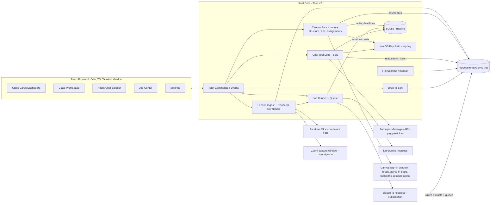

# ClassHub — End-to-End Specification

ClassHub is a personal, local-only macOS desktop app (Tauri v2) that serves as the centralized
hub for Daniel's master's program (AI in Biomedical & Health Sciences, Fall 2026). It ingests
class material from `~/Documents/AIBHS`, synthesizes dense high-yield HTML study guides using
the Claude Code (Max 20x) subscription, and provides an agent chat sidebar backed by the direct
Anthropic API with agentic retrieval over pre-extracted material.

This file is the single source of truth for the project. Each milestone below is designed to be
completed in **one dedicated coding session** to avoid context rot. See [Session protocol](#session-protocol).

---

## 1. Verified facts & hard constraints

These were verified on 2026-08-22. Do not re-litigate them in milestone sessions.

- **Agent SDK credit is PAUSED.** Anthropic announced (then paused before the June 15, 2026
  launch) a separate monthly Agent SDK credit. Current reality: `claude -p` / Agent SDK usage
  with subscription auth **draws from the normal subscription usage limits** (same rolling
  limits as interactive Claude Code). Source: support.claude.com article 15036540.
- **Headless subscription use is officially supported.** The locally installed `claude` CLI
  (v2.1.237 at `~/.local/bin/claude`) is logged in to the Max 20x subscription and `claude -p`
  uses those credentials.
- **Auth precedence gotcha (critical):** Claude Code resolves auth in this order:
  cloud creds → `ANTHROPIC_AUTH_TOKEN` → `ANTHROPIC_API_KEY` → `apiKeyHelper` →
  `CLAUDE_CODE_OAUTH_TOKEN` → interactive login. Because ClassHub also holds a console API key
  for the chat agent, **every spawned `claude` process MUST have `ANTHROPIC_API_KEY` and
  `ANTHROPIC_AUTH_TOKEN` removed from its environment**, or synthesis silently bills
  pay-per-token API credits instead of the subscription.
- **Chat agent uses the direct Anthropic Messages API** (pay-per-token, console API key).
  Deliberate choice: chat availability must be independent of subscription rate limits, which
  heavy synthesis jobs can exhaust.
- **Anthropic has no embeddings API.** RAG is agentic (grep/read over pre-extracted markdown),
  not vector-based. No embedding provider, no vector DB.
- **Claude cannot read `.pptx`.** It reads PDFs and images natively. LibreOffice
  (`soffice --headless --convert-to pdf`) converts PPTX → PDF during ingestion.
- **A Zoom recording link is read through a browser window, never fetched.** There is no
  supported way to pull a caption track from a share link: the Zoom API path needs
  host/admin OAuth that a student account does not have, whether a *viewer* may see the
  transcript is the host's setting, and a recording may sit behind institutional SSO or a
  passcode. So the link opens in a webview the user can sign in to, which is what §7.1's
  capture window is for. Measured 2026-09-02 on a UF cloud recording (Fundamentals,
  2026-09-01): the share link served Zoom's recording-player page to an anonymous GET with
  no redirect, no passcode gate and no sign-in; the player's Vuex store was populated 4.5 s
  after the window opened and exposed `ccUrl`; the caption fetched from it was a 102 KB
  WebVTT of 755 sentence-level cues, and the whole capture took 6.1 s. That track carries
  **no speaker names**: the room's one Zoom account recorded everyone, so for a lecture-hall
  recording the professor/student distinction is absent whichever route produced the text,
  and the digest says so in its header rather than inventing it.
- **What one real session costs.** Measured 2026-09-02 on that 2 h 36 m recording, Opus at
  `xhigh`, list-price equivalents from the CLI's own accounting: the digest (§8.4) ran
  12.4 min over 5 turns for $3.06, writing 69k output tokens — the 75 KB session HTML fit in
  one `Write`, so the output cap was never reached; the Week 2 unit guide (§8.1), built from
  that one corpus note, ran 18.2 min over 34 turns for $5.59, 103k output tokens through the
  chunked Write-then-Edit pattern. Both draw on the subscription's rolling limits, not on
  credits.
- **Parakeet is on the machine, but not reusable in place.** `mlx-community/parakeet-tdt-0.6b-v3`
  and `parakeet_mlx` ship inside LocalFlow's bundled venv, with `ffmpeg` on PATH. The resident
  LocalFlow process keeps the model loaded but exposes no socket or port, so it cannot be
  borrowed — each transcription pays its own model load. Its packaged `parakeet-mlx` console
  script also carries a stale shebang from the machine it was built on, so the module entry
  (`python -c "from parakeet_mlx.cli import app; app()"`) is what gets invoked. Measured
  2026-09-02 with exactly that invocation on 73 minutes of 16 kHz speech (the real Week 2
  transcript read aloud by macOS `say`, since Zoom published a caption for the session):
  49 s wall time including the model load, about **0.7 minutes of compute per hour of
  audio**, 548 sentence-level cues.
- **Parakeet does no speaker diarization.** Its output is unattributed text. Zoom's own caption
  track carries speaker names when the people speaking are on their own Zoom accounts, and for
  a lecture the professor/student distinction is most of what makes a transcript worth reading
  — so Zoom's track is always preferred, and Parakeet is the fallback for when the host
  published none. A lecture-hall recording made from the room's single account carries no
  names on either route (measured above).
- **The four courses do not share an organizational structure.** Read from the syllabi:

  | Class | The course's own divisions | Dates in syllabus |
  | --- | --- | --- |
  | Fundamentals of AI in Medicine I | 14 weekly topics, no grouping | yes (Aug 25 …) |
  | Biostatistics for AI | 15 weekly topics, no grouping | yes (08/20 …) |
  | Applied Generative AI in Medicine | 3 Parts spanning 16 weeks | no |
  | AI in Health Design Studio I | none published | — |

  So there is no uniform "weeks 1–15" and no universal module layer: 14 / 15 / 16 / unknown.
  Two of the four declare no grouping above the weekly topic at all. The app therefore reads
  each course's own structure (§7.2) rather than imposing one, and never assumes a hand-made
  folder is the course's real division.
- **Weeks are not uniformly spaced.** Fundamentals runs Week 13 on Nov 17 and Week 14 on Dec 1,
  skipping Thanksgiving. A week number can never be computed as `(date − start) / 7`; it comes
  from the course's own schedule.
- **Canvas offers exactly one usable way in, and it is not a credential.**
  `https://ufl.instructure.com/api/v1/` is live (401 unauthenticated) and exposes
  `/courses/:id/modules?include[]=items`, `/files`, `/folders` and `/assignments` — the
  authoritative course structure, without a human transcribing it. Both credentialed paths are
  closed by the same administrators:
  - **Personal access token** — disabled. Canvas answers *"Your Canvas administrators have
    chosen to limit your ability to generate your own access token."* Verified 2026-08-26.
  - **OAuth2** — equally gated, and not a fallback. The flow needs a developer key
    (`client_id`/`client_secret`) that only an institution admin can issue, usually after a
    security review; without an enabled key Canvas returns `unauthorized_client`. There is no
    self-service path for a student account.

  - **`POST /api/v1/users/:id/tokens`** — the same permission gate as the UI button. Reaching
    for it would be routing around a control an administrator deliberately set, which is a
    different act from reading data the account can already read. Not used.

  Existing `Canvas for iOS` tokens in the account are not a loophole either: Instructure's
  mobile apps run on Instructure's own globally-enabled developer keys, which is exactly why
  OAuth2 works for them and cannot for us. Regenerating one would break the real iOS app and
  would file ClassHub's traffic under Instructure's key in UF's audit logs.

  What works is **session reads**, verified end to end on 2026-08-26: UF SSO (Shibboleth and
  Duo) completes inside an embedded `WKWebView`, and `/api/v1` then honours that window's own
  session cookie for same-origin GETs — `/users/self` returns the real user and
  `/courses?enrollment_state=active` the enrolled courses. This is how in-Canvas theme
  JavaScript queries it. The constraint is strict: the request must originate from a page
  Canvas served, so it is issued *inside* the signed-in page and never by a native HTTP client
  holding copied cookies (§7.2). Session and cookie authentication appear **nowhere** in
  Instructure's OAuth2 or access-token references — an undocumented side effect, not a
  supported integration, and nothing should assume it is contractual.

  The line this app holds: reading through the user's own session automates their own browsing;
  minting a credential through it does not. Only the first is done. Keeping the session's own
  cookie so it survives a relaunch stays on the first side of that line — it is the credential
  Canvas already issued to the browser, extended in duration and not in reach.

  Two properties of that session were measured rather than assumed:

  - **Canvas issues it as a session cookie, so the app keeps it itself.** `canvas_session` and
    `log_session_id` arrive with neither `Expires` nor `Max-Age`. WKWebView holds expiry-less
    cookies in memory and never writes them to its own jar, so quitting the app ends the
    session — measured 2026-08-27 against that jar, which held Duo's month-long device-trust
    cookie from the same runs and not one cookie for `ufl.instructure.com`. This is a property
    of what Canvas sends, not of the webview's configuration: the data store is persistent and
    on disk. ClassHub therefore stores those cookies itself (§7.2), and a relaunch reads Canvas
    without a sign-in. The window still opens hidden — a live session is read without ever
    putting a window on screen — and is shown when Canvas genuinely asks for a sign-in, and
    also once a read has run long enough that hiding it would be hiding a stall, which a
    multi-megabyte download routinely does.
  - **The in-page rule covers file bytes too.** `/files/:id/download` refused every request
    issued from `reqwest` with cookies read out of the webview (403, all files) — the session
    lives in cookies the webview does not hand out. Fetched from inside the page it serves
    normally, so a downloaded file comes back base64 through the same channel as everything
    else.

- **No course publishes Canvas Modules.** Read from all four courses on 2026-08-26:
  `/courses/:id/modules` returns an empty list for every one of them. Canvas therefore supplies
  no course structure today, and the syllabus is the operative source for `units` (§7.2). What
  Canvas does hold is worth having on its own: assignments with true due dates, and course
  files organized into the professor's own folders. Assignment due dates arrive as UTC
  instants, and the semester straddles the DST change — a fixed offset puts one of this term's
  two assignments on the wrong day — so they are converted through the machine's real timezone.

  Canvas also exposes **GraphQL** at `POST /api/graphql`, whose permissions mirror REST. It
  would collapse a whole sync into one round trip, but being a POST it needs the `X-CSRF-Token`
  header read from the `_csrf_token` cookie. REST GETs need no CSRF and the rate limit is 700
  requests / 10 minutes — far above a full sync — so REST is the default and GraphQL is an
  optimization only if request counts ever justify the extra moving part.
- Toolchain verified installed: Rust 1.96.1, Node v26.3.1, Homebrew. LibreOffice is NOT yet
  installed (Milestone 4 installs it via `brew install --cask libreoffice`).

## 2. Prerequisites

| Prerequisite | Needed by | Status |
| --- | --- | --- |
| `claude` CLI logged in to Max 20x subscription | Milestone 3 | Done |
| LibreOffice (`brew install --cask libreoffice`) | Milestone 4 | Installed |
| Anthropic console API key with usage credits | Milestone 7 | Obtained |
| LocalFlow (supplies Parakeet + `parakeet_mlx`) and `ffmpeg` | Milestone 12 | Installed |

## 3. Architecture



**Stack:** Tauri v2 (Rust backend) + React 19 + Vite + TypeScript + Tailwind CSS + shadcn/ui.
SQLite via `rusqlite` (bundled) in the Tauri app-data dir. Streaming from Rust to the frontend
via Tauri events. No Python anywhere in the stack.

## 4. Filesystem conventions

The AIBHS tree is the **source of truth**. ClassHub reads it directly and writes only to the
designated locations below. The AIBHS root path is configurable (default `~/Documents/AIBHS`).

```
~/Documents/AIBHS/
├── Biostatistics for AI/                  ← one folder per class (4 total)
│   ├── Weeks/                             ← WHERE A LECTURE LIVES (§7.1), every class
│   │   ├── Week 01 — Intro to Biostatistics/
│   │   │   ├── 2026-08-20 — Lecture.md    ← the normalized transcript, SOURCE material
│   │   │   └── Slides/                    ← anything else specific to that week
│   │   └── Week 02 — Study Designs/
│   ├── Module 1/                          ← a unit folder, when the course has one (§7.2)
│   │   ├── Slides/                        ← .pptx lecture slides
│   │   ├── Reading Material/              ← .pdf readings
│   │   └── R Files/
│   │       ├── Class Files/               ← provided .Rmd / .html
│   │       └── Edited Files/              ← Daniel's classwork (.R)
│   ├── Study Guides/                      ← APP-MANAGED: generated artifacts
│   │   ├── Module 1.html
│   │   ├── Semester Master.html
│   │   ├── Practice/                      ← generated practice exams
│   │   └── Sessions/                      ← generated per-lecture session documents
│   │       ├── 2026-08-20 — Central Tendency.html
│   │       └── 2026-08-20 — Central Tendency.md
│   ├── Notes/                             ← APP-MANAGED: per-class markdown notes
│   ├── _Inbox/                            ← APP-MANAGED: drop-to-sort staging
│   └── .classhub/
│       ├── extracts/                      ← APP-MANAGED: hidden extraction cache,
│       │   └── Module 1/Slides/Biostatistics_Module1_Slides_class2.pptx.md
│       └── corpus/                        ← APP-MANAGED: distilled lecture contributions,
│           └── Week 02 — Study Designs/2026-08-27 — Lecture.md   keyed by unit (§8.5)
└── ... (3 more class folders)
```

Rules:

- Folder structure inside each class is **arbitrary and user-owned**; never assume the exact
  layout above. Scanner and agents must tolerate any nesting.
- Extract paths mirror the source file's relative path with `.md` appended, under
  `.classhub/extracts/`. PPTX→PDF conversions live alongside as `<name>.pptx.pdf`.
- `Study Guides/`, `Notes/`, `_Inbox/`, `.classhub/` are excluded from scanning, drop-to-sort
  proposals, and staleness computation of source material.
- **`Weeks/` is storage, and for these four courses it also settles scope.** A lecture goes
  there because a lecture happens at a time. Each course meets once a week and divides itself no
  finer than a week, so the week a lecture was filed under is the division it belongs to (§8.5).
  The two axes are kept separate anyway: a course that divided itself finer than its meetings
  would need them apart, and nothing about storing a lecture by date assumes otherwise.
- `Weeks/` is **not** app-managed. A transcript is source material like a slide deck: the
  scanner indexes it, extraction routes it through the zero-token text path, and chat searches
  it. Filing it in the tree is what joins it to the pipeline rather than parking it beside.
- The app never deletes source files. Moves happen only through the confirmed drop-to-sort flow
  and are audit-logged.

## 5. Data model (SQLite)

Migrations run at startup (numbered SQL files embedded in the Rust binary). Schema:

```sql
classes(id INTEGER PK, folder_name TEXT UNIQUE, display_name TEXT, code TEXT,
        color TEXT, room TEXT, instructors TEXT, credits INTEGER,
        grading_basis TEXT, final_exam_start TEXT NULL, final_exam_end TEXT NULL,
        -- Which Canvas course this matched, and when it last synced. Neither is
        -- a credential: the mapping is how a sync shows it read the right course
        -- rather than asserting it, and the stamp is what Settings displays.
        canvas_course_id TEXT NULL, canvas_synced_at INTEGER NULL);

meetings(id INTEGER PK, class_id INTEGER FK, weekday INTEGER,  -- 1=Mon .. 7=Sun
         start_time TEXT, end_time TEXT, periods TEXT);

files(id INTEGER PK, class_id INTEGER FK, rel_path TEXT, sha256 TEXT, size INTEGER,
      mtime INTEGER, kind TEXT,            -- pptx|pdf|rmd|r|html|md|other
      extract_rel_path TEXT NULL, extracted_at INTEGER NULL,
      extracted_sha256 TEXT NULL,          -- hash of source when extract was made
      UNIQUE(class_id, rel_path));

jobs(id INTEGER PK, kind TEXT,             -- extract|module_guide|master_guide|sort_proposal|syllabus_scan|practice|lecture_digest
     class_id INTEGER NULL, scope TEXT NULL,  -- e.g. module rel path, or 'master'
     status TEXT,                          -- queued|running|succeeded|failed|cancelled
     session_id TEXT NULL,                 -- claude session id (for --resume)
     payload TEXT NULL,                    -- kind-specific completion data; survives a restart for --resume
     owner_pid INTEGER NULL,               -- the process running it (§6); NULL is a row from a
                                           -- build before the column, treated as orphaned
     created_at INTEGER, started_at INTEGER NULL, finished_at INTEGER NULL,
     log_path TEXT NULL, error TEXT NULL, summary TEXT NULL);

-- A course's own divisions, whatever that course calls them (§7.2). This is what
-- replaces "a top-level folder is a module": Biostatistics and Fundamentals divide
-- into weekly topics and declare no modules at all, Applied Generative AI declares
-- three Parts, and Canvas may say something different again. `kind` and `name` carry
-- the course's own words; the app never shows the word "unit" to the reader.
units(id INTEGER PK, class_id INTEGER FK, ordinal INTEGER,
      kind TEXT,             -- module|week|part, as the course names it
      name TEXT,             -- 'Module 3' | 'Week 7 — Tree-Based Models' | 'Part II'
      canvas_id TEXT NULL,   -- set when Canvas is the source
      rel_path TEXT NULL,    -- its folder, when it has one; units need not be folders
      starts_on TEXT NULL, ends_on TEXT NULL,
      source TEXT,           -- canvas|syllabus — which reader declared it, canvas winning
      UNIQUE(class_id, name));

-- One span of one lecture, mapped to one unit (§8.5) — the join that lets a lecture
-- stored by date feed a guide scoped by topic. A lecture contributes its whole length
-- to one unit today, since no course divides itself finer than its meetings; the span
-- columns are what the table would need if one ever did.
lecture_contributions(id INTEGER PK, class_id INTEGER FK, unit_id INTEGER FK,
                      rel_path TEXT,          -- the transcript this span is cut from
                      start_ms INTEGER, end_ms INTEGER,
                      start_line INTEGER, end_line INTEGER,  -- resolved from ## HH:MM anchors
                      corpus_rel_path TEXT,   -- the distilled note under .classhub/corpus/
                      summary TEXT,
                      confidence TEXT,        -- high|medium|low
                      status TEXT,            -- applied|pending|dismissed
                      created_at INTEGER,
                      UNIQUE(class_id, rel_path, unit_id, start_ms));

-- Also holds session documents (§8.4) under scope 'session:<transcript rel path>',
-- so they inherit the viewer, the listing and staleness without a table of their own.
-- Naming the source file rather than the date keeps the scope unique per transcript,
-- which turns a re-run into an update and gives staleness something real to hash.
guides(id INTEGER PK, class_id INTEGER FK, scope TEXT,  -- module rel path | 'master' | 'session:<path>'
       rel_path TEXT, generated_at INTEGER,
       source_manifest TEXT,               -- JSON: [{rel_path, sha256}] used for staleness
       UNIQUE(class_id, scope));

deadlines(id INTEGER PK, class_id INTEGER FK, title TEXT, kind TEXT,  -- assignment|exam|quiz|project|other
          due_at TEXT, notes TEXT NULL, status TEXT,  -- open|done
          source TEXT);                    -- manual|agent|syllabus|canvas

grade_categories(id INTEGER PK, class_id INTEGER FK, name TEXT,
                 weight REAL CHECK (weight >= 0 AND weight <= 100));
grade_items(id INTEGER PK, category_id INTEGER FK, name TEXT,
            score REAL CHECK (score >= 0), max_score REAL CHECK (max_score > 0),
            graded_at TEXT NULL);

-- The drop-to-sort confirm queue (§10). Nothing here has moved anything;
-- approval is what performs the move.
move_proposals(id INTEGER PK, class_id INTEGER FK,
               source_rel_path TEXT,       -- class-relative, exists on disk at proposal time
               dest_rel_path TEXT,         -- class-relative target incl. filename
               reasoning TEXT,
               confidence TEXT NULL,       -- high|medium|low from sort jobs; NULL from chat
               source TEXT,                -- chat|sort_job|canvas
               status TEXT,                -- pending|approved|dismissed
               created_at INTEGER, resolved_at INTEGER NULL);

-- The proposed-deadline confirm queue (§11), so proposals survive an app restart
-- between proposal and confirmation. Both readers land here — the syllabus scan
-- and the Canvas sync — and approval carries the row's own `source` onto the
-- deadline. Nothing here has created a deadline.
deadline_proposals(id INTEGER PK, class_id INTEGER FK, title TEXT, kind TEXT,
                   due_at TEXT, notes TEXT NULL,
                   status TEXT,            -- pending|approved|dismissed
                   source TEXT,            -- syllabus|canvas
                   created_at INTEGER, resolved_at INTEGER NULL);

chat_sessions(id INTEGER PK, title TEXT, created_at INTEGER);
chat_messages(id INTEGER PK, session_id INTEGER FK, role TEXT,
              content TEXT,                -- JSON: full Messages-API content blocks
              created_at INTEGER);

audit_log(id INTEGER PK, action TEXT, payload TEXT, created_at INTEGER);
settings(key TEXT PK, value TEXT);         -- API key lives in Keychain, NOT here
```

**Seed data** (inserted by the first migration; codes stored as metadata but never displayed):

| display_name | folder_name | code | color | meetings | room | instructors | credits | final exam |
| --- | --- | --- | --- | --- | --- | --- | --- | --- |
| Fundamentals of AI in Medicine I | Fundamentals of Artificial Intelligence in Medicine I | CAI5720 | blue | Tue 16:05–19:05 (periods 9–11) | JAX1 231 | Zhenhong Hu, Yijiang Chen | 3 | — |
| AI in Health Design Studio I | AI in Health Design Studio I | CAI5724 | orange | Wed 17:10–18:00 (period 10) | JAX1 231 | Benjamin Shickel | 1 | 2026-12-07 20:00–22:00 |
| Biostatistics for AI | Biostatistics for AI | CAI5731 | green | Thu 11:45–13:40 (periods 5–6) | JAX1 231 | Esra Adiyeke, Tezcan Ozrazgat Baslanti | 2 | — |
| Applied Generative AI in Medicine | Applied Generative AI in Medicine | CAI6734 | amber | Tue 11:45–14:45 (periods 5–7) | JAX1 231 | Akshith Ullal, Xuefeng Liu | 3 | — |

All grading bases are Letter Grade. `display_name` intentionally drops "Artificial Intelligence"
verbosity only where it keeps cards clean; UI always uses `display_name`, never `code`.

## 6. Claude Code job runner

The job runner is the single gateway to the subscription. All heavy-token work (extraction,
guides, master file, sort proposals, syllabus scans, practice exams) flows through it.

**Invocation template** (Rust `std::process::Command`):

```
claude -p <prompt>
  --output-format stream-json --verbose
  --model <per job kind, see below>
  --allowedTools <per job kind, see below>
  --add-dir <class folder absolute path>
```

- **cwd** = the class folder.
- **Environment**: inherit, then **remove `ANTHROPIC_API_KEY` and `ANTHROPIC_AUTH_TOKEN`**
  (see §1). A startup self-check job asserts the active auth is the subscription (the
  stream-json init event exposes the auth/rate-limit type) and surfaces a blocking warning
  in the UI if not.
- **Tool scoping by job kind** (least privilege). `--allowedTools` is additive against
  the user's own claude config and does not restrict, so the **deny** list is the actual
  boundary and both are passed:
  - Never allowed, any kind: `Bash,WebFetch,WebSearch,Task` — `Task` because a spawned
    sub-agent is a path around the parent's tool scoping.
  - `extract`, `module_guide`, `master_guide`, `practice`, `lecture_digest`: allow
    `Read,Glob,Grep,Write`.
  - `sort_proposal`, `syllabus_scan`: allow `Read,Glob,Grep`, and additionally deny
    `Write,Edit,MultiEdit,NotebookEdit` (read-only is only real if the writes are denied).
- **Write scope is verified, not trusted**: `--add-dir` grants read and write together, so a
  write-capable job can physically reach every source file in the class folder. Sources are
  fingerprinted by (size, mtime) before the spawn and compared after; a run that changed
  anything outside `Study Guides/` and `.classhub/extracts/` is demoted to failed, records
  nothing, and its full path list is written to `audit_log`. This is what enforces §4's
  promise that the app never destroys source material.

  The app itself moves files while a job runs — an approved sort or Canvas move, a drop or a
  Canvas download staged into `_Inbox/`, a lecture filed into `Weeks/`, a note saved — and
  none of that is the job's doing. Each of those writes an audit row naming its paths, and
  the compare reads the rows for the job's window and takes those paths out of the touched
  list. Exclusion is by audit row, never by the shape of the change: a rename with no row
  behind it is still the job's, and a file the app moved is cleared only while it still
  carries the size and mtime it had where it came from, so a job that rewrote it after the
  move is still caught. The corollary is that every app write into source material must be
  audited, because the audit log is what tells the guard "that was us".
- **Models**: one global model/effort pair, set in Settings and read at spawn time so a
  change applies to the next job — queued ones included. Defaults to Opus at `xhigh`.
- **Streaming**: parse stream-json lines into typed events (init, assistant text deltas, tool
  use, result). Persist raw lines to `log_path`; forward condensed progress events to the
  frontend via Tauri events (`job://{id}/progress`).
- **Queue**: max 2 concurrent jobs; `master_guide` runs exclusively (queue drains first).
  Jobs are cancellable (kill child process, mark `cancelled`).
- **Resumability**: store the claude `session_id` from the init event; failed/interrupted
  `master_guide` jobs offer "Resume" which re-invokes with `--resume <session_id>`.
- **Two processes, one table.** The installed app and a dev build share the database (§13), so
  every row records the process that enqueued it (`owner_pid`). Startup recovery fails only
  rows whose owner is gone — a live process's job is left alone, and a row from a build that
  predates the column counts as orphaned. The automatic extract enqueue checks for an active
  job and inserts in one transaction, so two launches in the same minute yield one job; the
  user-triggered guards (one sort, one scan, one guide per scope) read the table before
  enqueuing. Cancel stays per-process, because the child handle lives where it was spawned:
  cancelling a row a live process elsewhere owns says so, and a row whose owner is gone is
  settled in place, since recovery runs only at launch.
- **The self-check runs once a day**, not once a launch: when the latest self-check verdict is
  a success within the last 24 hours it stands and is restored at launch; anything else — a
  failure, or no check at all — runs it. The manual re-run behind the auth warning is
  unconditional.
- Prompts are Rust-side templates (askama or `format!` with named sections) versioned in
  `src-tauri/prompts/`. Each prompt states: role, exact output path(s), output contract,
  and what NOT to do (no source edits, no files outside the contract).

## 7. Ingestion & extraction pipeline

Goal: every source file gets a clean markdown extract under `.classhub/extracts/` so the chat
agent and synthesis prompts can search text instead of re-reading binaries.

1. **Scan** (on launch, on window focus, and manual refresh): walk each class folder
   (excluding app-managed dirs), upsert `files` rows with sha256 + mtime. Detect
   added/changed/removed files by hash.
2. **Convert**: for `.pptx` files, run
   `soffice --headless --convert-to pdf --outdir <extracts mirror dir> <file>`
   producing `<name>.pptx.pdf`. Skip if the PDF is newer than the source hash.
3. **Extract** (per changed file, batched into one `extract` job per class per run):
   - Text-native formats (`.Rmd`, `.R`, `.md`, `.txt`): local Rust extraction (copy /
     light normalization). `.html` (R-rendered notebooks): local tag-strip to text.
     No tokens spent.
   - Visual formats (`.pdf`, converted PPTX-PDFs): `claude -p` extraction. The prompt
     instructs: read the PDF, produce a faithful markdown extract preserving structure,
     tables, formulas, code; **describe every figure/diagram/chart in brackets**
     (e.g. `[Figure: scatterplot of X vs Y showing positive correlation]`); write to the
     mirrored extract path.
4. **Record**: update `extract_rel_path`, `extracted_at`, `extracted_sha256`.
5. **Staleness**: a guide is stale when its `source_manifest` differs from the current set of
   `{rel_path, sha256}` in its scope. Computed on demand; surfaced as badges.

Extraction is triggered automatically after a scan finds changes (extraction is cheap:
sonnet + mostly local), but **guide synthesis is never automatic**.

Caption tracks (`.vtt`, `.srt`) found in the tree are extracted locally through the same
normalizer §7.1 uses — the searchable copy is the merged prose, not the timing grid. Media
files are indexed but never extracted: transcribing is minutes of compute, so it happens when
a lecture is explicitly added, never as a side effect of a scan noticing an `.mp4`.

## 7.1 Lecture transcripts

A recording reaches the app as one of three things, and they converge on one path: whatever
came in becomes cues, the cues become markdown, the markdown is filed as source material.

1. **Caption track** (`.vtt` / `.srt` / Zoom's in-meeting "Save Transcript" `.txt`) — read
   directly. Preferred whenever it exists, because it carries speaker names.
2. **Media file** — transcribed on-device by Parakeet (§1), invoked as a bounded subprocess
   the way LibreOffice is. The interpreter path is a Setting, defaulting to LocalFlow's.
3. **Zoom recording link** — a webview opens the link, the user completes SSO and any
   passcode themselves, and the transcript is read out of the authenticated page via
   `eval_with_callback`. Deliberately **no JS injection into the app and no remote-IPC
   grant**: zoom.us is read, and never becomes a caller into ClassHub. The capture window
   needs no capability entry for exactly that reason — it calls no commands.

   The recording player is a Vue 2 app on `#app`, and its Vuex store is the source:
   `ccUrl` (the caption file the player itself offers), else `transcriptList`
   (`{username, ts, endTs, text}`). Reading the store rather than the rendered panel is
   not a shortcut but the only correct route — the panel is a `vue-recycle-scroller`, so
   the DOM holds only the rows currently on screen, and scraping it would return twenty
   cues of a three-hour lecture while looking like it had worked.

   When the store exposes no caption track because the host disabled viewer transcripts,
   `viewMp4Url` is downloaded with the same session's cookies and routed to (2). That
   degradation is why on-device transcription earns its place rather than duplicating Zoom.

   On a UF cloud recording (measured 2026-09-02, §1) the probe's states run `waiting`
   (page loaded, no store yet, 1.5 s) → `fetching` (store up with `ccUrl`, 4.5 s) → `ready`
   (6.1 s), with no `login` or `passcode` state in between; `ccUrl` is the route that pays
   off, and the track it serves is sentence-level WebVTT with no speaker prefix. Each state
   change and the final route are written to stderr with their timings, because the window
   closes on success and nothing else records what the page looked like.

**Normalization** is pure, local and zero-token. A raw caption track is one cue per couple of
seconds, so a lecture arrives as thousands of fragments — unreadable, and hostile as input to
a digest prompt. Consecutive cues from one speaker merge back into paragraphs, breaking on a
speaker change, a long pause, or a soft length cap at a sentence boundary, with an `## HH:MM`
anchor every five minutes so a digest can cite a time that scrubs to the right moment. An
anchor carries the start time of the paragraph that opens its five-minute section, so the
sequence is irregular where a paragraph runs across a boundary (the real Week 2 transcript
opens `00:08`, `00:17`, `00:20`, `00:25` …: the mic was off for eight minutes, and one
paragraph spanned the 00:15 mark). Zoom punctuates sparsely, so a merged paragraph can run
well past the soft cap before a sentence ends; the digest's `Read` returned every such
paragraph whole.

Speaker attribution is a guess with a corroboration rule: a multi-word `Name:` prefix is taken
as a display name, but a single-word one has to recur before it counts, because `Danny:` and
`Remember:` are the same shape in isolation and only differ across a whole file.

**Filing** puts every transcript at `<Class>/Weeks/Week NN — <topic>/<date> — <title>.md`.

A lecture is filed by *when it happened*, and for these four courses that also settles what it
counts as covering (§8.5). The week comes from the course's own schedule
(§7.2), because breaks make arithmetic wrong: Fundamentals runs Week 13 on Nov 17 and Week 14
on Dec 1. The Add lecture form shows the resolved week and lets it be corrected.

A transcript whose week cannot be resolved lands in `_Inbox/` and the §10 sorter proposes one.
A transcript's *name* carries no routing signal — they are all a date and "Lecture" — so the
inbox listing carries a line of its subject matter and the sorter routes it by content.

Ingestion never overwrites: a second lecture on one date, or re-adding the same one, gets a
` (2)` suffix rather than replacing a file.

## 7.2 Canvas sync — where the course's structure comes from

The course's real divisions live in Canvas, and every hop between Canvas and ClassHub that
passes through a human loses something. This section removes that hop.

**What is read** from `https://ufl.instructure.com/api/v1/`:

| Endpoint | Gives |
| --- | --- |
| `/courses?enrollment_state=active` | the enrolled classes, matched to `classes` on the course code, exactly |
| `/courses/:id/modules?include[]=items` | **the course's own divisions** → `units` (§5) |
| `/courses/:id/files` | slides and readings, downloadable into the tree |
| `/courses/:id/folders` | where the professor filed each file — the destination a move proposal takes |
| `/courses/:id/assignments` | deadlines with real due dates — no syllabus guesswork |

The course code is the only field worth matching on. The account is enrolled in a dozen
"active" courses, orientation shells and years-old org sites among them, and a name match would
have to survive `CAI5724- AI in Health Design Studio I` against `AI in Health Design Studio I`.
A near-miss files one class's material into another, so zero matches and two matches are both
reported rather than guessed at.

Reads only. ClassHub never writes to Canvas.

**Authentication** has one available path, because UF has closed both credentialed ones (§1):
neither a personal access token nor an OAuth2 developer key can be obtained by a student
account.

What remains is a **signed-in window**, the technique `zoom.rs` already proves: a Tauri webview
the user completes UF SSO in, after which the app reads `/api/v1/…` on that session. Same
posture as the Zoom capture — reads only, no IPC grant to the remote origin, and the response
is parsed in Rust.

One detail is load-bearing rather than incidental: **every request is issued from inside the
Canvas page**, via `eval_with_callback` running
`fetch('…', {credentials: 'same-origin'})`. Canvas honours the session cookie for same-origin
requests only, and a native HTTP client replaying cookies read out of the webview is refused —
verified, 403 on every file (§1). Issued in-page, the request *is* the Canvas web UI's own.
`fetch` is asynchronous and `eval_with_callback` is not, so each request parks its result on the
window under an id and Rust polls for it — the same start-then-poll shape `zoom.rs` uses.

That applies to file bytes as much as to JSON: a download comes back base64-encoded through the
same channel, which is why file size is capped rather than streamed. Anything past the cap is
named and left for Canvas's own download button.

GETs need no CSRF token; ClassHub never writes to Canvas, so the `X-CSRF-Token` dance for
mutating verbs never arises. Pagination follows the `Link` header's `rel="next"`, since Canvas
serves 10 items per page by default and a truncated collection looks exactly like a complete one.

**The session is kept across launches.** Canvas sets `canvas_session` and `log_session_id`
without an expiry, so WKWebView discards them the moment the app quits (§1) and every launch
would otherwise open with a Duo push. ClassHub stores those cookies in the macOS Keychain —
under the same service as the API key, never in the database and never in a file — and puts
them back *before* the Canvas window issues its first request, which is the request that decides
whether Canvas serves the page or bounces to SSO. Everything Canvas set for its own host is kept
except `_csrf_token`, which only matters for writes; keeping by that rule rather than by a list
of names means a Canvas rename cannot silently drop the cookie the whole thing rests on.

No credential is minted. What is stored is the cookie Canvas already issued to the browser, so
the app's reach stays the reach the sign-in granted, and `POST /api/v1/users/:id/tokens` remains
off-limits (§1). Canvas sets the lifetime: a refusal deletes the stored copy and opens the
sign-in window, which is what a password change, an admin revoke and Canvas's own timeout each
look like from here. A copy no sync has used for 30 days is refused and deleted the next time a
sync asks for it — that being the window Duo's device-trust cookie keeps, past which the full
sign-in was coming anyway. The check is made on use rather than on a timer, because sync is
manual and nothing here should introduce a scheduler.

A window that has not navigated anywhere yet is not a Canvas asking for a sign-in. The initial
empty document reports no host at all, and reading that as "somewhere other than Canvas" would
reveal a window and discard a restored cookie a moment before it worked — so that one reading
waits a few seconds. Everything conclusive is acted on at once: a 401 from Canvas, or a page
genuinely at `login.ufl.edu`. Delaying *those* is worse than useless, because macOS throttles a
hidden webview's JavaScript and Duo's prompt boots into a painted shell with no body when it
starts up off screen — measured 2026-08-27. The sign-in window is shown the moment SSO is real.

It is nonetheless undocumented (§1): if it stops working, it stops, and the fallback is the
syllabus path below rather than anything cleverer.

**Structure precedence is canvas > syllabus > folder.** Canvas is ground truth when it has
anything to say, which today it does not — no course publishes modules (§1) — so the syllabus
scan is what actually supplies `units`: it reads the weekly schedule out of the same document,
in the same pass that reads the due dates, and returns it beside them. Where a course groups its
weeks under named Parts or Modules, those are the divisions and the weeks are the schedule
filling them in; where nothing groups them, the weeks are the divisions. A unit's `source`
column records which reader supplied it, and the workspace names that on the list.

A course with neither is shown as having none. A folder is where material sits, not something
the course declared, and listing the top-level folders as divisions put a second numbering
sequence under the course's own and labelled it a guess. What the folder does know belongs on
the declared unit's own row: each scan fills `units.rel_path` from the top-level folder whose
name matches the unit's, which is what gives §8.1's guide something to read.

**That match does not currently fire for any of the four courses.** A division is named the way
the course names it — `Week 1 — Introduction to Biostatistics for Artificial Intelligence in
Medicine` — and the folders beside it are `Module 1` and `Syllabus`, so name equality never
holds. Every unit's `rel_path` is NULL, and a unit guide has no file sources; what it is built
from is its corpus notes (§8.5), which reach it without a folder.

Nothing looser is built, and matching on the ordinal is the candidate that was considered and
declined. Across all four classes there is exactly one top-level content folder — `Biostatistics
for AI/Module 1` — against 49 declared divisions; the rest of the tree is `_Inbox`, `Syllabus`,
`Notes` and `Study Guides`. Mapping seventeen weeks onto one folder is not an ordinal problem,
and a matcher that fires once is one whose only real behaviour is its wrong answers. It earns
its place when the tree grows per-division folders, or when Canvas file attribution supplies the
join instead.

**Sync is manual and non-destructive.** It runs when asked, never on a timer. New units are
inserted and existing ones updated in place; units whose name no longer appears in Canvas are
kept, not deleted — a mid-semester Canvas reshuffle must not silently orphan a guide. A unit
Canvas has an id for is matched on that id, so renaming a published module updates it rather
than forking a second row under the new name. A higher-precedence source fills a unit's fields
in rather than replacing them, because only the tree ever learns where the material sits on
disk; a source refreshing its own row replaces them, so a date the course removed can be
cleared.

Assignments become `deadline_proposals` with `source='canvas'`, and their UTC due dates are
converted through the machine's real timezone (§1). One card per (title, calendar day) whichever
reader proposed it, and Canvas outranks the syllabus on that card: Canvas returns the
assignment's own `due_at` while a scan returns a model's reading of prose about it, so a rescan
never replaces a stated time with a bare date.

Files download into `_Inbox/` and are proposed through the §10 confirm queue, destination taken
from the folder Canvas keeps them in; where Canvas keeps a file loose, no destination is
invented and the file waits for the content-aware sorter, which the sync enqueues. **A sort job
never replaces a Canvas destination on its own.** Where Canvas filed a file is an observation —
the professor put it there — and a sort job's destination is an inference from a filename and a
tree; a file Canvas has placed is out of an automatic sort's scope entirely. A chat move is the
reader asking, so it retargets. Disagreeing with the placement takes one of two explicit
routes on the card: "change destination" names the folder directly, and **SORT BY CONTENT**
runs a sort job over that one file and, because it was asked for, lets the sort's destination
replace Canvas's. The card then re-renders as a sort proposal with the Canvas folder named in
its reasoning, so the professor's placement stays visible. Explicit, never heuristic: for every
file nobody asked about, Canvas's placement still outranks a content guess.

Each folder name is mapped onto the vocabulary the tree already uses, so a course calling its
decks "Lecture Slides" does not earn that class a second folder beside the "Slides" every other
class has. An exact name always wins over a suffix match, and a numbered qualifier is never
stripped — "Week 2 Slides" and "Week 3 Slides" are two folders, and collapsing them would file
two weeks of material together.

Re-syncing is a no-op: files are matched by name and size against everything the class already
holds, a proposal already waiting is refreshed rather than stacked, and a download never lands
on a name the inbox already holds. A file whose size Canvas does not publish is named and
skipped, since without it neither the duplicate check nor the size ceiling can do its job.

## 8. Study guide synthesis

### 8.1 Unit guides (`module_guide` job)

Manual trigger per unit from the Class Workspace — one guide for one of the course's own
divisions (§5), whatever that course calls them. The job kind keeps its original name; the UI
shows the course's word (`Module 3`, `Week 7`), never "unit". Prompt contract:

- Inputs: all extracts under the unit's folder when it has one (primary) + originals via
  `--add-dir` when the extract flags a figure worth re-inspecting; Daniel's classwork files
  marked as "learner work" for the worked-examples section; and the unit's corpus notes, which
  are how lecture content reaches a guide when the lecture itself lives under `Weeks/` (§8.5).
- Output: **one self-contained HTML file** at `Study Guides/<Unit name>.html`. No external
  requests (no CDN fonts/JS/CSS). Inline CSS, inline SVG, and inline vanilla JS powering
  interactive teaching devices (owner decision 2026-08-22: interactivity is load-bearing).
  Fully readable with scripts disabled and in print. Print-friendly stylesheet.
  Class accent color as the theme hue. Footer with generated-at timestamp and source manifest.
- Required sections (the "guide anatomy"):
  1. **Key concepts** — dense high-yield summaries, exam-oriented
  2. **Diagrams** — inline SVG concept maps / flowcharts / comparison tables
  3. **Formula & code reference** — stats formulas, R snippets with expected outputs
  4. **Worked examples** — pulled from classwork, annotated step-by-step
  5. **Self-test quiz** — active-recall questions, answers hidden in `<details>` elements
  6. **Glossary** — terms with one-line definitions
- Tone: dense reference, not tutorial prose. Every claim traceable to source material;
  cite source filenames inline in small muted text.
- After the job succeeds, upsert `guides` row with the source manifest.

### 8.2 Semester master file (`master_guide` job)

Manual trigger per class ("Generate Semester Master"). **Full re-synthesis from all raw
material every time** (deliberate quality-first decision — not map-reduce over module guides).
Prompt contract: read every extract (and originals as needed) across all modules, synthesize
cross-module connections, output `Study Guides/Semester Master.html` with the same anatomy
plus a "Cross-module threads" section. This is a long-running exclusive job (potentially
30+ min); UI must show phased streaming progress and support resume (§6).

### 8.3 Practice exams (`practice` job)

Triggered from chat, or from the `PRACTICE EXAM` action that sits beside `VIEW GUIDE` in
every guide cluster of the workspace — a folder's row in Materials, a division's row in the
Structure list, and the semester-master strip. Inputs: scope (a division, a folder, or the
semester) + optional focus topics from chat. A division's exam draws on the same sources as
its guide (§8.5) — its folder, if it has one, and its distilled lectures — so the action is
offered on a division's row exactly when a guide could be built, and a division with neither
is refused by name. One exam per scope at a time, the same duplicate-active guard as guides.
Output: `Study Guides/Practice/<scope> — <date>.html`, exam-style questions with hidden
answers + scoring rubric; the row shows `GENERATING EXAM…` while it is written, and the
exam appears in the workspace's PRACTICE EXAMS listing when the job succeeds.

### 8.4 Session documents (`lecture_digest` job)

Manual trigger per filed transcript, from the Add lecture form or the Lectures listing. The
job reads the transcript plus the rest of its module (so spoken content ties to the slides it
was about) and writes **two** documents — `Study Guides/Sessions/<date> — <topic>.html` for
reading, and `.md` alongside it for retrieval, since §9's `search_material` covers
`Study Guides/` and that markdown twin is the copy chat finds.

Both land under `Study Guides/`, already inside §6's `JOB_WRITABLE`, so the write-contract
check needs no widening.

**The job names its own output.** `<topic>` is what the session was actually about in three to
six words, drawn from the content — "Attention and Positional Encoding", not "Lecture". Having
chosen a name, the job prints `{title, relPathHtml, relPathMd}` as strict JSON on stdout; the
app verifies both files exist under `Sessions/` before recording anything, because "wrote the
HTML, skipped the markdown" would otherwise pass as success and silently leave the session out
of chat's reach.

Required sections: one-line summary · session summary · key points with `HH:MM` anchors ·
**said out loud, not on the slides** (emphasis, exam hints, corrections to the slides — the
reason the document exists) · terms introduced · questions asked and how they were answered ·
action items and dates as a record, never as created deadlines · open threads.

The prompt is bound to the transcript: no outside knowledge, no invented speaker or time, and
a session that covered something partially is reported with the gap named as a gap.

### 8.5 Unit corpus — what a guide is actually built from

ClassHub stores a lecture by when it happened (§4) and synthesizes by what it is about, so
something has to join the two. `lecture_contributions` (§5) is that join.

**The calendar is the join, not a model.** Each of the four courses meets once a week, and each
declares divisions no finer than a week: three number their weeks, and the fourth declares three
Parts whose own names carry the week ranges they span (`Part I: … (Weeks 1-8)`). A meeting
therefore sits inside exactly one division — for a week-numbered course the week it happened in,
and for a Part-numbered one the Part whose range contains that week. Nothing has to infer the
mapping, because filing the transcript already decided it.

Resolving a lecture's week is the one step with any judgement in it, and it comes from `units`
rather than from arithmetic: weeks are not uniformly spaced (§1), so a date cannot be divided
into a week number. Where a course publishes no schedule the Add lecture form asks, defaulting
to the nearest week by date.

The same table, asked about today instead of a lecture's date, is what tells the app where a
course *is*. Its **current division** is the dated division whose published start is the latest
on or before today — a division runs from its start to the next one's, so that is the one
containing today — whatever the course calls it: a syllabus row stored as `module` because its
name opens with neither "Week" nor "Part" (`Reading Days — No Class`) is no less a division than
one called a week. Two starting on one day go to the week over a coarser division it sits
inside, then to the later ordinal. One query answers for every reader: the class card, the
workspace eyebrow, the Structure list (a `NOW` mark on the row, matched by id; the list marks it
and does not scroll to it) and the chat overview's `Now:` line — and the query is keyed by the
day, so a dashboard left open across midnight asks again. A course that published no dates has
no current division and the app shows nothing, because the only alternative is a week from
arithmetic; Applied Generative AI, whose Parts name week ranges and no days, is that course
today. Nothing published says when a course ends — no scan has ever filled `ends_on` — so past
its last dated division the last one stays current.

This is worth stating because the obvious alternative is wrong here. Asking the digest to
segment a lecture across units would buy nothing — no division is finer than a meeting, so
every span it produced beyond the first would be an error — and a wrong boundary is the one
mistake in this pipeline that quietly corrupts study material rather than failing visibly.

**Each lecture is distilled once**, into `.classhub/corpus/<unit>/<the transcript's own name>`:
the high-yield content of the transcript, every point carrying its `HH:MM` anchor back to the
source. The path is derived rather than chosen by the digest, the way an extract path mirrors
its source (§4) — which is what lets the contribution row name it at filing time, before the
distillation has run, and makes "did the note get written" a question about one known path
rather than about a name a model reported. This is what makes the cost sane — the expensive read
happens once per lecture rather than once per guide per lecture — and it makes the corpus
inspectable, so what a guide drew on can be read directly rather than inferred from the guide.
A long lecture covers many topics;
the anchors are what let a guide cite the right stretch of one, which is a different problem
from splitting it across units and is already solved by §8.4's anchored key points.

**A unit guide's sources** are therefore: files under the unit's folder when it has one — which
is what `units.rel_path` records (§7.2) — files Canvas attributed to it (§7.2), and its corpus
notes, each listed with the transcript path so the job can open the professor's exact words when
the distillation is not enough. `.classhub/corpus/` joins the extract cache in
`search_material`'s scope (§9), so chat retrieves it too.

A contribution is recorded as applied when it is written, because the filing decision it follows
is the user's own rather than a model's reading. Correcting one means refiling the lecture into
a different week, which is a move like any other — there is no separate span to reassign. The
distillation travels with the transcript: an approved move re-resolves the unit, relocates the
corpus note into the new unit's folder, and rewrites the session document's scope and manifest to
the new path, so a refile spends no tokens and the session document never reads as stale over a
rename. The guide the lecture left goes stale — its manifest still names a transcript that no
longer counts among its sources — and the guide it joined gains a note. A transcript moved out
of `Weeks/` altogether loses its row and its note, since no division reads it any more.

`lecture_contributions` keeps its per-span shape (`start_ms`/`end_ms`, resolved line bounds)
even though a lecture currently contributes its whole length to a single unit. The columns cost
nothing, and they are what the table would need if a course ever declared divisions finer than
its meetings.

## 9. Agent chat (direct Anthropic API)

- **Transport**: Rust `reqwest` streaming SSE to `POST /v1/messages`, `stream: true`.
  API key from macOS Keychain (`keyring` crate, service `classhub`). Model configurable in
  Settings; the dropdown is populated from `GET /v1/models`; default to the current
  mid-tier (Sonnet-class) model.
- **Tool loop**: hand-rolled in Rust: send → on `tool_use` block, execute locally → append
  `tool_result` → continue until end_turn. Stream text deltas and tool-call chips to the
  frontend. Persist full content blocks to `chat_messages`.
- **System prompt**: identity ("ClassHub agent"), today's date, the open class, injected
  context, retrieval guidance (search extracts first; cite file paths), and write-action
  policy (file moves are proposals only).
  - **The open class rides with the question.** `send_chat` carries the id of the workspace
    the question was asked from, if one was open, and the prompt gains one line saying so: a
    question that names no class means that one. It is context for the turn and nothing is
    persisted, so the same conversation can move between classes. The ask panel's starters
    draw from that class too, and from any class on the dashboard.
  - **The overview** is the per-class picture the app itself has: how the course divides
    itself (count and kind, the current division, and in the detailed form every division
    with its date), the lectures filed under those divisions and which are distilled or have
    a session document, material by folder — a folder is named as a folder, never as a
    module — every guide scope with its staleness, and the proposals of both kinds waiting
    for approval. The compact form rides every turn as cached system context and stays one
    line per topic; the detailed form, behind `get_overview`, is where the lists and the
    proposal ids go. Measured 2026-09-02 against the real hub: the compact overview is
    6.4 KB of text (6.0 KB before M19), and the whole system block — template and overview —
    cached at about 5,000 tokens beside about 3,600 for the tool schemas.
- **Read tools** (Milestone 7):
  - `get_overview()` — classes, schedule, divisions with dates, lectures with their notes and
    session documents, guides with freshness, waiting proposals with ids, open deadlines
  - `list_material(class, subpath?)` — tree listing
  - `search_material(query, class?)` — ripgrep over extracts, corpus notes, notes, and guides
  - `read_material(path, offset?, limit?)` — bounded file reads (extracts/notes/guides/text
    sources; never binaries)
- **Write tools** (Milestone 8):
  - `trigger_synthesis(class, scope)` — enqueue a guide job. `scope` is one of the course's
    own divisions as the overview names it (`Week 3`, or its topic), a folder of material
    (`Module 1`), or `master`; a division routes to the unit guide (§8.1) and draws on its
    folder and its distilled lectures. A division answers to its whole name and to its kind
    and number, so `Week 1` is an exact hit rather than a substring of Weeks 10–15; a folder
    named exactly like a division is that division's folder, and the division wins. Nothing
    is guessed: an empty, ambiguous or unmatched scope is an error naming the candidates.
  - `upsert_deadline(...)` / `complete_deadline(id)` / `delete_deadline(id)`
  - `upsert_grade_category(...)` / `add_grade_item(...)`
  - `write_note(class, title, content_md)` — creates/updates `Notes/<title>.md`
  - `propose_file_moves(moves[])` — routes into the drop-to-sort confirm queue; never moves
    directly
  - `generate_practice(class, scope, focus?)` — the same scopes as `trigger_synthesis`; a
    division's exam is built from the same sources as its guide (§8.3)
- Sidebar UX: toggleable right panel, session list, streaming markdown, tool-call chips with
  expandable args/results, inline confirm cards for proposals.

## 10. Drop-to-sort (propose-and-confirm)

1. Files dropped onto a class workspace (Tauri `onDragDrop`) are **copied** into
   `<Class>/_Inbox/` (originals untouched).
2. A `sort_proposal` job (read-only tools) receives the inbox listing + the class folder tree
   and returns strict JSON on stdout:
   `[{file, destination_rel_path, create_folders: [], reasoning, confidence: high|medium|low}]`.
3. UI renders one proposal card per file: destination path, reasoning, confidence badge,
   with Approve / Change destination (folder picker) / Leave in inbox.
4. On approve, Rust performs the move (creating folders as needed), updates the file index,
   and writes an `audit_log` entry. No file ever moves without explicit approval.
5. The inbox badge on the class card shows pending count.
6. A pending proposal whose file is no longer on disk — sorted by hand in Finder, or moved
   from another build's queue — is resolved as dismissed with an audit row
   (`sort.proposal_vanished`, carrying the row) before either the queue or the badge answers,
   so both agree with the disk. Dismissal is terminal per path: a file that comes back to that
   inbox path through a drop is a fresh proposal, and a Canvas re-sync, which matches files by
   name and size against the tree, never re-proposes one.

## 11. Hub features

- **Schedule**: weekly grid (Mon–Fri) built from `meetings`; today highlighted; "next class"
  chip on the dashboard; exam countdown chips (days until each `final_exam_start`).
- **Deadlines**: per-class list + dashboard aggregation (next 7 days strip). CRUD via UI and
  chat tools. **Syllabus extraction**: a `syllabus_scan` job reads a chosen file (or whole
  class folder) and proposes deadlines as JSON → confirm cards → insert with `source='syllabus'`.
  Proposals still waiting, from either reader, are counted on the class card (`N PROPOSED`) and
  in the chat overview, since the queue itself lives inside the workspace. A proposal dated
  before today is tagged `PAST` and left out of ADD ALL: a past date may be a real deadline
  entered late or a scan misreading last year's syllabus, and only its own card can say, so it
  stays individually addable.
- **Notes**: markdown files in `<Class>/Notes/`. Lightweight editor (textarea + live preview,
  no heavy editor dependency). Notes are included in `search_material` scope.
- **Grades**: weighted categories per class (weights should sum to 100%; show a warning
  otherwise). Items with score/max. Computed: current weighted grade over graded items,
  displayed on the class card and Grades tab.

## 12. UI specification & design language

**Any milestone session that touches UI MUST first read the frontend-design skill**
(`/Users/danny/.claude/plugins/cache/claude-plugins-official/frontend-design/unknown/skills/frontend-design/SKILL.md`)
and apply it. Non-negotiable per project owner.

- Minimalist, modern, generous whitespace; light + dark mode; system font stack or a single
  bundled variable font (no CDN fetches).
- Per-class accent colors: blue, orange, green, amber (matching the enrollment screenshot's
  card edge bars). Class cards show a left accent bar, `display_name` only (never course
  codes), next meeting, the current division (§8.5) as one mono accent line in the course's
  own words — `WEEK 3 · DATA EXPLORATION, PROCESSING, AND QUALITY`, and a "No Class" week
  exactly as the syllabus wrote it — staleness, inbox and proposal badges, current grade,
  nearest deadline. The division line truncates rather than wraps, so the deadline under it
  keeps its space; a course with no current division shows no line.
- **Views**: Dashboard (4 class cards + deadlines strip + exam countdowns + job status pill)
  · Class Workspace (accent header whose eyebrow names the current division after the
  meeting time; tabs: Materials, Study Guides, Notes, Grades, Deadlines)
  · Guide viewer (sandboxed iframe rendering the HTML file + Open in Browser / Show in Finder)
  · Chat sidebar (global, overlays right side, keyboard shortcut) · Job Center (bottom bar
  pill expanding to a panel with live logs) · Settings.
- Empty states matter: a class with no modules yet (3 of 4 classes today) shows a friendly
  drop-target hero, not a blank pane.

## 13. Engineering conventions

- TypeScript strict; React function components; **no `useEffect`** (per workspace rules — use
  event handlers, derived state, and TanStack Query for async server state from Tauri
  commands).
- **No Python in the codebase.** ClassHub ships no Python and imports none. Two external tools
  are invoked as bounded subprocesses — LibreOffice for PPTX conversion (§7) and Parakeet for
  transcription (§7.1) — and one of them happens to be written in Python. That is a property
  of the tool, not of this stack: file in, file out, no shared runtime. The rule is about what
  this project is written in, and it stays absolute there.
- Dev loop only: `npm run tauri dev`. Never run production builds (`tauri build`) in sessions.
  The one production build is `npm run install-app` (`scripts/install-app.sh`), which the owner
  runs after a milestone lands: it quits the installed app, builds the bundle, replaces
  `/Applications/ClassHub.app` and relaunches it on the current commit.
- Rust: `anyhow` for errors in commands, typed event payloads (serde), no `unwrap()` outside
  tests/startup.
- Commits: small, per-milestone; no AI attribution lines; existing git config untouched.
- Secrets: credentials only in the Keychain — the Anthropic API key and the Canvas session
  cookies (§7.2) — never in the database, never in a file. `.gitignore`: `node_modules`,
  `target`, app-data, any `.env`.
- **Model output never reaches the DOM unfiltered.** Answers render into the app document
  itself, which holds the IPC bridge, so `src/lib/answer.ts` is the single place markdown
  becomes markup: raw HTML is escaped and link/image URLs outside `http(s)`/`mailto`/
  relative are dropped (marked only runs `encodeURI`, which leaves `javascript:` intact).
  Generated guides and class HTML notebooks keep `allow-scripts` to work, so a
  document-level CSP is what stops them reaching the network. The app window carries a CSP
  of its own, but a `srcdoc` frame inherits it and policies intersect — so the window
  policy must keep `script-src 'unsafe-inline'` or those frames go inert. The window CSP
  is therefore an anti-exfiltration control (no external script origin, no external
  connect-src, no object/base/form), not the thing that blocks `javascript:` URLs.
- **One database for every build.** The data directory is Tauri's own `app_data_dir()`
  (`~/Library/Application Support/com.danny.classhub`), resolved by `lib.rs::data_dir` for
  every caller — the database, job logs, the LibreOffice profile, Zoom downloads and the
  transcription scratch space. The installed app and a dev build therefore open the same
  `classhub.db`, which runs in WAL mode so two processes can hold it open at once. Nothing
  renames that folder: a hand-picked name is not worth a second database.
- Tests (`cargo test`) cover the pure functions where a bug is silent: date validation,
  the streamed-escape decoder, the job-output array and object parsers, the HTML stripper,
  the source fingerprint diff, the caption parser and cue merger (§7.1 — a transcript
  shredded into fake speakers, or left unmerged, fails quietly and downstream), and the
  current-division resolution against the seeded syllabi (§8.5 — a wrong week on a card is
  silent). UI and job plumbing are exercised by running the app.

## 14. Milestones

One milestone per coding session, in order. Dependencies are strictly earlier-numbered.
Mark the checkbox when the acceptance criteria pass.

### Session protocol

1. Start a fresh session. Read `SPEC.md` in full, then the milestone section.
2. Read the frontend-design skill if the milestone touches UI (all except M4).
3. Implement only that milestone. Verify with `npm run tauri dev` against the real AIBHS folder.
4. Tick the milestone checkbox in §14 (the only permitted SPEC.md edit) and commit.
5. Run `npm run install-app` (owner). The installed app is the one the semester runs on, and a
   milestone that only exists in `target/debug` has not shipped.

---

- [x] **M1 — Scaffold + dashboard.**
  Tauri v2 app (`npm create tauri-app` — React + TS + Vite), Tailwind + shadcn, rusqlite with
  migrations + seed data (§5), settings table with AIBHS root, class discovery (map folder
  names → seeded classes), dashboard with 4 accent-colored class cards showing next meeting.
  *Accepted when:* app launches via `npm run tauri dev`, DB is created and seeded, all 4
  classes render as cards with correct names (no codes), colors, and next-meeting times.

- [x] **M2 — Class workspace.**
  File scanner/indexer (§7 step 1, hashes into `files`), class view with module/file tree
  (app-managed dirs hidden), file-kind icons, row actions: Show in Finder, Open in default app.
  *Accepted when:* Biostatistics shows Module 1's real tree; adding/removing a file in Finder
  and refreshing updates the tree and the `files` table.

- [x] **M3 — Claude Code job runner.**
  Job queue + `jobs` table, `claude -p` spawn per §6 (env stripping, tool scoping, stream-json
  parsing, log files), Tauri progress events, Job Center UI (bottom pill → panel, live output,
  cancel), startup subscription-auth self-check with UI warning.
  *Accepted when:* a throwaway "list the files in this class folder" job runs end-to-end with
  live streamed output, is cancellable, and the self-check confirms subscription auth (with
  `ANTHROPIC_API_KEY` deliberately set in the parent env to prove stripping works).

- [x] **M4 — Ingestion & extraction.**
  Install LibreOffice. PPTX→PDF conversion, extract jobs per §7 (local for text formats,
  `claude -p` for PDFs), extract cache under `.classhub/extracts/`, auto-extract after scans,
  staleness computation groundwork (manifest diffing utility).
  *Accepted when:* the Biostatistics Module 1 pptx and pdf produce faithful markdown extracts
  with bracketed figure descriptions; re-running without changes spends zero tokens.

- [x] **M5 — Module study guide synthesis.**
  `module_guide` prompt template per §8.1 (all six sections, self-contained HTML contract),
  Synthesize button per module, staleness badges (module + card level), `guides` manifest
  tracking, in-app sandboxed guide viewer + Open in Browser / Show in Finder.
  *Accepted when:* Biostatistics Module 1 yields a self-contained HTML guide with all six
  sections and inline SVG, viewable in-app, offline, and print-clean; touching a source file
  flips the staleness badge.

- [x] **M6 — Semester master synthesis.**
  `master_guide` exclusive job per §8.2 (full raw re-synthesis, cross-module threads section),
  long-job UX: phased progress display, resume-from-session on failure, time-elapsed indicator.
  *Accepted when:* a master file generates for Biostatistics (single module today — the
  pipeline must still work), resume works after a forced mid-job kill.

- [x] **M7 — Chat sidebar (read).**
  Keychain-backed API key settings + model picker (from `/v1/models`), SSE streaming chat with
  the four read tools (§9), tool-call chips, session persistence and picker, global sidebar
  with keyboard shortcut.
  *Accepted when:* "What did Module 1 of Biostats cover about measures of central tendency?"
  streams an answer grounded in extracts with cited file paths, and history survives relaunch.

- [x] **M8 — Chat write-actions.**
  All write tools per §9: synthesis triggering (visible in Job Center), deadline/grade/note
  tools, `propose_file_moves` routing into the M9 confirm queue (build the queue data model
  now; full UI lands in M9), `generate_practice` producing a practice exam HTML.
  *Accepted when:* chat can create a deadline, write a note file, kick off a module synthesis,
  and generate a practice exam — each visibly reflected in the UI.

- [x] **M9 — Drop-to-sort.**
  Drag-drop onto class workspace → `_Inbox/` copy, `sort_proposal` job with strict-JSON output,
  proposal cards (approve / change destination / leave), folder-creating moves, audit log,
  inbox badges.
  *Accepted when:* dropping a mixed handful of files (e.g. a slides pptx named "week3" and an
  unrelated pdf) yields sensible proposals, approvals move files correctly (new folders
  created as proposed), and every move is audit-logged. Chat-proposed moves (M8) surface in
  the same queue.

- [x] **M10 — Schedule + deadlines.**
  Weekly schedule grid + today highlight + next-class and exam-countdown chips, deadline CRUD
  (per-class tab + dashboard 7-day strip), `syllabus_scan` job with confirm cards.
  *Accepted when:* the grid matches §5 seed data, a manually added deadline appears on the
  dashboard, and a syllabus scan proposes at least date-bearing items from a real syllabus
  file with confirm-before-insert.

- [x] **M11 — Notes + grades + polish.**
  Markdown notes editor with preview (files in `Notes/`), weighted grade tracker with computed
  current grade on card + tab, Settings screen (AIBHS root, API key management, model,
  concurrency), empty/error states everywhere (3 empty classes today must look intentional),
  final design pass with the frontend-design skill.
  *Accepted when:* notes round-trip to disk and are chat-searchable, grade math is correct for
  a worked example (weights warning at ≠100%), settings changes persist, and every view has a
  designed empty state.

- [x] **M12 — Lecture transcripts + session documents.**
  Caption normalization and cue merging with `cargo test` coverage (§7.1), on-device Parakeet
  transcription with a Settings-overridable interpreter, the Zoom capture window with its
  media-download fallback, both filing entrances (explicit module and content-aware sorting),
  and the `lecture_digest` job writing a self-named HTML + Markdown pair (§8.4). Add lecture
  form and a Lectures listing in the Class Workspace.
  *Accepted when:* a Zoom `.vtt` becomes a merged, speaker-attributed transcript filed in a
  module, a digest names itself for the topic and produces both documents, chat answers a
  question about that session citing the markdown twin, and a regenerated module guide cites
  the transcript — the proof it joined the pipeline rather than sitting beside it.

- [x] **M13 — Canvas as ground truth.** (`milestones/M13-canvas-ground-truth.md`)
  Settle the auth path first (token or signed-in window, §7.2), then `units` from Canvas
  modules with a syllabus fallback, course-file sync into the tree, and assignments → deadlines.
  *Accepted when:* all four classes' real divisions land in `units` with nothing typed by hand,
  from whichever source declares them — the syllabus, for every course that publishes no modules
  (§1) — a Canvas assignment appears as a deadline card carrying its true due date, and a course
  file reaches the tree through an approved move.

- [x] **M14 — Lectures into weeks, and the unit corpus.** (`milestones/M14-lecture-mapping.md`)
  Transcripts file into `Weeks/` (§4), which is what maps them to units; week → Part resolution
  for the one course declaring Parts; distilled corpus notes; unit-scoped guide sources and the
  manifest union that keeps a unit guide stale-aware (§8.5).
  *Accepted when:* a filed lecture reaches its unit's guide through a corpus note, the guide goes
  stale when the transcript changes, chat retrieves the note, and refiling the lecture to another
  week moves its contribution with it.

- [x] **M15 — One database for every build.** (`milestones/M15-one-database.md`)
  The data-directory merge of 2026-09-02 is done; this makes two processes on that database
  safe (job rows own their process, so recovery fails only orphans and the extract pipeline is
  never run twice), adds the one-command reinstall the installed app is kept current with, and
  runs the auth self-check once a day instead of every launch.
  *Accepted when:* a dev build launched beside the installed app leaves its running job alone,
  one changed file yields one extract job across both, `npm run install-app` leaves
  `/Applications/ClassHub.app` on the current commit opening the same database, and two launches
  in a day produce one self-check.

- [x] **M16 — The first real lecture.** (`milestones/M16-first-real-lecture.md`)
  M14 was accepted on fixtures. One real recording goes through the Zoom, transcription,
  filing, digest, corpus and unit-guide path, everything that breaks is fixed, and what was
  measured lands in §1 and §7.1.
  *Accepted when:* a real session is in the tree, the corpus, a session document and its unit's
  guide with nothing hand-edited, chat cites it, and refiling it moves its contribution.

- [x] **M17 — Proposals that tell the truth.** (`milestones/M17-proposals-tell-the-truth.md`)
  Pending deadline proposals counted on the class card; past-dated proposals marked and skipped
  by ADD ALL; move proposals whose file has left the inbox resolved; the write-scope check
  excludes the app's own audited moves; SORT BY CONTENT on a Canvas card.
  *Accepted when:* the card badge matches the queue, approving a move during a running job no
  longer demotes it, a vanished inbox file leaves no card behind, and a Canvas placement can be
  overridden by an explicit content sort.

- [x] **M18 — This week.** (`milestones/M18-this-week.md`)
  The current division per class, resolved from `units` and never from arithmetic, on the card,
  the workspace header, the Structure list and the chat overview.
  *Accepted when:* the dashboard names each dated course's current week for today's date, a
  "No Class" week reads as the syllabus wrote it, and Applied Generative AI, which publishes no
  dates, shows nothing.

- [x] **M19 — Chat knows what the app knows.** (`milestones/M19-chat-parity.md`)
  The overview carries divisions, lectures, corpus notes, unit guides and pending proposals;
  synthesis and practice triggers accept a division; the open class rides with each question;
  practice exams get their button in the workspace.
  *Accepted when:* a question asked from a workspace needs no class name, "make a practice exam
  for Week 3" queues a unit-scoped job, and the same exam can be started from the row's button.

- [ ] **M20 — Every format in the tree.** (`milestones/M20-every-format.md`)
  `docx` through LibreOffice to the HTML stripper, `ipynb` flattened locally, `py` and `csv` on
  the text route, all zero-token; PDFs and converted decks viewable in the app through the asset
  protocol scoped to the AIBHS root.
  *Accepted when:* the Biostatistics `.docx` is searchable in chat, a fixture notebook extracts
  with code fences and outputs, a slide PDF opens inline, and no extract job was spawned.

- [ ] **M21 — Grades from Canvas.** (`milestones/M21-grades-from-canvas.md`)
  Assignment groups become categories, graded-and-posted submissions become items, a submitted
  assignment closes its deadline, all keyed on Canvas ids so a re-sync updates in place.
  *Accepted when:* a graded quiz appears under its category with the right score after one sync,
  its deadline is done with an audit row, and a second sync changes nothing.

- [ ] **M22 — What the professor said.** (`milestones/M22-what-the-professor-said.md`)
  A probe of announcements, Pages and the Canvas syllabus body per course; announcements as a
  workspace section and chat context; Pages and the syllabus body into the extract cache so
  search and the syllabus scan reach them; the sync's age on the dashboard, and a sync on launch
  when the stored session is live and the last one is a day old.
  *Accepted when:* an announcement appears in its workspace after a sync, a Page is cited by
  chat, the Applied Generative AI scan can read the Canvas syllabus, and the dashboard names the
  sync age.

## 15. Risks & trade-offs (accepted)

- **Master re-synthesis cost/time**: full raw re-synthesis on every run is token-heavy and
  slow by design (quality-first choice). It shares subscription limits with interactive
  Claude Code use — always user-triggered, runs exclusively, never scheduled.
- **Chat is pay-per-token**: read tools are extracts-first and reads are bounded to keep
  context small; practice/synthesis work is delegated to the subscription via the job runner.
- **LibreOffice fidelity**: rare PPTX features may render imperfectly in PDF; acceptable for
  lecture slides.
- **Zoom page capture is undocumented**: §7.1's link path reads a page structure Zoom changes
  without notice, so it is written to fail legibly — each probe reports what it did and did
  not find, and a miss names the manual step (download the track, add it as a file) rather
  than dead-ending. The file and media paths do not depend on it.
- **Parakeet borrows another app's bundle**: the default interpreter lives inside LocalFlow,
  so an update there can move it. Surfaced as a Settings path with a not-found warning, which
  makes it a settings fix instead of a mystery.
- **Digests are not cheap**: even merged, a long lecture is a large prompt against the shared
  subscription limits. Like every other synthesis job, it stays manually triggered — never
  automatic on ingest.
- **Canvas session auth is undocumented and unowned**: UF restricts API tokens (§1), so the
  app reads through a signed-in webview. That works today and is not a supported integration —
  Instructure can change the page or the endpoint without notice, and there is no version to
  pin. Written to fail legibly for that reason, and the fallback is the syllabus source, which
  is already what supplies `units` in practice. M14 does not depend on Canvas — it needs *a*
  unit list, not Canvas's.
- **Course structure comes from a model reading a PDF**: with no Canvas modules published, the
  syllabus scan is the source, and it can misread a schedule. Mitigated by it being cheap to
  re-run, by units being visible and labelled with where they came from, and by nothing
  downstream deleting on a re-read. A wrong division is visible on the workspace rather than
  buried in a guide.
- **A lecture's unit is only as right as its week**: the join is the calendar (§8.5), so a
  transcript filed under the wrong week feeds the wrong guide. Cheaper to live with than the
  alternative — the week is shown on the Add lecture form and correctable by refiling, and the
  corpus note is readable, so a wrong call is visible rather than silent. It also depends on no
  course dividing itself more finely than it meets, which is true of all four and is a property
  of the courses rather than a guarantee.
- **Single-user, local-only**: no auth, no telemetry, no deployment infra. The subscription
  OAuth stays personal; nothing here is multi-tenant.

## 16. Future ideas (explicitly out of v1)

- Spaced-repetition export (Anki) from quiz sections
- Cross-class semester dashboard analytics (study time, grade trends)
- Auto-sync of the AIBHS folder from cloud storage
